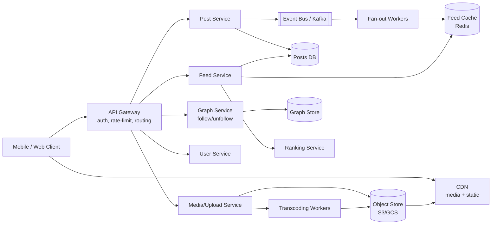
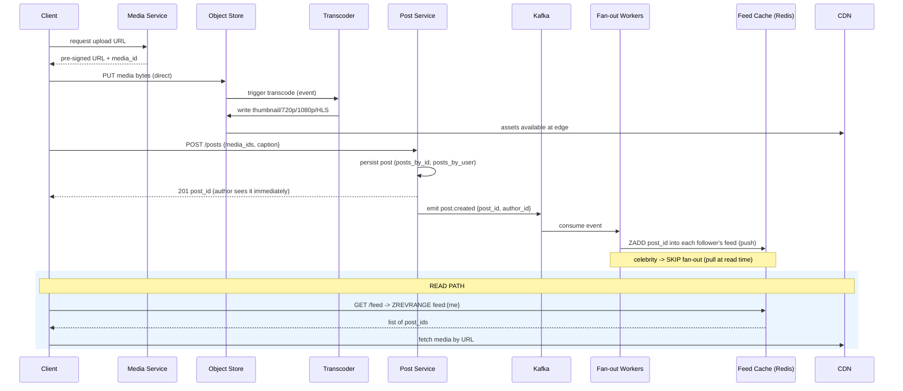
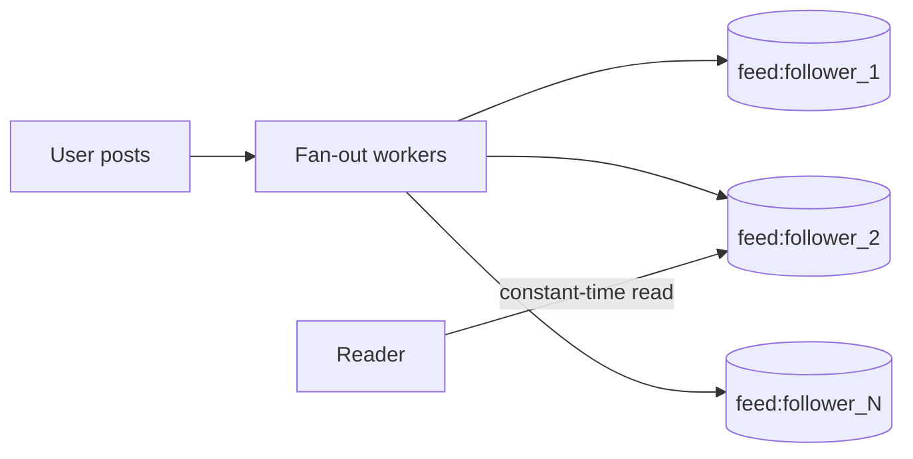
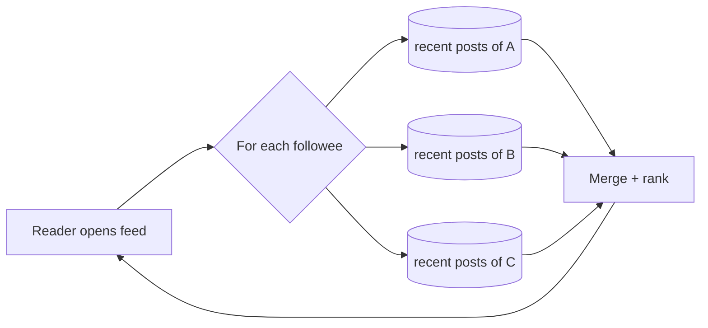
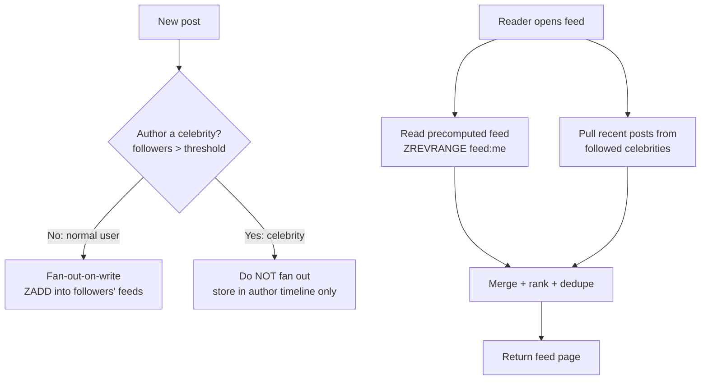
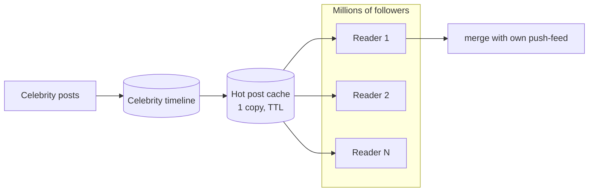
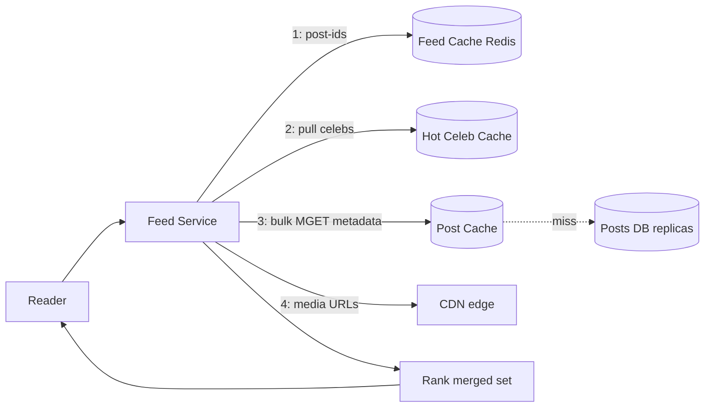
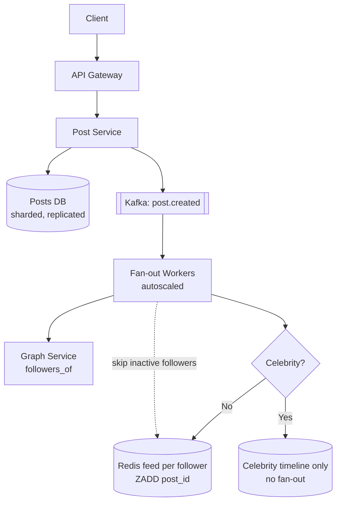
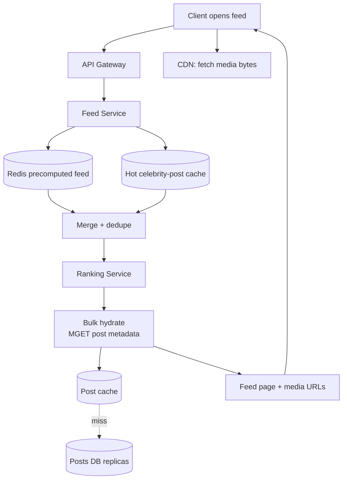
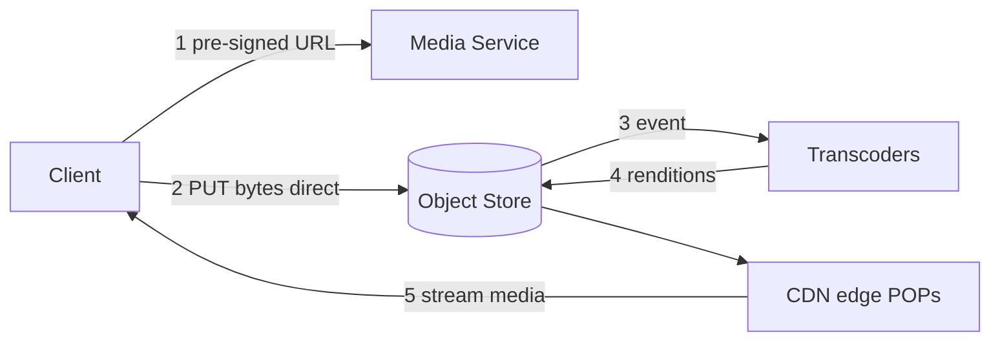

# Designing an Instagram-like Photo/Video Sharing App (Feed-Focused)

> A complete, interview-ready walkthrough: requirements → estimates → APIs → data model → data flow → **feed generation (push/pull/hybrid)** → celebrities → read scaling → failure handling → trade-offs. Use the headings as your whiteboard agenda. The **feed** is the heart of this problem — spend most of your time there.

---

## 0. How to drive the interview (talk track)

1. **Clarify** functional + non-functional requirements (don't assume).
2. **Estimate** scale (DAU, posts/sec, feed reads/sec, fan-out, storage) to justify choices.
3. **Define the APIs** and core components.
4. **Walk the data flow**: post creation → media pipeline → storage → feed build → delivery.
5. **Pick storage** per data type (posts, media, follow graph, feeds) and justify.
6. **Feed strategy**: push (fan-out-on-write) vs pull (fan-out-on-read) vs **hybrid** — trade-offs.
7. **Handle celebrities** (millions of followers) — the fan-out bomb.
8. **Scale reads**: caching, replicas, precomputation; avoid feed-read bottlenecks.
9. **Handle failure** and summarize **trade-offs**.

Keep saying *"here's the trade-off…"* — that's what's being graded.

---

## 1. Problem & motivation

Build a photo/short-video sharing service where users **post media**, **follow** other users, and consume a **home feed** of recent + relevant posts from accounts they follow.

**What makes it hard:**
- **Read-heavy**: feed reads dominate writes by ~100:1. Feeds must load in tens of ms.
- **Write fan-out**: one post by a popular account must reach millions of followers' feeds.
- **Media-heavy**: photos/videos need transcoding, multi-resolution storage, and global CDN delivery.
- **Skewed graph**: follower counts span from 10 to 100M+ (celebrities) — no single strategy fits all.
- **Relevance**: not just chronological — ranking drives engagement.

The central tension: **do work at write time (precompute feeds) or read time (assemble on demand)?** The answer is *both*, chosen per-account — that's the hybrid design.

---

## 2. Requirements

### Functional
- Users **create posts** (1+ photos or a short video, caption, location, tags).
- Users **follow / unfollow** other users (asymmetric — like Twitter, unlike Facebook).
- **Home feed**: recent and relevant posts from followed accounts, paginated, infinite scroll.
- Users can **like / comment** (engagement signals feed ranking).
- View a **user profile** (their own posts, reverse-chronological).

### Out of scope (state it, then park it)
Stories, DMs, Reels recommendation/discovery (non-followed content), search, ads. Mention them so the interviewer knows you know, then focus on the feed.

### Non-functional
- **Low feed latency**: p99 feed load < ~200 ms.
- **High availability**: feed must always render (stale-but-available > unavailable).
- **Scalable**: 500M DAU, billions of feed reads/day, 100M+ posts/day.
- **Eventual consistency is OK**: a new post appearing in followers' feeds a few seconds late is fine. (No need for read-after-write on *others'* feeds.)
- **Durability**: never lose a user's uploaded media or post.

### Clarifying questions to ask the interviewer
- **Chronological or ranked** feed? (Assume ranked, with recency as a strong signal.)
- **Follower distribution** — do we need to support celebrity accounts (100M+)? (Yes → hybrid.)
- Read-after-write for the **author's own** feed/profile? (Yes — they must see their post instantly.)
- **Media limits** — max video length, max photo size, supported formats?
- **Global** or single-region? (Global → CDN + regional replicas.)
- Do we need **edit/delete** of posts? (Yes — affects cache invalidation.)

---

## 3. Back-of-the-envelope estimation

Assume Instagram-ish scale:

| Quantity | Assumption | Result |
|---|---|---|
| **DAU** | — | 500M |
| **Posts/day** | ~20% of DAU post, ~1 each | 100M/day ≈ **~1.2K/sec** avg, **~5–10K/sec peak** |
| **Feed reads/day** | each DAU opens feed ~10–20× | ~5–10B/day ≈ **~100K/sec** avg, **~500K–1M/sec peak** |
| **Read : Write ratio** | — | **~100 : 1** (read-optimize everything) |
| **Avg followers** | — | ~200 (median far lower; mean skewed by celebs) |
| **Fan-out writes** | 100M posts × 200 followers | **~20B feed-inserts/day ≈ ~230K/sec avg, ~1M/sec peak** |
| **Media size** | photo ~2 MB × multi-res ≈ 3 MB; video larger | 100M × ~3 MB ≈ **~300 TB/day** ingested → ~**100 PB/year** |
| **Follow graph** | 1B users × ~200 edges | **~200B edges** (~3–5 TB raw, more with indexes) |
| **Precomputed feed cache** | 500M active × ~500 post-IDs × ~16 B | **~4 TB** in RAM (sharded Redis) |

**Takeaways that drive the design:**
1. **100:1 read:write** → precompute and cache feeds aggressively.
2. **Fan-out peak ~1M/sec** with celebrity spikes of **100M inserts for a single post** → can't naively fan-out everyone → **hybrid**.
3. **300 TB/day media** → object storage + CDN, never in the DB.

---

## 4. Core components & APIs



### Component responsibilities
- **API Gateway** — auth (OAuth/JWT), TLS, rate limiting, routing.
- **User Service** — profiles, auth, settings.
- **Graph Service** — follow/unfollow, "who follows X", "who does X follow"; serves the fan-out and pull paths.
- **Media/Upload Service** — issues pre-signed upload URLs, validates, triggers transcoding.
- **Transcoding Workers** — generate multiple resolutions/formats (thumbnail → 4K, HLS/DASH for video).
- **Post Service** — creates the post record, emits a `post.created` event.
- **Fan-out Workers** — consume `post.created`, write post-IDs into followers' feed caches (push path).
- **Feed Service** — assembles a user's home feed (merge precomputed + pulled celebrity posts → rank → paginate).
- **Ranking Service** — orders candidate posts by relevance.
- **Event Bus (Kafka)** — decouples writes from fan-out; absorbs spikes; enables replay.

### Key APIs (REST-ish; gRPC internally)

```http
# Create a post (media already uploaded → returns media IDs)
POST /v1/posts
{ "media_ids": ["m_123","m_124"], "caption": "sunset 🌅",
  "location": "SF", "tags": ["#nofilter"] }
→ 201 { "post_id": "p_987", "created_at": 1717612800 }

# Get home feed (cursor pagination — never OFFSET)
GET /v1/feed?limit=20&cursor=eyJ0cyI6MTcx...   # opaque cursor
→ 200 { "items": [ {post...}, ... ], "next_cursor": "eyJ0cyI6..." }

# Follow / unfollow
POST   /v1/users/{id}/follow
DELETE /v1/users/{id}/follow

# Request a pre-signed upload URL (client uploads media directly to object store)
POST /v1/media/upload-url
{ "type": "image/jpeg", "bytes": 2097152 }
→ 200 { "media_id":"m_123", "upload_url":"https://s3...&sig=...", "expires_in":600 }

# Profile feed (author's own posts, reverse-chronological)
GET /v1/users/{id}/posts?limit=20&cursor=...
```

**Why cursor pagination, not `page`/`OFFSET`?** Feeds are append-mostly and huge. `OFFSET` scans and skips rows (slow, O(N)); a **cursor** (e.g., last `(ranking_score, post_id)` seen) is O(1) to resume and stable as new posts arrive at the top.

---

## 5. Data model & storage choices

**Principle: polyglot persistence — match each data shape to the right store.**

| Data | Store | Why |
|---|---|---|
| **Posts** (metadata) | Wide-column (Cassandra) or sharded SQL | Massive write volume, simple key access by `post_id` / `user_id`, time-ordered |
| **Media blobs** | Object store (S3/GCS) + **CDN** | Cheap, durable, infinitely scalable; **never** store blobs in a DB |
| **Follow graph** | Sharded KV / wide-column (or graph DB) | 200B edges, need fast "followers of X" and "followees of X" |
| **Feeds** (precomputed) | **Redis** (in-memory) | Sub-ms reads, sorted by score, TTL/trim to bound size |
| **Counters** (likes/comments) | Redis + async durable rollup | High-frequency increments; eventual durability |
| **Social/derived analytics** | Data lake / OLAP (later) | Offline ranking model training |

### Posts table (Cassandra-style, partitioned by author for profile reads)
```
posts_by_user (
  user_id      partition key,
  created_at   clustering key DESC,   -- newest first
  post_id, media_ids, caption, location, tags, like_count, comment_count
)
posts_by_id (post_id PK → full post)   -- point lookups for feed hydration
```

### Follow graph (store BOTH directions — denormalize for read speed)
```
followers_of (user_id  → set/rows of follower_ids)   -- drives FAN-OUT (push)
following_of (user_id  → set/rows of followee_ids)   -- drives PULL + profile-of-followees
```
Storing both directions doubles writes on follow/unfollow (rare) to make reads cheap (constant). Classic **read-optimization via denormalization**.

### Feed cache (Redis Sorted Set per user)
```
feed:{user_id}  →  ZSET of  member=post_id , score=ranking_score (or timestamp)
ZADD feed:{u} <score> <post_id>          # fan-out insert
ZREVRANGE feed:{u} 0 19                   # top 20 for the home feed
ZREMRANGEBYRANK feed:{u} 0 -1001          # trim to newest/best ~1000
```
We store **only post-IDs** (pointers) in the feed, then **hydrate** full post + media URLs from `posts_by_id` + cache. Keeps the feed cache tiny and avoids duplicating post data per follower.

---

## 6. Data flow: post creation → storage → feed → delivery



**Step-by-step:**
1. **Upload first, post second.** Client gets a pre-signed URL and uploads media **directly to the object store** (bypasses our app servers — saves bandwidth/compute). Returns `media_id`.
2. **Transcode asynchronously.** Object-store event triggers workers that produce a thumbnail, multiple resolutions, and HLS/DASH renditions for video. Assets land back in the object store, fronted by the **CDN**.
3. **Create post.** `POST /posts` writes metadata to the Posts DB and returns `201` immediately — **the author sees their own post right away** (read-after-write for self).
4. **Emit event.** Post Service publishes `post.created` to **Kafka** (decouples the slow fan-out from the user-facing request).
5. **Fan-out (push).** Workers look up the author's followers and `ZADD` the `post_id` into each follower's `feed:{user_id}` Redis ZSET — **unless** the author is a celebrity (see §8).
6. **Delivery (read).** On feed open, Feed Service reads the top-N post-IDs from Redis, **merges in** any followed-celebrity posts (pull), **ranks**, hydrates post/media, and returns. Media itself streams from the **CDN**, not our servers.

---

## 7. Feed generation strategies — push vs pull vs hybrid (the core)

This is where to spend the most time. Three approaches:

### 7.1 Push — fan-out-on-write (precompute feeds)
On post creation, **write the post-ID into every follower's feed** immediately.



- ✅ **Reads are trivially fast** — feed is already materialized (one `ZREVRANGE`). Perfect for the 100:1 read-heavy reality.
- ✅ Read load is predictable and cache-friendly.
- ❌ **Write amplification**: 1 post → up to *millions* of writes. A celebrity with 100M followers = 100M Redis writes per post (the **fan-out bomb**).
- ❌ Wastes work for **inactive followers** (we precompute feeds nobody reads).
- ❌ New follow/unfollow needs backfill/cleanup.

### 7.2 Pull — fan-out-on-read (assemble on demand)
Store nothing per-follower. On feed open, **fetch recent posts from everyone the user follows**, merge, rank.



- ✅ **No write amplification** — posting is cheap; great for celebrities.
- ✅ No wasted precomputation for inactive users.
- ✅ Always fresh; easy to re-rank.
- ❌ **Reads are expensive**: a user following 1,000 accounts triggers many queries + a merge **on every feed open** → high latency, heavy DB load at 100K+ reads/sec.
- ❌ Hard to cache; "thundering herd" on popular followees.

### 7.3 Hybrid — the real-world answer ✅
**Push for the masses, pull for celebrities.** Split accounts by follower count.



- **Normal authors (followers < ~10K–100K):** **push** — fan out to followers' feeds. Cheap fan-out, instant reads for the long tail.
- **Celebrity authors (followers > threshold):** **don't fan out**. Their posts live in their own timeline; followers **pull** them at read time and merge.
- **Read path** = precomputed feed (push) **⊕** small pull from the handful of celebrities each user follows, then rank.

Because a user typically follows only a **few** mega-accounts, the pull side is small and **cacheable** (a celebrity's recent posts are read by millions → cache once, serve everyone).

| Strategy | Write cost | Read cost | Best for | Used by (real world) |
|---|---|---|---|---|
| **Push** | High (fan-out) | **Very low** | Most users; read-heavy systems | Instagram/Twitter baseline |
| **Pull** | **Very low** | High | Celebrities; inactive users | Celebrity timelines |
| **Hybrid** ✅ | Balanced | Low | **Everything at scale** | Instagram, Twitter, Tumblr |

**Extra optimizations layered on the hybrid:**
- **Don't fan out to inactive users.** Skip precompute for users who haven't opened the app in N days; lazily build their feed on next login (pull). Saves a large fraction of fan-out writes.
- **Active-follower fan-out.** Prioritize fanning out to recently-active followers first; backfill the rest async.

---

## 8. Celebrities / creators with millions of followers

The single hardest part. One post by a 100M-follower account naively = **100M feed writes**, spiking Kafka, workers, and Redis — a self-inflicted DoS.

**Mitigations (stack them):**

1. **No fan-out for celebrities (pull instead).** Their posts are fetched at read time and merged. This is the primary fix — turns 100M writes into ~0 writes + cached reads.
2. **Cache the celebrity's recent posts hard.** Their latest posts are requested by millions → cache in Redis/CDN with short TTL; **read once, serve all**. Pull cost becomes a single cache hit per reader.
3. **Async, throttled, prioritized fan-out (if any).** For "borderline" accounts, fan out gradually: active followers first, the rest drained from Kafka at a controlled rate so we don't saturate Redis.
4. **Per-key hot-shard handling.** A celebrity's follower list and post cache are hot keys → replicate across many Redis replicas / CDN nodes; split the follower set across shards for parallel fan-out if we *do* push.
5. **Dedupe + merge at read.** Reader's feed = precomputed (push from normal followees) merged with pulled celebrity posts, deduped, then ranked.



**Threshold tuning:** the push/pull cutoff (e.g., 50K–100K followers) is a knob. Below it, push (cheap fan-out, fast reads). Above it, pull (avoid the write bomb). Some systems also flip an account to pull dynamically when it suddenly goes viral.

**One-liner:** *"I never fan out a celebrity's post to 100M feeds — I leave it in their timeline and pull it at read time from a single hot cache that millions share."*

---

## 9. Media pipeline (upload, transcode, deliver)

- **Direct-to-object-store upload** via pre-signed URLs → app servers never touch raw bytes (saves bandwidth/CPU).
- **Async transcoding** → thumbnail, 720p/1080p/4K, and **HLS/DASH** adaptive bitrate for video. Store all renditions in the object store.
- **CDN in front of everything** → media served from edge POPs near the user; our origin handles only cache misses. This offloads the vast majority of read bytes.
- **Image/video IDs are content-addressable** and immutable → cache forever (`Cache-Control: immutable`); edits create new IDs.
- **Process out of band**: a post can be created with media "processing"; renditions attach when ready.

This keeps the **feed path metadata-only and fast** — media bytes flow client ↔ CDN, never through the feed services.

---

## 10. Ranking / relevance (recent **and** relevant)

A pure reverse-chronological feed is simplest; "relevant" implies **ranking**:

- **Candidate generation**: the merged set (push feed ⊕ pulled celebrity posts).
- **Scoring signals**: recency, affinity (how much you interact with the author), predicted engagement (like/comment/dwell probability), media type, diversity (don't show 5 posts from one account).
- **Two-stage**: cheap heuristic score at read time for the top page; heavier ML model offline/near-line writing a `ranking_score` used as the Redis ZSET score.
- **Keep recency dominant** so the feed feels live; blend relevance on top.

Store the score as the **ZSET score** so `ZREVRANGE` returns ranked order directly. Re-rank the small merged set per request for freshness.

---

## 11. Scaling reads & avoiding feed-read bottlenecks

Reads are 100× writes — this section is where the system lives or dies.

1. **Precomputed feeds in RAM (push).** The home feed read is a single `ZREVRANGE` from Redis → sub-ms. This is the #1 defense against read load.
2. **Multi-layer caching:**
   - **CDN** — all media + some static feed fragments.
   - **Feed cache (Redis)** — materialized post-ID lists per user.
   - **Post/object cache (Redis)** — hydrated post metadata by `post_id` (read once, reused across all feeds containing it).
   - **Hot-content cache** — celebrity posts shared by millions.
3. **Read replicas + sharding** for the Posts DB; route reads to replicas, writes to primary. Shard by `user_id`/`post_id`. Accept **replica lag** (eventual consistency is fine for others' feeds).
4. **Hydrate in bulk.** Feed returns N post-IDs → one **multi-get** (`MGET`) for all post metadata, not N round-trips. Avoids the N+1 query problem.
5. **Cursor pagination** (not OFFSET) → O(1) page resumption, stable under inserts.
6. **Trim feeds.** Keep only the newest/best ~500–1,000 IDs per feed (`ZREMRANGEBYRANK`). Bounds memory and read cost; older history comes from the profile/DB on demand.
7. **Avoid hot keys.** Replicate hot Redis keys across replicas; for a celebrity follower-list/post, fan reads across many replicas or the CDN.
8. **Backpressure & async.** Fan-out via Kafka absorbs write spikes so reads aren't starved; consumers scale independently.
9. **Prefetch / pagination on client** — load page 1 fast, prefetch page 2 during scroll.



---

## 12. Failure scenarios — *"what if X fails?"*

| Failure | Impact | Mitigation |
|---|---|---|
| **Feed cache (Redis) node down** | Some users' feeds missing | Replicas + failover; on miss, **rebuild from DB (pull)** — degraded but available |
| **Fan-out worker backlog** | New posts slow to appear in feeds | Kafka buffers; autoscale consumers; prioritize active followers; eventual consistency is acceptable |
| **Celebrity post spikes Kafka** | Fan-out lag for everyone | Celebrities are **pull-only** (no fan-out); throttle/borderline-account draining |
| **Object store / CDN miss storm** | Slow media | Multi-tier CDN, origin shielding, pre-warm popular assets |
| **Posts DB primary down** | Writes blocked | Failover to replica; writes retried via Kafka; reads served from replicas/cache |
| **Hot key (celebrity)** | One shard saturated | Replicate hot keys, CDN the post, split follower set across shards |
| **Replica lag** | Slightly stale feed | Acceptable for others' posts; route the **author's own** reads to primary/cache for read-after-write |

**Guiding principle:** the feed must **always render**. Prefer **stale-but-available** over unavailable — fall back from cache → replica → pull-rebuild rather than erroring.

---

## 13. Trade-off analysis (the money section)

| Axis | Choice A | Choice B | Guidance |
|---|---|---|---|
| **Push vs Pull** | Fan-out-on-write (fast reads, costly writes) | Fan-out-on-read (cheap writes, costly reads) | **Hybrid**: push for the long tail, pull for celebrities |
| **Consistency vs Latency** | Strong (read-after-write everywhere) | Eventual (feeds lag a few s) | Eventual for *others'* feeds; strong only for **author's own** view |
| **Precompute vs On-demand** | Materialize all feeds | Build at read time | Precompute active users; **skip inactive** users (lazy build) |
| **Storage cost vs Read speed** | Store feeds per user (RAM) | Recompute each read | Trade RAM for speed — it's a read-heavy system; **trim** to bound cost |
| **Freshness vs Cost** | Re-rank every read | Cache ranked feed | Cache base, re-rank only the small merged top page |
| **Blob in DB vs Object store** | DB (simple) | Object store + CDN | **Always** object store + CDN for media |

**CAP framing:** the feed system leans **AP** — under partition we keep serving (possibly stale) feeds rather than blocking. Strong consistency is reserved for the narrow case of the **author seeing their own post** immediately.

**One-liner to say out loud:** *"I'd use a **hybrid fan-out**: push posts from normal accounts into followers' precomputed Redis feeds for sub-ms reads, but **never** fan out celebrities — their posts stay in their timeline and are pulled from a shared hot cache at read time. Media goes to object storage behind a CDN, post metadata to a sharded wide-column store, the follow graph denormalized both directions, and Kafka decouples the write path from fan-out so read traffic is never starved. I skip precomputing feeds for inactive users and trim feeds to the newest ~1,000 to bound memory."*

---

## 14. Full system design (detailed)

End-to-end, split into **(A)** write path (post creation + fan-out), **(B)** read path (feed delivery), and **(C)** media path.

### 14A. Write path — post creation & fan-out



### 14B. Read path — feed delivery



### 14C. Media path — upload & delivery



---

## 15. Networking, security & performance best practices

### Networking
- **CDN for all media** — photos/videos served from edge POPs; origin hit only on cache miss. **Adaptive bitrate (HLS/DASH)** for video, modern codecs (H.265/AV1).
- **TLS at the edge/LB**; **HTTP/3 (QUIC)** for multiplexed, low-latency feed + media fetches on flaky mobile networks; **gRPC** between internal services.
- **Direct-to-object-store uploads** via pre-signed URLs — raw media bypasses app servers (saves bandwidth/CPU).
- **Cursor pagination** on the wire (compact, stable under inserts) — never `OFFSET`.
- **Connection pooling / keep-alive** between services; co-locate feed cache with feed services.

### Security
- **AuthZ on every read** — enforce private accounts, blocks, and channel membership before returning posts; never trust the client.
- **Signed, expiring media URLs** so private media isn't hotlinkable; per-object access checks.
- **Sanitize uploads in a sandbox** — strip EXIF/GPS, re-encode to kill polyglot/malware files, virus-scan before publish.
- **Rate-limit writes** (post/like/follow) and run **abuse/bot detection** on the fan-out path to blunt spam.
- **Avoid enumeration leaks** (follower lists, user existence); defend against scraping.

### Performance
- **Precomputed feeds + multi-layer cache** (CDN → feed cache → post cache) → sub-ms reads.
- **Bulk hydrate** (`MGET`) to kill N+1; store only post-IDs in the feed.
- **Trim feeds** to the newest ~1,000; **skip inactive** users.
- **Thumbnails first**, lazy-load full-res; **client prefetch** of the next page during scroll.

---

## 16. Staying current — modern & emerging approaches

- **Stores:** Cassandra/**ScyllaDB** for posts, **Redis** for feeds, **Kafka** for fan-out — the industry-standard stack at Meta/Twitter scale; Facebook's **TAO** for the social graph.
- **Media:** HLS/DASH ABR, **AV1/HEVC** codecs, per-title encoding; CDNs (CloudFront/Fastly/Akamai); on-the-fly image resizing at the edge.
- **Transport:** **HTTP/3/QUIC** for mobile; gRPC internally.
- **Ranking:** **two-tower retrieval** + GBDT/DNN ranking, **feature stores** (Feast), near-line feature computation; embeddings for relevance.
- **Reference systems:** Instagram feed/Stories architecture, Twitter Timelines + Manhattan store, LinkedIn feed.
- **How I stay current:** engineering blogs (Meta, Discord, Twitter/X, Pinterest), papers (TAO, f4), and prototyping + load-testing before adopting.

---

## 17. Likely follow-up questions (rehearse these)
- Push vs pull fan-out — when each? *(read-heavy → push; celeb write-bomb → pull)*
- How do you keep a celebrity's post out of 100M feeds? *(no fan-out; pull from one shared hot cache)*
- How does the author see their own post instantly? *(read-after-write to primary/cache for self)*
- Feed cache (Redis) dies — what now? *(rebuild from DB via pull; degrade, don't fail)*
- "Relevant" ranking without killing latency? *(precompute score as the ZSET score; re-rank only the small merged top page)*
- A normal post suddenly goes viral — how? *(dynamically flip the author to pull)*
- Storing a 200B-edge follow graph? *(denormalize both directions for O(1) reads)*
- Hot key on a celebrity's follower list? *(replicate across replicas, shard, CDN the post)*

---

## 18. Summary checklist (whiteboard recap)

- **Read-heavy (100:1)** → precompute + cache feeds; single `ZREVRANGE` read.
- **Hybrid fan-out** → push normal accounts, pull celebrities; merge + rank at read.
- **Celebrities** → no fan-out, shared hot cache, pull at read (kills the write bomb).
- **Storage** → posts in wide-column, media in object store + CDN, graph denormalized both ways, feeds in Redis ZSETs.
- **Kafka** decouples write from fan-out; absorbs spikes; lets consumers scale.
- **Skip inactive users**, **trim feeds**, **bulk-hydrate**, **cursor paginate** → bound cost and latency.
- **Eventual consistency** everywhere except the **author's own** read-after-write.
- **Always render** the feed — degrade (cache → replica → pull) rather than fail.
