# Designing an Online Chess Platform (Real-Time, Timed Games)

> A complete, interview-ready walkthrough: requirements → estimates → entities → APIs → architecture → **matchmaking, server-authoritative move validation, the game clock, real-time delivery, game end & ratings, persistence/replay** → scaling → failure handling → trade-offs. Use the headings as your whiteboard agenda. The hard parts are the **server-authoritative clock (who flags first under network lag), move validation, and rating-based matchmaking** — spend your time there.

> Think Lichess / Chess.com. Two human players are matched by strength, join a real-time session, exchange moves over a persistent connection; the **server is the sole authority** on legality, game state, and the clock. Finished games are persisted as PGN for later viewing.

---

## 0. How to drive the interview (talk track)

1. **Clarify** functional + non-functional requirements (timed 1v1, rating-based matchmaking, server-authoritative).
2. **Estimate** scale (concurrent players, concurrent games, moves/sec, storage).
3. **Model entities** (players, games, moves, clocks, ratings) + their keys.
4. **Define the APIs** (matchmaking REST + the **real-time move transport** over WebSocket).
5. **Walk the game lifecycle**: queue → match → session → move → validate → clock → broadcast → end → persist.
6. **Nail the clock** (server-authoritative time, flagging, lag compensation) and **move validation** (server-side rules engine).
7. **Matchmaking** (rating windows) + **reconnection** + rating updates.
8. **Persistence & replay** (PGN), then **storage, scaling, failure + trade-offs**.

Keep saying *"here's the trade-off…"* — that's what's being graded. The signature line: **"the server is authoritative for legality, state, and time; clients are just views."**

---

## 1. Problem & motivation

A real-time online chess service: players request a **timed** game, get **matched by rating**, join a **live session**, and alternate **moves**. The server **validates every move**, maintains the **authoritative board and clocks**, decides the **end** (checkmate / resign / draw / timeout), and **persists** the finished game for replay.

**What makes it hard:**
- **Server-authoritative clock** — deciding *who ran out of time first* is subtle under network latency. A move sent "on the buzzer" may arrive after the server thinks time expired. Flag the wrong player and the game is ruined.
- **Server-authoritative move validation** — never trust the client. Full chess rules (castling, en passant, promotion, check, checkmate, stalemate, threefold repetition, 50-move rule, insufficient material) must run on the server to prevent illegal-move cheating.
- **Rating-based matchmaking** — pair players of similar strength quickly, per time control, widening the search as they wait.
- **Real-time, consistent state** — both players (and spectators) must see the **same** board and clocks with low latency, surviving reconnects.
- **Fairness & anti-cheat** — legality is enforced structurally; engine-assistance cheating needs statistical detection.

The central tension: the game must feel **instant** to both players, yet the **server alone** decides legality, state, and time — and it must resolve the **flag race** fairly when the network is slow.

---

## 2. Requirements

### Functional
- **Start a timed game** — player picks a time control (e.g., 1+0 bullet, 3+2 blitz, 10+0 rapid) and joins a queue.
- **Rating-based matchmaking** — pair with an opponent of similar rating in that time-control pool.
- **Real-time game session** — both players connected; moves delivered live to the opponent.
- **Server-side move validation** — only legal moves accepted; illegal moves rejected.
- **Authoritative clocks** — per-player countdown; increment support; **timeout ⇒ loss** (unless already decided).
- **Game end** — checkmate, resignation, draw (stalemate / threefold / 50-move / insufficient material / agreement), timeout, abort.
- **Rating update** — recompute both players' ratings on completion.
- **Persistence & replay** — store the finished game (moves + clocks + result) as **PGN** for later viewing.
- **(Extensions)** spectating, draw offers / takebacks, reconnection, rematch, anti-cheat.

### Non-functional
- **Low latency** — p99 move round-trip < ~100 ms for co-located players; the clock must feel exact.
- **Correctness** — the authoritative game state and clock are **never wrong**; a legal game is never corrupted by a bad move or a mis-flag.
- **High availability** — an in-progress game must survive a server restart (don't lose a game people are playing).
- **Durability** — a finished, rated game is **never lost**; ratings update atomically.
- **Scalable** — millions of concurrent players, hundreds of thousands of concurrent games.
- **Fairness** — clock decisions are lag-compensated and reproducible from server timestamps.

### Clarifying questions to ask the interviewer
- **Only human vs human**, or also vs bots / puzzles? (Assume **human 1v1**.)
- **Time controls** — bullet/blitz/rapid only, or classical/correspondence (days per move)? (Assume real-time bullet→rapid; note correspondence differs.)
- **Rating system** — Elo or **Glicko-2**? (Assume Glicko-2 like Lichess; Elo is the simple fallback.)
- **Spectators** — required? (Yes, read-only; affects fan-out.)
- **Reconnection policy** — does the clock keep running while a player is disconnected? (Yes, with a small grace window.)
- **Anti-cheat depth** — structural legality only, or engine-detection too? (Legality now; statistical detection as an async subsystem.)
- **Global** — multi-region for latency? (Yes → regional game servers, pair by region.)

---

## 3. Back-of-the-envelope estimation

| Quantity | Assumption | Result |
|---|---|---|
| **DAU** | — | 10M |
| **Concurrent players (peak)** | ~10% online & playing | **~1M in games** |
| **Concurrent games** | 2 players/game | **~500K live games** |
| **Games/day** | ~5 games/active user | **~50M games/day** |
| **Move rate** | blitz ≈ 40 full moves over ~6 min ⇒ ~0.2 plies/s/game | **~100–200K moves/sec peak** |
| **Move validation cost** | rules engine per move | **microseconds** — CPU-cheap |
| **Live game state** | board + clocks + history | **~a few KB/game** ⇒ ~GBs total in memory |
| **Persisted record** | moves + clocks + metadata as PGN | **~5–10 KB/game** ⇒ ~0.5 TB/day |
| **Matchmaking pool** | waiting players per time control | thousands, sorted by rating |

**Takeaways that drive the design:**
1. **Games are tiny and CPU-light**, but **stateful and long-lived** (minutes). → a **game-server tier that owns games in memory** (one authoritative owner per game), not a stateless request/response service.
2. **Real-time move exchange** for 1M connections → a **connection/gateway tier** with persistent WebSockets, decoupled from game logic.
3. **The clock is the hard correctness problem**, not throughput → invest in **server-authoritative timing + lag compensation**.
4. **Persistence is modest** (~0.5 TB/day) and **append-only** → cheap to store every game as PGN for replay.

---

## 4. Core entities & data model

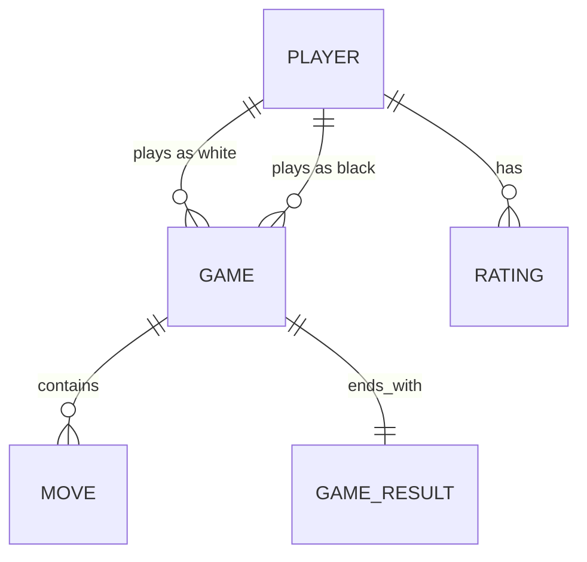

| Entity | Key fields | Notes |
|---|---|---|
| **Player** | `player_id`, name, rating, rating_deviation, country | Identity + strength; `rating` per time-control category |
| **Rating** | `(player_id, category)`, value, RD, volatility, games | Glicko-2 state per bucket bullet/blitz/rapid |
| **Game** | `game_id`, white_id, black_id, `time_control`, `status`, start_ts, region | Owned by one game server while live |
| **GameState** *(in-memory)* | FEN, side_to_move, castling, ep_target, halfmove_clock, position_hashes | Authoritative live state; rebuildable from moves |
| **Clock** *(in-memory)* | white_ms, black_ms, increment_ms, turn_started_ts | Server-authoritative remaining time |
| **Move** | `(game_id, ply)`, uci, san, clock_ms_after, ts | Ordered by **ply** (half-move index) — the ordering key |
| **GameResult** | `game_id`, winner, reason, white_rating_delta, black_rating_delta | checkmate / resign / draw / timeout / abort |

**Ordering key = `ply`.** Chess is strictly turn-based, so each game has a single monotonic **half-move index (`ply`)**. Move `ply = n` is only legal from the position after `ply = n−1`. This makes ordering trivial (one writer per game) — unlike chat, there's no fan-out sequencing problem.

### Time-control notation
```
base + increment   (minutes + seconds/move)   e.g., 5+3 = 5 min base, +3 s per move
category:  bullet (< 3 min)  ·  blitz (3–8)  ·  rapid (8–25)  ·  classical (> 25)
```
Rating is tracked **per category** (a strong bullet player may be an average rapid player). Matchmaking pools are keyed by exact time control.

---

## 5. APIs

### Matchmaking & lifecycle (REST/HTTP)
```http
POST /v1/matchmaking/queue      {time_control:"5+3"}            # enter the pool, returns ticket
DELETE /v1/matchmaking/queue    {ticket_id}                     # cancel search
GET  /v1/games/{id}             -> {fen, clocks, moves, status} # snapshot (resume/replay)
POST /v1/games/{id}/resign                                      # resign
POST /v1/games/{id}/draw        {action:"offer|accept|decline"} # draw negotiation
GET  /v1/players/{id}/games?before=<cursor>                     # finished-game history (replay list)
```

### Real-time transport (WebSocket — the hot path)
Once matched, each player holds a persistent **WebSocket** to the game's server; moves and clock updates flow as framed events.

```jsonc
// server -> both: game starts, seats + clocks assigned
{ "type":"game_start", "game_id":"g_42", "color":"white", "opponent":{"name":"Mia","rating":1587}, "time_control":"5+3", "clocks":{"white":300000,"black":300000} }

// client -> server: submit a move (from-square, to-square, optional promotion)
{ "type":"move", "game_id":"g_42", "ply":7, "uci":"e7e8q", "client_ts": 1721659200123 }

// server -> both: accepted move + AUTHORITATIVE clocks after applying it
{ "type":"move_applied", "ply":7, "uci":"e7e8q", "san":"e8=Q+", "fen":"...", "clocks":{"white":297400,"black":301300}, "turn":"black" }

// server -> the mover: rejected (illegal or not your turn) -> client rolls back
{ "type":"move_rejected", "ply":7, "reason":"illegal_move" }

// server -> both: periodic authoritative clock sync (client interpolates between)
{ "type":"clock", "clocks":{"white":295800,"black":301300}, "turn":"white", "server_ts": 1721659203000 }

// server -> both: game over
{ "type":"game_over", "result":"black_wins", "reason":"timeout", "rating_delta":{"white":-8,"black":+8} }
```

**Why WebSocket for moves, REST for the rest?** Moves and clocks need **push, low latency, bidirectional** → WebSocket. Matchmaking, snapshots, history, and replay are **request/response, cacheable, retry-friendly** → REST. Moves carry a **`ply`** so the server can reject stale/duplicate submissions idempotently.

---

## 6. Architecture overview

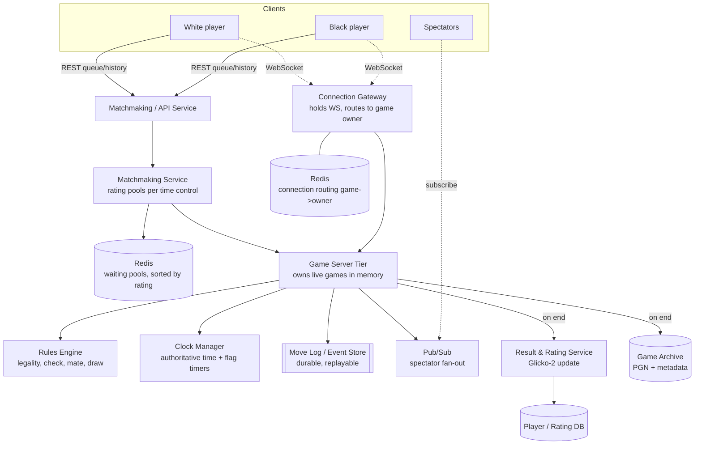

### Component responsibilities
- **Connection Gateway** — terminates player WebSockets; routes each player's frames to the **game-owner** node (via Redis `game_id → owner`). Stateful but disposable: on disconnect, the client reconnects (any gateway) and resumes.
- **Matchmaking Service** — maintains per-time-control **waiting pools sorted by rating** (Redis sorted sets); pairs players and asks a Game Server to create the game.
- **Game Server (the core)** — **owns the authoritative game** in memory: applies moves through the rules engine, drives the clock, broadcasts to both players + spectators, appends to the durable move log, and finalizes on end. **One owner per game** (single-writer ⇒ trivial move ordering).
- **Rules Engine** — pure chess logic: legal-move generation/validation, check/checkmate/stalemate detection, draw conditions.
- **Clock Manager** — per-game authoritative clocks; sets **flag timers** and resolves timeouts with lag compensation (§10).
- **Move Log / Event Store** — durable append-only log of moves so a crashed game is **reconstructable**.
- **Result & Rating Service** — computes Glicko-2/Elo deltas and updates both players atomically.
- **Game Archive** — finished games as **PGN + metadata** for replay; served via cache/CDN.
- **Pub/Sub** — fan-out live moves to spectators (read-only), keeping the hot player path lean.

---

## 7. Game lifecycle: queue → match → play → end → persist

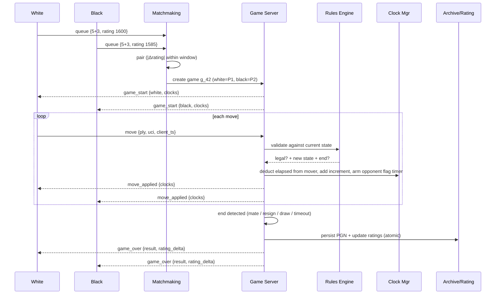

**Key points:**
1. **Single-writer game owner** processes moves serially → no race between the two players' moves; `ply` increments cleanly.
2. **Validate before applying** — an illegal or out-of-turn move is rejected and never mutates state.
3. **Clock updated on every move** — deduct the mover's elapsed, add increment, re-arm the opponent's flag timer.
4. **End detection is server-side** — the engine reports mate/stalemate/draw; the clock reports timeout.
5. **Persist + rate atomically on end** — the finished game is durable and both ratings move together.

---

## 8. Matchmaking (focus area)

**Goal: pair two players of similar strength, in the same time control, quickly.** Rating is a number (Elo/Glicko, ~0–3000); pools are separate per exact time control (you don't mix 1+0 with 10+0).

### The pool structure
- One **waiting pool per time control**, holding `(player_id, rating, joined_at, region)`.
- Keep it **sorted by rating** (Redis **sorted set** `ZADD pool:5+3 rating player`) so the nearest-rated opponent is a range query away.

### Pairing strategies
| Strategy | How | Trade-off |
|---|---|---|
| **Greedy on arrival** | New player matches the closest waiting player within the window | Instant when pool is dense; can make globally sub-optimal pairs |
| **Periodic batch** (Lichess-style) | Every ~1 s, run a pass over the pool and pair globally (nearest-neighbor / min-cost matching) | Better pairings; adds up to ~1 s wait |
| **Hybrid** ✅ | Try greedy immediately; if no in-window opponent, wait for the next batch tick | Fast when possible, optimal when busy |

### Widening window (the key idea)
Start strict, relax as the player waits so nobody waits forever:
```
window(t) = base ± (Δ0 + rate · seconds_waited)     # e.g., ±50, growing to ±100, ±200 …
```
- **Provisional players** (few games, high rating deviation) → **wider** window immediately (we're unsure of their strength).
- **Region/latency** — prefer same-region opponents for low RTT; widen to cross-region only after waiting.
- **Avoid immediate rematches** / recently-played opponents when the pool allows.

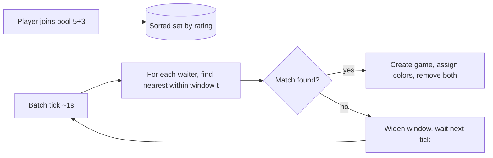

**Color assignment** — balance white/black over a player's recent games; otherwise random.

**One-liner:** *"Per-time-control pools sorted by rating in Redis; a batch tick pairs each waiter with the nearest-rated opponent inside a window that **widens with wait time** (and starts wide for provisional/high-RD players), preferring same-region — so matches are fast **and** fair."*

---

## 9. Move validation & game state (focus area)

**The server is the sole authority on legality — never trust the client.** The client may validate locally for instant UI, but the server re-validates every move with a full rules engine.

### Authoritative game state (per live game, in memory)
```
FEN / board       : piece placement (8x8, or bitboards)
side_to_move      : white | black
castling_rights   : KQkq
en_passant_target : square or none
halfmove_clock    : plies since last capture/pawn move  (50-move rule)
fullmove_number   : display
position_history  : hashes of every position            (threefold repetition)
```

### Validating a move
1. **Right player, right turn** — the sender owns `side_to_move`; the submitted `ply` matches the expected next ply (else reject stale/duplicate — **idempotent**).
2. **Pseudo-legal + legal** — the piece moves correctly; **special rules** (castling through/into check, en passant, promotion) handled; the move **does not leave the mover's king in check**.
3. **Apply** — mutate the board, update castling/ep/halfmove, push the position hash, flip `side_to_move`.
4. **Detect end** — checkmate, stalemate, **threefold repetition**, **50-move rule**, **insufficient material**; report to the game server.
5. **Broadcast** the accepted move + new FEN + authoritative clocks to both players (and spectators).

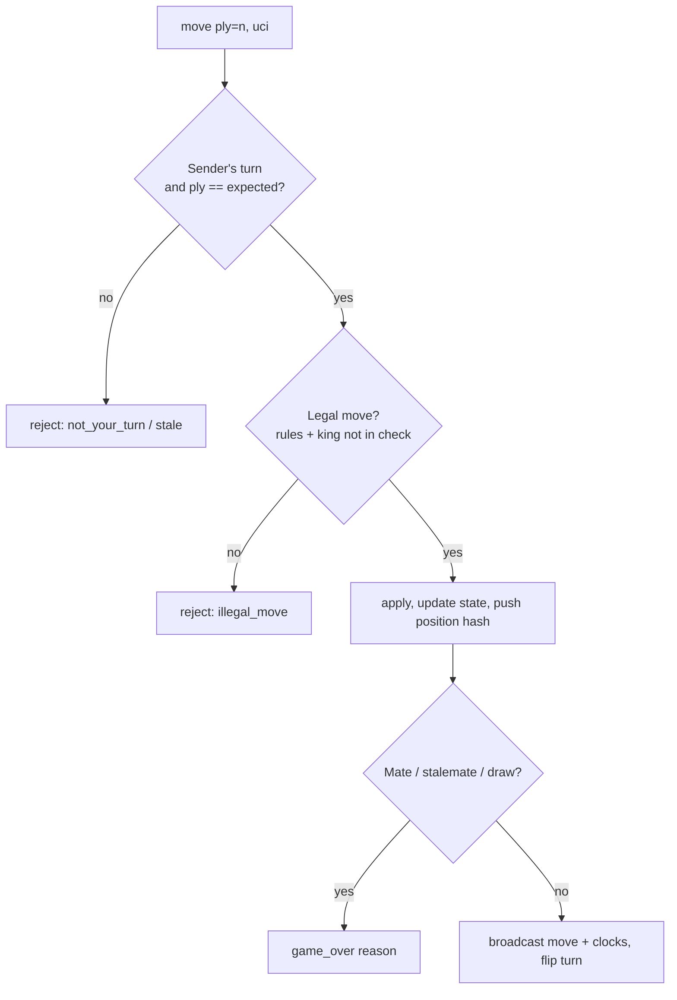

**Move format** — prefer **UCI** `from+to(+promo)` (e.g., `e7e8q`); derive **SAN** (`e8=Q+`) for display/PGN. Unambiguous and easy to validate.

**Anti-cheat** — illegal moves are impossible (structural). **Engine-assistance** (a human relaying an engine's moves) is a *separate* problem: an async subsystem flags suspicious accuracy/timing patterns; out of the hot path.

**One-liner:** *"The server keeps the authoritative FEN + castling/ep/halfmove/position-history and re-validates every move — right turn, legal, king-safe — then detects mate/stalemate/threefold/50-move/insufficient-material. Clients are optimistic views that roll back on `move_rejected`."*

---

## 10. The game clock (focus area — the hard part)

**The server owns time. Clients only display an estimate.** The subtle problem is **who flags first under network latency** — a move sent at the buzzer may arrive after the server thinks the clock hit zero.

### The model
- Each side has **remaining milliseconds**; `increment_ms` is added after each completed move (Fischer).
- The clock **only ticks for the side to move**. The server records `turn_started_ts` = the instant it broadcast the opponent's move (i.e., when it became your turn).
- On receiving your move at server time `t_recv`:
  ```
  elapsed          = t_recv − turn_started_ts − lag_credit
  remaining[mover] = remaining[mover] − elapsed + increment_ms
  if remaining[mover] <= 0  before the move arrived  → the mover FLAGS (loses on time)
  ```

### Detecting timeout when a player just sits there
- When it becomes X's turn, the Clock Manager **arms a flag timer** = `remaining[X]` ms.
- If the timer **fires before a move arrives** → declare **timeout**: X loses — *unless the opponent cannot possibly win* (e.g., opponent has only a king / insufficient material) → **draw** instead. If a mate/stalemate already occurred, that result stands.
- If a move **arrives just before** the timer, the game server (single-writer) processes it first and **cancels** the timer — the single-owner design makes this race deterministic (one thread decides order).

### Lag compensation (fairness)
Naive "server receive time" penalizes high-latency players — unfair. Mitigations:
- **Measure per-player network lag** continuously (WebSocket ping/pong RTT) and credit back an estimated one-way lag (`lag_credit`) so a player isn't flagged for their connection.
- **Cap the credit** (e.g., ≤ a few hundred ms) so it can't be abused to gain time.
- **Grace on the very last move** — many implementations don't flag if the move was clearly *sent* before expiry (client_ts + measured lag), trusting the measured connection profile.

### Keeping both clients in sync
- The server periodically pushes an **authoritative `clock` snapshot** `{white_ms, black_ms, turn, server_ts}`.
- Clients **interpolate locally** (tick down the active side) between snapshots but **snap to the server** on every update — so drift never accumulates and both players agree.

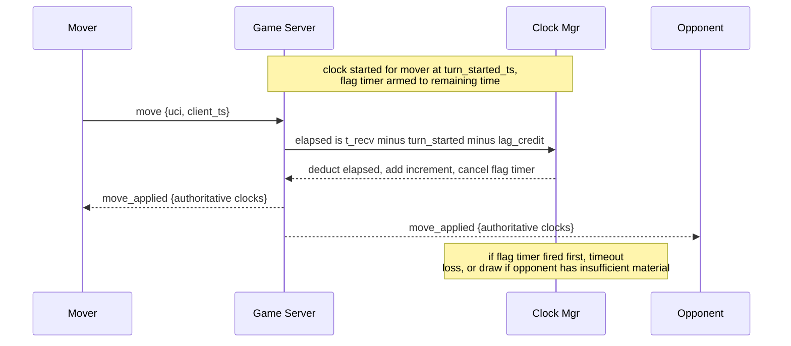

**One-liner:** *"The server is the clock authority: it deducts `t_recv − turn_started` from the mover, adds increment, and arms a flag timer for the side to move. Timeout ⇒ loss, unless the opponent has insufficient material ⇒ draw. Network lag is measured via ping and **credited back (capped)** so players aren't flagged for their connection; clients interpolate but always snap to the server's authoritative snapshots."*

---

## 11. Game session & real-time delivery (focus area)

### One authoritative owner per game
- Each live game is **owned by exactly one game-server node**, holding the state + clocks in memory (a **sharded actor**: `game_id → owner` via consistent hashing, recorded in Redis).
- **Single-writer** ⇒ moves are serialized naturally; there's no distributed consensus per move and `ply` ordering is automatic.
- Gateways forward each player's frames to the owner; the owner broadcasts results back through the gateways to both players.

### Reconnection (clients drop constantly)
- Game state lives on the **server**, not the client. On reconnect, the client calls `GET /v1/games/{id}` (or a WS resume) and receives the **current FEN + clocks + move history**, then resumes live.
- **Clock keeps running** during a disconnect (you can't gain time by pulling the cable), but a small **grace window** and "opponent disconnected" indicator are shown; if you don't return before your flag, you lose on time. Optional: auto-abort if a player never makes a first move.

### Spectators
- Read-only subscribers to the game's move stream via **pub/sub**; they get the same `move_applied`/`clock` events but can't submit moves.
- Popular games (thousands of watchers) → the owner publishes **once** to a fan-out layer (Redis pub/sub / a broadcast tier) that cached spectator gateways read — the **celebrity/hot-game** pattern, keeping the player path lean.

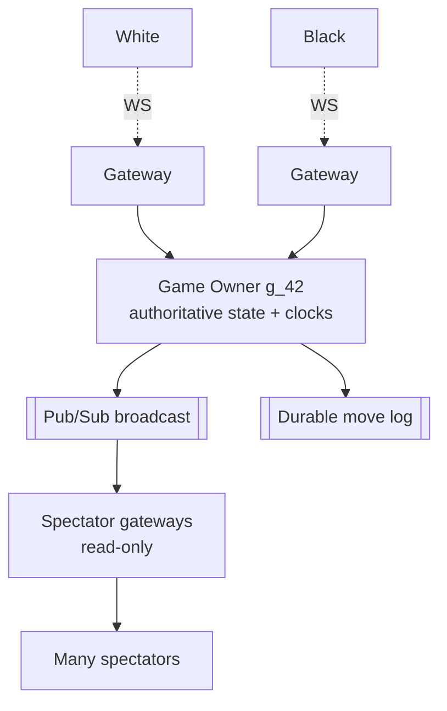

**One-liner:** *"Each game has a single authoritative owner node (sharded by `game_id`), so moves serialize without consensus. State lives server-side, so reconnects just re-fetch FEN + clocks and resume; the clock keeps running through disconnects with a grace indicator. Spectators are read-only pub/sub subscribers, and hot games fan out through a broadcast tier."*

---

## 12. Game end & rating updates (focus area)

### End conditions
| Reason | Detected by | Result |
|---|---|---|
| **Checkmate** | rules engine | mover wins |
| **Resignation** | player action | opponent wins |
| **Timeout (flag)** | clock manager | flagged player loses (draw if opponent has insufficient material) |
| **Stalemate** | rules engine | draw |
| **Threefold repetition / 50-move** | position history / halfmove clock | draw (claimable/automatic) |
| **Insufficient material** | rules engine | draw |
| **Draw agreement** | offer + accept | draw |
| **Abort / abandonment** | no first move / long disconnect | no result, usually unrated |

### Rating update (Glicko-2 preferred; Elo as the simple story)
On completion, the **Result & Rating Service** computes both deltas **atomically**:
- **Elo (say this first, it's simple):** expected score `E_A = 1 / (1 + 10^((R_B − R_A)/400))`; new `R_A' = R_A + K·(S_A − E_A)` with `S ∈ {1, 0.5, 0}`. `K` larger for provisional players.
- **Glicko-2 (production):** tracks rating **+ deviation (RD) + volatility**; uncertain/inactive players move more, confident players move less — better than Elo for confidence and inactivity. Ratings are **per time-control category**.
- Update **both players in one transaction** (they must move together); write a **rating-history** row for auditing/graphs. Only **rated** games count (casual/abort don't).

**One-liner:** *"The engine or clock reports the end; the Result service updates both players' **per-category** ratings atomically — Elo `R += K·(S − E)` as the simple model, **Glicko-2** in production for confidence/volatility — then the game is archived as PGN."*

---

## 13. Persistence & replay (focus area)

Two very different durability needs: **surviving a crash mid-game** vs **archiving finished games**.

### Live durability (don't lose a game in progress)
- The authoritative state is in memory (fast), but every accepted move is **appended to a durable move log** (event store) keyed by `game_id`, with the post-move clocks.
- If the owner node crashes, a new owner **replays the move log** to rebuild the exact position + clocks and resumes. (The log **is** the source of truth; the in-memory board is a cache.)

### Finished-game archive (for later viewing)
- On end, write a single immutable record: **metadata** (players, ratings, time control, result, timestamps) + the **move list as PGN** (with clock annotations) + final FEN.
- **PGN** is the portable standard — compact, human-readable, replayable in any viewer:
  ```
  [White "Ada"] [Black "Mia"] [Result "0-1"] [TimeControl "300+3"]
  1. e4 e5 2. Nf3 Nc6 3. Bb5 a6 ... 0-1
  ```
- Serve replays from a **cache/CDN** (finished games are immutable ⇒ perfectly cacheable). A replay is just "step through the moves," reconstructing each position client-side.

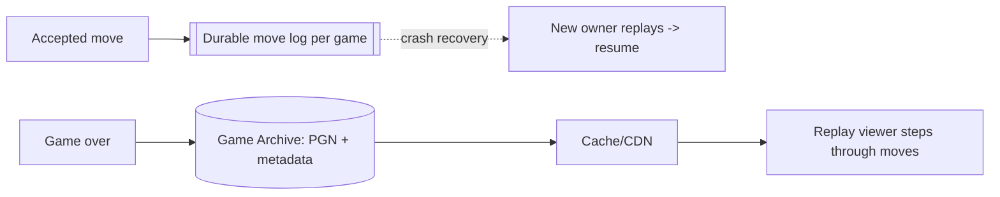

**One-liner:** *"Every move is appended to a durable per-game log, so a crashed game is rebuilt by replay — the log is the truth, memory is the cache. On end, the game is frozen as **PGN + metadata** in an append-only archive and served immutably from a CDN for replay."*

---

## 14. Storage choices

| Data | Store | Why |
|---|---|---|
| **Live game state + clocks** | In-memory on the game owner (+ Redis backup) | Microsecond move application; single-writer authority |
| **Move log / event store** | Append-only log (Kafka / durable log / fast KV by `game_id`) | Crash recovery by replay; ordered by `ply` |
| **Matchmaking pools** | Redis sorted sets (by rating, per time control) | Range queries for nearest-rated opponent; ephemeral |
| **Connection routing** | Redis (`game_id → owner`, `player → gateway`) | Fast routing + cheap failover |
| **Finished games (PGN)** | Object store / wide-column, partition by `game_id` or `player_id` | Massive append-only volume; immutable; replay reads |
| **Players & ratings** | Relational (Postgres) | Transactions for atomic dual-rating updates + history |
| **Rating history** | Relational / time-series | Graphs, auditing |
| **Replay delivery** | CDN / cache | Immutable finished games ⇒ edge-cacheable |
| **Anti-cheat features** | Analytics store (async from move log) | Off the hot path |

**Live vs archived** is the key split: **hot, tiny, in-memory** while playing (backed by a replayable log); **cold, immutable, cheap** once finished (PGN in an archive + CDN).

---

## 15. Scalability considerations

- **Game-server tier scales by game count** — each game is a few KB and CPU-light; a node hosts **tens of thousands of games**. Shard by `game_id` (consistent hashing); rebalance as load grows.
- **Connection tier scales independently** — ~100k WebSockets/node behind an L4/L7 LB; routing via Redis so any gateway can serve any player (cheap failover).
- **Matchmaking shards by time control** (and optionally region) — each pool is independent; hot pools (blitz) get more workers.
- **Stateless supporting services** — matchmaking pairing, rating, archive are horizontally scalable; durable state lives in Redis/log/DB.
- **Hot games (spectators)** — broadcast tier + cached game state fan out to many watchers without touching the player path.
- **Multi-region** — regional game servers + gateways for low RTT; **pair players by region** first; a game's owner lives in one region (both players routed there); archives replicate globally.
- **Graceful degradation** — under load, shed non-critical (spectator streams, presence) before player moves; the clock and move path are sacred.

---

## 16. Failure scenarios — *"what if X fails?"*

| Failure | Impact | Mitigation |
|---|---|---|
| **Player disconnects** | Can't see/make moves | State is server-side; reconnect re-fetches FEN + clocks; **clock keeps running** + grace indicator; auto-abort if no first move |
| **Game-owner node dies** | Live games on it stall | New owner **replays the move log** to rebuild exact state + clocks and resumes; routing updated in Redis |
| **Gateway node dies** | Its connections drop | Clients reconnect to another gateway (routing via Redis) and resume |
| **Move lost / retried** | Duplicate/stale submit | Idempotent on `(game_id, ply)`: re-applying the same ply is a no-op; wrong ply rejected |
| **Clock race at the buzzer** | Mis-flag risk | **Single-writer owner** orders "move vs timer" deterministically; lag credit (capped) for fairness |
| **Client clock drift** | Displayed time wrong | Authoritative `clock` snapshots; client interpolates but snaps to server |
| **Rating update fails** | Inconsistent ratings | Atomic dual-update transaction; retry from the persisted result (idempotent by `game_id`) |
| **Archive write fails** | Game not saved | Move log is already durable → re-derive and retry the PGN archive |
| **Cheating (engine use)** | Unfair games | Structural legality always enforced; async statistical detection flags accounts |
| **Region outage** | Games unreachable | Owner + both players re-homed on reconnect; replay log to resume; archives replicated |

**Guiding principle:** the **durable move log is the source of truth** (rebuild any live game), the **single-writer owner** makes move/clock ordering deterministic, and **idempotency on `(game_id, ply)`** heals retries. Correctness of state and time is non-negotiable; spectators/presence are best-effort.

---

## 17. Trade-off analysis (the money section)

| Axis | Choice A | Choice B | Guidance |
|---|---|---|---|
| **Authority** | Trust client moves/clock (fast, cheating) | **Server-authoritative** legality + time | Server authority — always ✅ |
| **Clock truth** | Client-timed (unfair, hackable) | **Server-timed + lag credit** | Server clock; measure lag, credit capped ✅ |
| **Game state** | Distributed/replicated per move (consensus) | **Single-writer owner in memory** + replayable log | Single owner — no per-move consensus ✅ |
| **Matchmaking** | Greedy instant (sub-optimal) | Batch optimal (slower) | **Hybrid**: greedy, fall back to batch tick |
| **Rating** | Elo (simple) | **Glicko-2** (confidence/volatility) | Glicko-2 in production; Elo to explain |
| **Move ordering** | Sequencer/consensus (chat-style) | **`ply` from single writer** | Turn-based ⇒ ply is free ordering ✅ |
| **Persistence** | Snapshot state periodically | **Event-sourced move log** | Log = truth + crash recovery + PGN ✅ |
| **Disconnect** | Pause clock (exploitable) | **Keep clock running** + grace | Keep running; grace indicator |
| **Spectators** | Push through player path | **Separate pub/sub broadcast tier** | Isolate hot games from player latency |

**CAP framing:** each game is a **CP island** — one authoritative owner serializes moves and time (consistency + correctness over availability *for that game*), rebuildable from a durable log after failover. Matchmaking, spectating, and presence lean **AP** (stay available, reconcile). Acked/rated results are **durable, non-negotiable**.

**One-liner to say out loud:** *"Players queue by time control and are **paired by rating** with a window that widens over time. Each game gets a **single authoritative owner** that validates every move with a rules engine and owns the clock — deducting `t_recv − turn_started` and arming a flag timer, with **capped lag credit** so nobody is flagged for their connection. Moves are ordered for free by **`ply`** (single writer), every move is appended to a **durable log** (so a crashed game is replayed and resumed), and on end both **Glicko-2 ratings update atomically** and the game is frozen as **PGN** in an immutable, CDN-served archive. Clients are optimistic views that roll back on rejection and snap to authoritative clock snapshots."*

---

## 18. Full system design (detailed)

End-to-end, split into **(A)** matchmaking, **(B)** the live move/clock loop, and **(C)** end/persist/rate + replay.

### 18A. Matchmaking → game creation
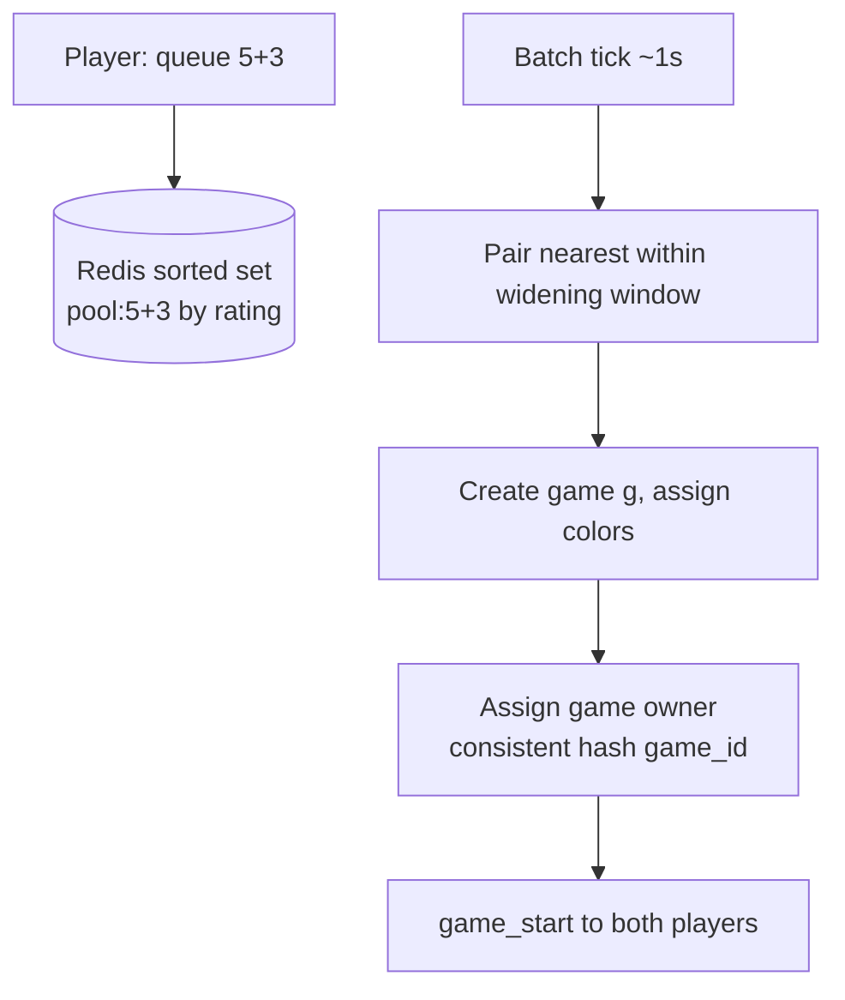

### 18B. Live move & clock loop
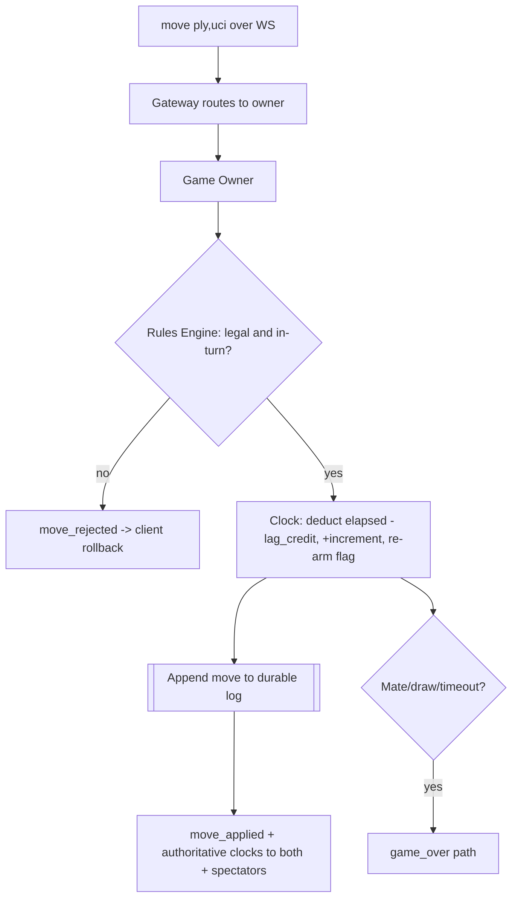

### 18C. End → persist → rate → replay
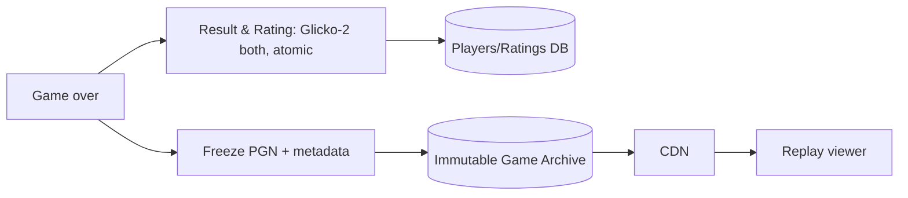

---

## 19. Networking, security & performance best practices

### Networking
- **Persistent WebSocket per player** with ping/pong heartbeats (also the **lag measurement**), auto-reconnect with backoff + jitter.
- **Independent gateway tier** (~100k conns/node) behind an L4/L7 LB; **routing via Redis** (`game_id → owner`, `player → gateway`) for cheap failover.
- **TLS at the edge**; **HTTP/3 / QUIC** for mobile resilience; **gRPC** internal; both players of a game routed to the **same owner** (and, multi-region, the same region).

### Security & fairness
- **AuthN/Z** on connect and per action (only the two seated players can move/resign; spectators are read-only).
- **Server-authoritative legality** blocks illegal-move exploits; **rate-limit** move spam and queue abuse.
- **Anti-cheat**: async statistical **engine-detection** (accuracy/timing) on the move log; flag & review — never trust client "analysis."
- **Abuse**: sandbag/boost detection via rating anomalies; fair-play bans; audit result-affecting events.

### Performance
- **In-memory authoritative state** + microsecond validation ⇒ sub-ms server processing per move.
- **Single-writer owner** ⇒ no locks/consensus on the hot path; `ply` ordering for free.
- **Authoritative clock snapshots + client interpolation** ⇒ exact-feeling clocks without chatty updates.
- **Immutable finished games** ⇒ CDN-cacheable replays; **hot games** fan out via a broadcast tier.

---

## 20. Staying current — modern & emerging approaches

- **Reference systems:** **Lichess** (open-source; Scala, **Glicko-2**, actor-per-game, lag compensation) and **Chess.com**.
- **Ratings:** **Glicko-2** / TrueSkill over classic Elo for confidence + inactivity handling.
- **Transport:** WebSocket, **HTTP/3/QUIC**, gRPC streaming; actor models (Akka/Erlang/Elixir) for per-game ownership.
- **State:** event-sourced move logs (the game **is** its move list); Redis for pools/routing; object store + CDN for PGN.
- **Anti-cheat:** ML/statistical engine-move detection, timing analysis, centipawn-loss profiling.
- **Patterns:** **sharded actors** (one owner per game), **event sourcing**, **optimistic client + server reconciliation**, **lag compensation** (borrowed from real-time gaming/netcode).
- **How I stay current:** the Lichess engineering blog & open-source repo, real-time game netcode talks, distributed-systems and rating-theory papers.

---

## 21. Likely follow-up questions (rehearse these)
- **How do you decide who flagged first under lag?** *(server-authoritative clock, `t_recv − turn_started`, capped lag credit; single-writer owner orders move-vs-timer deterministically)*
- **How do you stop illegal-move cheating?** *(server-side rules engine validates every move; client is just a view)*
- **A player disconnects mid-game — what happens?** *(state is server-side; reconnect re-fetches FEN + clocks; clock keeps running with a grace indicator)*
- **The game server crashes — is the game lost?** *(no — replay the durable move log to rebuild exact state + clocks and resume)*
- **How do you match players fast but fairly?** *(rating-sorted pools per time control; window widens with wait; wider for provisional/high-RD)*
- **Elo vs Glicko-2?** *(Elo `R += K(S−E)` simple; Glicko-2 adds deviation + volatility → better confidence/inactivity)*
- **How is move ordering guaranteed?** *(strictly turn-based; single-writer owner increments `ply`; no sequencer needed)*
- **Timeout but the opponent only has a king?** *(insufficient material ⇒ draw, not a loss)*
- **Handling thousands of spectators on a top game?** *(broadcast tier + cached state, isolated from the player path)*

---

## 22. Summary checklist (whiteboard recap)

- **Entities** — players (+ per-category rating/RD), games, moves (ordered by **`ply`**), in-memory state + clocks; PGN archive.
- **Transport** — WebSocket for moves/clocks; REST for queue/history/replay; moves idempotent on `(game_id, ply)`.
- **Matchmaking** — Redis rating-sorted pools **per time control**; **window widens with wait**; wider for provisional; pair by region.
- **Move validation** — **server-authoritative** rules engine (legality, check/mate, stalemate, threefold, 50-move, insufficient material); client optimistic + rollback.
- **Clock** — **server owns time**; deduct `t_recv − turn_started`, add increment, arm flag timer; **timeout ⇒ loss (draw if insufficient material)**; **capped lag credit**; snapshots + client interpolation.
- **Session** — **one authoritative owner per game** (sharded by `game_id`, single-writer ⇒ free ordering); reconnection re-fetches state; spectators via pub/sub.
- **End & rating** — engine/clock detect end; **Glicko-2** (or Elo) update **both players atomically**.
- **Persistence** — every move appended to a **durable log** (crash recovery by replay); finished game frozen as **PGN + metadata**, served immutably via CDN.
- **Scale** — game tier by game count (tens of k/node), connection tier ~100k WS/node, matchmaking sharded by time control, multi-region pairing.
- **CAP** — each game is a **CP island** (single-writer owner, replayable log); matchmaking/spectating/presence lean AP; rated results durable and non-negotiable.
