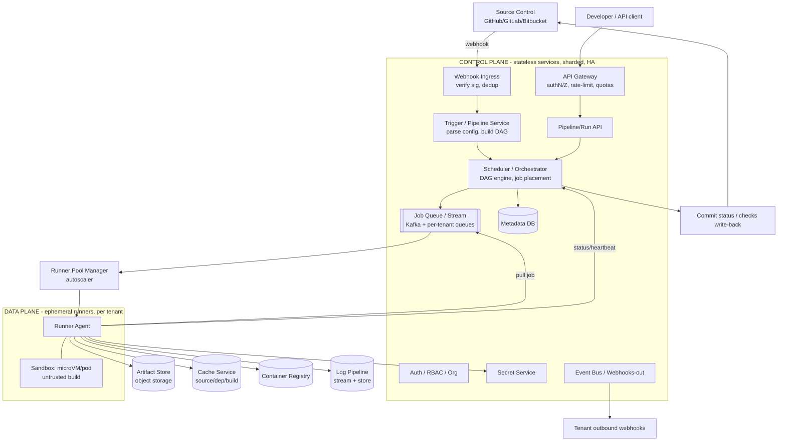
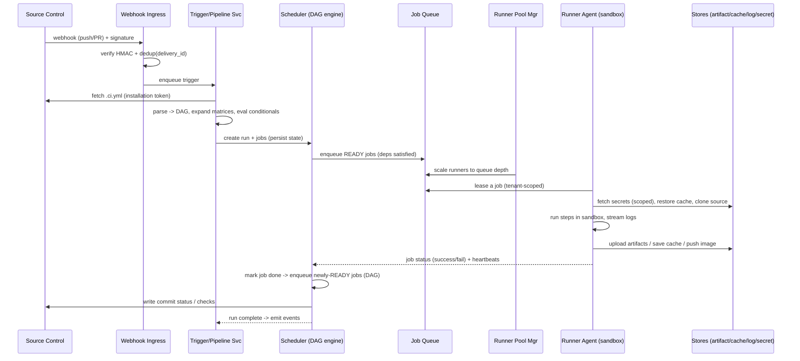
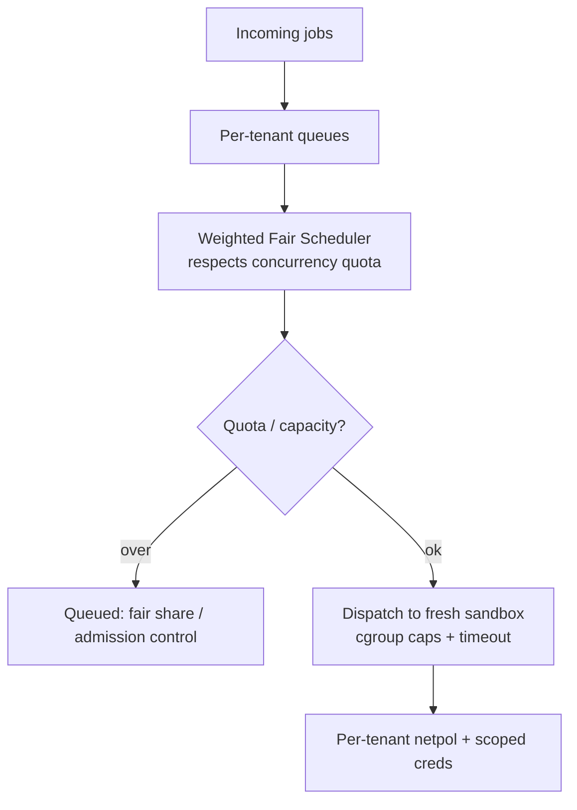
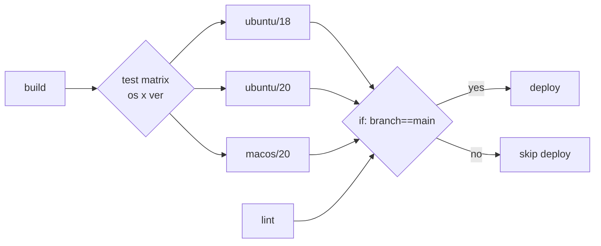
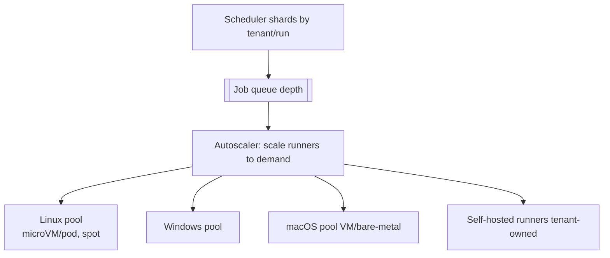
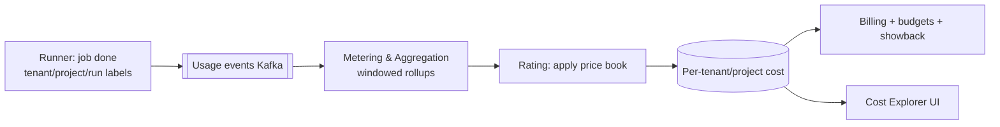

# Designing a Multi-Tenant CI/CD Platform (Cloud-Native)

> A complete, interview-ready walkthrough: requirements → estimates → architecture/components → **multi-tenancy & security → execution semantics → scaling → billing → observability/compliance** → trade-offs → rollout plan. Use the headings as your whiteboard agenda. The hard parts are **strong tenant isolation while running untrusted build code, fair scheduling, and correct DAG execution semantics** — spend your time there.

> Think GitHub Actions / GitLab CI / CircleCI / Buildkite. Tenants connect their repos; pushes/PRs trigger pipelines that run as DAGs of jobs on ephemeral runners; artifacts, caches, and logs flow back — all isolated per tenant, metered per tenant, and scaled elastically.

---

## 0. How to drive the interview (talk track)

1. **Clarify** functional + non-functional requirements and assumptions.
2. **Estimate** scale (tenants, builds/day, concurrent jobs, runner fleet, storage).
3. **Split control plane vs data plane (runners)** — the key architectural cut.
4. **Walk the trigger→schedule→execute→report flow.**
5. **Pick the isolation boundary** for untrusted build code (the security core).
6. **Define execution semantics**: DAG, conditionals, matrices, retries, timeouts, cancel, idempotency.
7. **Scale**: autoscale runners, shard the scheduler/control plane, multi-region.
8. **Meter & bill** per tenant; **observe & comply**; **trade-offs**; **rollout plan**.

Keep saying *"here's the trade-off…"* — that's what's being graded.

---

## 1. Problem & motivation

A managed platform where many independent tenants run **continuous integration and delivery** pipelines triggered by source-control events, on a shared elastic fleet, without seeing or harming each other.

**What makes it hard:**
- **Untrusted code execution** — a build runs arbitrary tenant code (`make`, `npm`, Docker builds). Multi-tenant on shared infra → must isolate like a hostile workload.
- **Bursty, spiky load** — a monorepo push or a "merge train" can spawn thousands of jobs in seconds; nights/weekends idle. Elastic from zero.
- **Heterogeneous jobs** — seconds-long lint to hour-long integration suites; Linux default, plus Windows/macOS pools.
- **Stateful-ish caching** — dependency/build caches make or break build speed but must stay tenant-scoped.
- **Correctness under failure** — webhooks retry, runners die mid-job, networks flake → need idempotency, retries, and exactly-one logical run per trigger.
- **Fairness** — one tenant's 5,000-job burst must not starve everyone else (noisy neighbor).

The central cut: a **durable, sharded control plane** (orchestration, state, APIs) vs an **ephemeral, elastic data plane** (runners that execute untrusted jobs in disposable sandboxes).

---

## 2. Requirements

### Functional
- **Integrate with source control** (GitHub/GitLab/Bitbucket): OAuth/Apps, **webhooks**, repo read/clone, commit-status/checks write-back.
- **Trigger pipelines** on push/PR/tag/schedule/manual/API.
- **Execute pipelines as DAGs** of jobs/steps with conditionals, matrices, dependencies.
- **Runners/agents** execute jobs in isolated environments (Linux default; Windows/macOS pools).
- **Artifacts & images** — store/retrieve build outputs and container images.
- **Caching** — source, dependency, and build caches to speed builds.
- **Secrets** — securely inject tenant secrets into jobs, scoped.
- **Logs** — stream live job logs to the UI; persist them.
- **Retries, timeouts, cancellation, re-runs.**

### Non-functional
- **Strong tenant isolation** (security is primary — untrusted code).
- **Low scheduling latency** — a job starts in seconds (warm), not minutes.
- **High availability** — control plane HA; a runner/host loss doesn't lose pipeline state.
- **Scalable** — 100k+ tenants, millions of jobs/day, tens of thousands of concurrent jobs.
- **Fair** — no noisy-neighbor starvation; per-tenant quotas.
- **Observable & compliant** — logs/metrics/traces, **audit**, retention, DR.
- **Cost-attributable** — per-tenant/project metering and billing.

### Assumptions (state them)
- Managed cloud + Kubernetes available. Linux runners default; Windows/macOS via dedicated pools (often macOS = bare-metal/VM, can't containerize).
- At-least-once webhooks (must dedup). Eventual consistency fine for logs/metrics; **strong** for pipeline state transitions.
- Server-side encryption (not customer-managed E2E unless asked).

### Clarifying questions
- **Tenant trust** — fully untrusted public (OSS forks running on our infra) or enterprise tenants? (Public PRs = the hardest threat model.)
- **Self-hosted runners** — allow tenants to bring their own compute? (Yes — big enterprise need.)
- **Max concurrency / build minutes** per plan tier?
- **Caching guarantees** — best-effort (fine) vs correctness-critical?
- **Multi-region / data residency** requirements?
- **Deployment (CD) scope** — do we also deploy to tenant environments, or stop at build/test/artifact?

---

## 3. Back-of-the-envelope estimation

| Quantity | Assumption | Result |
|---|---|---|
| **Tenants / repos** | — | 100k tenants, ~1M repos |
| **Builds/day** | ~10 pushes/active repo subset | ~10M pipeline runs/day ≈ **~120/sec avg, ~1–2K/sec peak** |
| **Jobs per pipeline** | DAG avg ~8 jobs (matrices inflate) | ~80M jobs/day ≈ **~1K/sec avg, ~10K+/sec peak** |
| **Concurrent jobs** | peak bursts | **~20k–50k concurrent runners** |
| **Avg job** | 2 vCPU, 4–8 GB, ~5 min | 30k × 2 = **~60k vCPU** live at peak |
| **Runner host packing** | 32 vCPU hosts, ~8 jobs each | **~few thousand hosts** at peak (scale to ~0 off-peak) |
| **Log volume** | ~1 MB/job | ~80 TB/day logs (hot→cold tiered) |
| **Artifacts/cache** | ~100 MB/build avg | tens of PB; cache hit-rate is the speed lever |
| **Webhook ingress** | every SCM event | **~thousands/sec peak**, must dedup |

**Takeaways that drive the design:**
1. **10k+ jobs/sec peak, untrusted** → ephemeral sandboxed runners + warm pools; isolation is non-negotiable.
2. **Spiky 0→huge** → autoscale-from-zero; queue + fair scheduler absorb bursts.
3. **Tens of PB artifacts/cache** → object storage + CDN; per-tenant scoping + GC.
4. **At-least-once webhooks** → idempotency/dedup at ingress.

---

## 4. Architecture & key components



### Component responsibilities & choices

| Component | Responsibility | Choice / notes |
|---|---|---|
| **Source-control integration** | OAuth/**App** install, webhook receipt, clone/mirror, status write-back | Use a **GitHub/GitLab App** (fine-grained, per-install tokens) not a personal token; short-lived installation tokens to clone |
| **Webhook ingress** | Verify HMAC signature, **dedup** (delivery id), enqueue | At-least-once → idempotency key = delivery id / `(repo, sha, event)` |
| **Trigger/Pipeline service** | Fetch pipeline config (`.ci.yml`), parse → **DAG**, expand matrices | Config-as-code in the repo; validate + version |
| **Scheduler/Orchestrator** | Walk the DAG, decide ready jobs, place on runners, track state | The brain; **sharded by tenant/run**; durable state machine |
| **Job queue/stream** | Decouple schedule↔execute, absorb bursts, fair dispatch | **Kafka** (durable log) + per-tenant logical queues for fairness |
| **Runner Pool Manager** | Autoscale runners, manage warm pools & OS pools | K8s + cluster-autoscaler / Karpenter; pools per OS/size/tenant-class |
| **Runner agent** | Pull job, set up sandbox, run steps, stream logs, upload artifacts | Stateless; **dials out**; least-privileged |
| **Artifact & image storage** | Build outputs + container images | **Object store** (S3) + CDN; **OCI registry** for images; per-tenant prefixes |
| **Secret management** | Store + inject tenant secrets, scoped | Vault/KMS; **short-lived**, scoped per repo/env; never in logs/images |
| **Cache service** | Source mirror, dependency cache, build cache | Object store + CDN; tenant-scoped keys; restore/save steps |
| **Metadata DB** | Tenants, repos, pipelines, runs, jobs, RBAC, quotas | Postgres (HA, sharded); strong consistency for state transitions |
| **APIs / eventing** | External REST + webhooks, internal gRPC, outbound events | REST/GraphQL external; **gRPC** internal; outbound webhooks + event bus |

### Control plane vs data plane (the key cut)
- **Control plane** — durable, HA, **sharded** services holding *pipeline state* (runs, jobs, DAG progress) in Postgres; schedules and reconciles. Survives runner churn.
- **Data plane** — **ephemeral runners** that execute untrusted jobs in disposable sandboxes, **pull** work from the queue, **dial out** (no inbound), and report status. Cattle: a runner dies → reschedule the job.
- **Logs/artifacts bypass the control plane** — they flow runner → log pipeline / object store directly, so the orchestrator isn't a data bottleneck.

### Internal & external APIs (REST / gRPC / webhooks / eventing)
```http
# External REST (tenant-facing)
POST /v1/repos/{id}/pipelines:run        {ref, inputs}        → {run_id}
GET  /v1/runs/{run_id}                    → {status, jobs[], dag}
POST /v1/runs/{run_id}:cancel
GET  /v1/runs/{run_id}/jobs/{jid}/logs?follow=true            # live log stream (SSE/WS)
POST /v1/webhooks (inbound from SCM)      # signature-verified
```
- **Internal: gRPC** between control-plane services and **agent↔scheduler** (lease, heartbeat, status) — typed, low-latency, streaming for logs.
- **Eventing**: every state change (`run.started`, `job.failed`, `run.succeeded`) publishes to an **event bus**; tenants subscribe via **outbound webhooks**; internal consumers drive notifications, metering, and the UI.

---

## 5. Data flow: trigger → schedule → execute → report



**Key points:**
1. **Verify + dedup at ingress** — HMAC signature (authenticity) + delivery-id dedup (at-least-once → exactly-one run).
2. **Config-as-code** — pipeline defined in the repo; parsed into a DAG; **matrices expanded**, **conditionals evaluated** at plan time (and per-job at runtime for dynamic ones).
3. **Persist run/job state before dispatch** — durable state machine; a control-plane restart resumes the DAG.
4. **Lease-based dispatch** — runners *pull* and **lease** jobs (visibility timeout); if a runner dies, the lease expires and the job is redelivered (with idempotency to avoid double-effect).
5. **DAG progression** — finishing a job unlocks dependents; the scheduler enqueues newly-ready jobs until the DAG completes.
6. **Status write-back** — commit statuses/checks update the PR; events fire to tenant webhooks.

---

## 6. Multi-tenancy & security (focus area — the core)

We run **untrusted tenant code** (including public-PR forks) on shared infra. Isolation is the product's foundation.

### 6.1 Tenant isolation

**Compute isolation — pick the boundary by threat model:**

| Boundary | Isolation | Startup | Density | Use |
|---|---|---|---|---|
| **Container/K8s pod** (namespaces/cgroups) | Shared kernel — **weak** for untrusted | ~ms | High | Trusted/enterprise tenants |
| **gVisor** (userspace kernel) | Medium-strong | ~tens ms | High | Hardened pods |
| **microVM (Firecracker/Kata)** ✅ | **Own kernel — strong** | ~125 ms | High | **Untrusted / public PRs** |
| **Dedicated VM/host pool** | Strongest | ~slow | Low | High-security / Windows/macOS |

**Recommendation:** **one job = one fresh, ephemeral sandbox**, destroyed after the job (no reuse → no state leakage between tenants). Use **microVMs** for untrusted/public workloads; pods (optionally gVisor-hardened) for trusted enterprise tenants; dedicated VM pools for Windows/macOS and high-security tiers.

**Network & data isolation:**
- **Per-tenant network policy** — default-deny egress + allowlist; **block the cloud metadata endpoint** (169.254.169.254) so jobs can't steal node IAM creds (SSRF); per-tenant subnets/namespaces; jobs can't reach each other.
- **Per-tenant data scoping** — artifacts/caches/logs keyed by `tenant_id` with **per-tenant encryption keys** (KMS); object-store IAM scoped so a job's credentials can only touch its tenant's prefix.
- **Per-tenant runner groups** — dedicated pools for tenants who require it (and for self-hosted runners they own).
- **K8s namespaces per tenant** (or vCluster) for control-plane-side resources, with NetworkPolicies + ResourceQuotas.

### 6.2 RBAC, role scopes & secret scoping
- **Hierarchy**: Org → Project/Repo → Pipeline; **roles** (Owner/Admin/Maintainer/Developer/Viewer) with scoped permissions (run pipeline, manage secrets, approve deploy, view logs).
- Enforced at the API gateway on **every** call and at **job dispatch** (can this pipeline use this runner group / this secret?).
- **Secret scoping** — secrets bound to a scope (org / repo / environment); a job only gets secrets for **its** scope, injected as **short-lived** env/files in the sandbox, **masked in logs**, never persisted to artifacts/images. **Protected/production secrets** gated by environment approvals and **not exposed to fork PRs** (the classic supply-chain attack — untrusted PR exfiltrating prod secrets).

### 6.3 Rate limiting & quotas
- **API rate limits** per tenant/token (gateway).
- **Concurrency quotas** — max concurrent jobs per tenant/plan (the main fairness lever).
- **Storage quotas** — artifact/cache GB per tenant; **build-minutes** budget per tier.
- **Enforced transactionally** (atomic reserve) at dispatch so two bursts can't both exceed the cap.

### 6.4 Noisy-neighbor protection (fair scheduling)
- **Per-tenant queues + weighted fair queuing** — round-robin/WFQ across tenants so one tenant's 5,000-job burst can't monopolize runners; each tenant gets a fair share, bursts drain as capacity frees.
- **Resource limits per job** — cgroup CPU/mem/PID/IO caps; hard timeouts; OOM-kills the job, not the host.
- **Admission control** — queue beyond quota; surface "queued (concurrency limit)".
- **Isolation of the build cache** so a poisoned/huge cache from one tenant can't affect others.



**One-liner:** *"One job runs in one **fresh microVM** with default-deny egress (metadata endpoint blocked), tenant-scoped encrypted storage, and short-lived scoped secrets that never reach fork PRs — and a **weighted-fair, per-tenant-quota scheduler** keeps any single tenant's burst from starving the fleet."*

---

## 7. Pipeline execution semantics (focus area)

### 7.1 DAG model, conditionals, matrices
- **DAG of jobs**, each with `needs:`/`depends_on:` edges → topological execution; independent branches run in parallel; a job starts only when **all** dependencies succeed (or per policy).
- **Steps** within a job run sequentially in the same sandbox (share workspace).
- **Conditionals** — `if:` expressions on branch, event, file paths, prior results, or inputs; evaluated at plan time for static gates and at runtime for dynamic ones (skip → mark `skipped`, propagate to dependents).
- **Matrices** — expand a job template over a parameter grid (`os × version`) into N parallel jobs; `fail-fast` cancels siblings on first failure (configurable); `include`/`exclude` to tune the grid.
- **Fan-in/fan-out** — fan-out a matrix, fan-in a "deploy" job that `needs:` all of them.



### 7.2 Retries/backoff, timeouts, cancellations
- **Retries** — per-step/job retry on failure with **exponential backoff + jitter**; distinguish **infra failures** (runner died, spot reclaimed → auto-retry, free) from **user failures** (test failed → don't auto-retry). Cap attempts.
- **Timeouts** — per-step, per-job, per-run wall-clock limits; on expiry, **cancel** (SIGTERM→SIGKILL), mark `timed_out`, free the runner.
- **Cancellations** — user/API cancel, or **superseded** (new push to the same PR auto-cancels the in-flight run — "concurrency group: cancel-in-progress"). Propagate cancel to running sandboxes (signal agent) and dependents (mark `cancelled`).

### 7.3 Idempotency & deduplication
- **Trigger dedup** — webhook delivery id / `(repo, sha, event)` idempotency key → one logical run per trigger despite at-least-once webhooks/retries.
- **Job lease idempotency** — at-least-once dispatch (a redelivered job after a dead runner) must not double-apply side effects: jobs get a **unique attempt id**; artifact/cache/registry writes are **idempotent** (content-addressed or attempt-scoped paths); "publish"/deploy steps guarded by idempotency keys.
- **Exactly-once *effect*, at-least-once *execution*** — the realistic guarantee: a job may *run* more than once (retry), but its observable result is reconciled to one (last-writer/attempt-scoped).
- **Deterministic run id** so UI/API/events refer to one canonical run.

**One-liner:** *"Pipelines are DAGs with matrices and conditionals; infra failures auto-retry with backoff while user failures don't; new pushes supersede in-flight runs; and at-least-once dispatch is made safe with attempt-scoped, content-addressed, idempotent writes so a re-run never double-publishes."*

---

## 8. Scaling (focus area)

### 8.1 Autoscaling runners/agents
- **Scale-to-zero + warm pools** — keep a small buffer of pre-booted runners per OS/size for fast starts; autoscale the rest on **queue depth** (jobs waiting) and per-pool utilization.
- **K8s cluster-autoscaler / Karpenter** (or cloud ASGs) provision nodes; bin-pack jobs; **spot/preemptible** for cheap, retry-safe jobs (infra-retry covers reclaim), on-demand for critical/long jobs.
- **OS pools** — separate autoscaled pools for Linux (containers/microVMs), Windows, macOS (VM/bare-metal, slower to provision → larger warm buffer).
- **Self-hosted runners** — tenants register their own agents (dial-out, labeled); the scheduler routes labeled jobs to them; tenant owns that capacity/cost.

### 8.2 Horizontal scaling & sharding of control plane + scheduler
- **Stateless services** scale horizontally behind LBs.
- **Shard the scheduler by tenant/run** (consistent hashing) so each shard owns a subset of runs → no global lock; the DAG engine for a run lives on one shard (ownership + failover).
- **Queue partitioned by tenant** for fairness + parallelism.
- **Metadata DB** sharded by `tenant_id`; read replicas for UI/API reads; strong consistency on the write path for state transitions.
- **Idempotent, lease-based** job handling so any scheduler replica can recover an orphaned run.

### 8.3 Multi-region
- **Regional control planes + runner fleets**; route a tenant/repo to a **home region** (data residency, latency).
- **Webhook ingress is global/anycast**, forwards to the repo's home region.
- **Artifacts/caches regional** with cross-region replication for DR; registry geo-replicated.
- **Self-hosted runners** can pin builds to a tenant's own region/VPC.
- Keep a run **within one region** (DAG locality) to avoid cross-region chatter; replicate only state needed for failover.



---

## 9. Cost tracking & billing per tenant (focus area)

**Meter everything a job consumes, attribute to tenant/project, aggregate, bill.**

- **Meters (emitted as usage events):**
  - **Compute** — runner **vCPU·seconds, GB·seconds, GPU·seconds**, by OS/instance type (macOS/Windows priced higher).
  - **Build minutes** — wall-clock per job × a multiplier per runner class.
  - **Storage** — artifact/cache **GB·month**, registry storage.
  - **Network egress** — artifact/log/image download bytes.
  - **API/requests** — if metered.
- **Attribution** — every job carries `tenant_id`/`project_id`/`pipeline_id`/`run_id`/`attempt_id` labels; the agent emits a usage event on job completion (and periodically for long jobs) tagged with these → cost attributes precisely down to project/pipeline.
- **Pipeline:**
  ```
  Runner agent → usage events → Kafka → Metering/Aggregation service
              → rated usage (apply price book) → per-tenant rollups (hourly/daily)
              → Billing (invoices, budgets, showback/chargeback) + Cost Explorer UI
  ```
- **Aggregation** — stream-aggregate usage events into per-tenant/per-project counters (windowed); reconcile against cloud bills (the platform's own cost) for margin.
- **Budgets & controls** — per-tenant budgets, alerts, and **hard caps** (stop scheduling when build-minutes/budget exhausted) — also a cost-abuse guard (crypto-mining in CI).
- **Idempotent metering** — usage events keyed by `attempt_id` so retries/redeliveries don't double-bill.



**One-liner:** *"Each job emits idempotent, attempt-keyed usage events tagged with tenant/project/run; a streaming metering pipeline rates them against a price book and rolls them up per tenant for billing, budgets, and hard caps — and we reconcile against our own cloud bill for margin."*

---

## 10. Observability & compliance (focus area)

### Logs, metrics, traces, correlation IDs
- **Logs** — live job logs **streamed** runner → log pipeline → UI (SSE/WebSocket) and persisted (hot store for recent, object store + tiering for old). **Secret-masked**. Separate **system logs** (scheduler/agent) from **user build logs**.
- **Metrics** — queue depth, scheduling latency, runner utilization, job success/failure/retry rates, p50/p99 **time-to-first-byte** (queued→running) and build duration, autoscaler lag → TSDB + SLOs/alerts.
- **Traces** — distributed trace across webhook → trigger → schedule → dispatch → run; find the slow stage.
- **Correlation IDs** — a `run_id` (+ `job_id`, `attempt_id`, `trace_id`, webhook `delivery_id`) propagated through every service, log line, metric, and event → one-click "everything about this run."

### Audit logging & retention
- **Append-only, tamper-evident audit** of security-relevant actions: secret create/access, RBAC/role changes, runner-group changes, pipeline config changes, manual approvals, run cancel/override, login. Per-tenant, queryable, exported to SIEM, with **configurable retention** (compliance: SOC2/ISO/GDPR). PII handling + data-deletion workflows.

### Disaster recovery
- **Backups** — Postgres PITR (point-in-time recovery), cross-region replicas; object store + registry cross-region replication; periodic restore drills.
- **RPO/RTO targets** — e.g., RPO minutes (replicated state), RTO < 1h (stand up control plane in DR region, runners autoscale from zero).
- **Graceful degradation** — if a region fails, fail over the home region; in-flight runs may need re-run (idempotent triggers make that safe); queued work survives in replicated Kafka.

### Zero-downtime deploys & backward-compatible migrations
- **Rolling / blue-green / canary** deploys of control-plane services behind LBs; **drain** runners (finish in-flight jobs, stop leasing new) before node replacement.
- **Expand-contract (backward-compatible) DB migrations** — add columns/tables first (expand), deploy code that writes both/reads new, backfill, then drop old (contract) — never a breaking schema change in one step. **Versioned APIs** + **versioned agent protocol** (new control plane supports old agents during rollout). Feature-flag risky changes.

---

## 11. Trade-offs (focus area — the money section)

### Shared vs dedicated runner pools
| | **Shared pool** | **Dedicated pool (per tenant/group)** |
|---|---|---|
| Cost / utilization | ✅ High (bin-packed, scale-to-zero) | ❌ Lower (idle reserved capacity) |
| Isolation | ◑ Relies on sandbox boundary | ✅ Physical/pool separation |
| Noisy neighbor | ◑ Needs fair scheduling | ✅ None (tenant owns the pool) |
| Compliance | ◑ Harder to argue | ✅ Easy (dedicated, even single-tenant nodes) |
| Best for | Most tenants, OSS, cost-sensitive | Enterprise, regulated, high-security |

**Guidance:** **shared by default** (microVM isolation + fair scheduling) for cost/utilization; offer **dedicated pools** as a premium/enterprise tier for compliance and predictable performance.

### Managed vs self-hosted agents
| | **Managed (our fleet)** | **Self-hosted (tenant's compute)** |
|---|---|---|
| Ops burden | ✅ We run it | ❌ Tenant runs it |
| Cost model | We meter & bill compute | Tenant pays their own cloud |
| Network access | ◑ Public/our VPC | ✅ Inside tenant VPC (private resources, on-prem) |
| Security/trust | We isolate untrusted code | ✅ Tenant trusts their own; ◑ they own patching |
| Best for | Fast onboarding, most tenants | Private networks, custom hardware (GPU), data residency |

**Guidance:** **managed by default**; **self-hosted runners** for tenants needing private-network access, special hardware, or strict data residency — they register dial-out agents we route labeled jobs to.

**One-liner to say out loud:** *"I'd split a **sharded, HA control plane** (trigger, DAG scheduler, metadata in Postgres, per-tenant queues on Kafka) from an **ephemeral runner data plane** where **one job runs in one fresh microVM** with default-deny egress and short-lived scoped secrets. **Weighted-fair per-tenant scheduling** kills noisy neighbors, **autoscale-from-zero + warm pools** handle spiky load, **idempotent attempt-scoped writes** make at-least-once dispatch safe, and **per-job usage events** drive tenant billing. Shared pools by default for cost, dedicated/self-hosted for enterprise isolation and private networks."*

---

## 12. Deployment plan (phased rollout, validation & guardrails)

| Phase | Scope | Validation & guardrails |
|---|---|---|
| **0. Foundations** | Multi-tenant data model, authN/Z, metadata DB, API skeleton, IaC | Threat model review; tenancy isolation tests; everything behind feature flags |
| **1. Core CI (private beta)** | SCM App + webhooks, DAG scheduler, **Linux microVM runners**, logs, artifacts | Internal dogfooding; load-test webhook ingress + scheduler; **isolation pentest** (try to escape sandbox / read another tenant) before any external code |
| **2. Caching + secrets + matrices** | Dependency/build cache, secret service, matrices/conditionals, retries/timeouts/cancel | Correctness suite (DAG edge cases, idempotency, dedup); secret-leak scans; chaos test (kill runners → jobs reschedule, no double-effect) |
| **3. Scale & fairness (GA)** | Autoscaling, per-tenant quotas, **weighted fair scheduling**, rate limits | Soak/burst tests (one tenant 5k jobs ≠ starvation); quota-enforcement tests; SLO dashboards + alerts; gradual tenant onboarding (% rollout) |
| **4. Billing & observability** | Metering pipeline, cost explorer, audit logs, tracing | **Reconcile metered cost vs cloud bill** (±% accuracy gate); audit completeness review; retention policies |
| **5. Multi-OS + dedicated/self-hosted** | Windows/macOS pools, dedicated pools, self-hosted runners | Per-OS isolation validation; self-hosted security guidance; pin-to-region tests |
| **6. Multi-region + DR** | Regional fleets, replication, DR runbooks | **DR game-day** (fail a region, hit RTO/RPO); restore drills; data-residency verification |

**Cross-cutting guardrails:**
- **Feature flags + canary + % rollout** for every phase; instant rollback.
- **Progressive delivery** — new scheduler/agent versions canaried on a small tenant cohort first.
- **Backward-compatible (expand-contract) migrations** and **versioned agent protocol** so rollouts never break in-flight runs.
- **Guardrail metrics** — error rate, scheduling latency, isolation-violation alerts, cost-anomaly detection; auto-halt rollout on breach.
- **Security gates** — isolation pentest before untrusted code; secret-handling review; fork-PR secret policy enforced from day one.

---

## 13. Networking, security & performance best practices

### Networking
- **Webhook ingress**: verify **HMAC signature** + dedup delivery id; **anycast/global** ingress forwarding to the repo's home region.
- **Runners dial out** (no inbound); **self-hosted runners** reach the tenant's private VPC/on-prem.
- **Per-tenant/per-job network policy** — default-deny egress + allowlist; **block the metadata endpoint** (fork-PR credential theft).
- **gRPC** internal + agent↔scheduler; **artifact/log/image uploads go direct** to object store / registry / CDN (not through the control plane).

### Security
- **One job = one fresh microVM** (untrusted), destroyed after — no reuse, no leak.
- **SCM App + short-lived installation tokens** (least privilege); never personal/long-lived tokens.
- **Secret scoping** — only the job's scope, **masked in logs, never to fork PRs**; protected/prod secrets gated by **environment approvals**.
- **Supply-chain security** — **signed images (cosign/Sigstore)**, SBOM, **SLSA provenance**, pinned action versions; **OIDC keyless** auth to cloud (no static secrets).
- **Per-tenant KMS** for artifacts/cache; **tamper-evident audit**.

### Performance
- **Autoscale-from-zero + warm pools**; **spot/preemptible** for retry-safe jobs; bin-packing.
- **Source/dependency/build cache** (CDN-backed) — the single biggest build-speed lever.
- **DAG parallelism** + **weighted-fair per-tenant scheduling**; **layer cache + lazy pull** for images.

---

## 14. Staying current — modern & emerging approaches

- **Reference systems:** GitHub **Actions**, GitLab CI, CircleCI, Buildkite; **Argo Workflows**, **Tekton**, Drone for K8s-native pipelines.
- **Runners:** **Actions Runner Controller (ARC)** on K8s, **Firecracker/Kata** isolation, **Karpenter** autoscaling.
- **Build/cache:** **BuildKit**, **Bazel** remote cache/RBE, sccache, **Nix** for reproducible builds.
- **Supply chain:** **SLSA** framework, **Sigstore/cosign**, in-toto attestations, SBOM (Syft/Trivy), **OIDC** federation (kill static cloud secrets).
- **Artifacts:** OCI images + **OCI artifacts**, Harbor registry.
- **How I stay current:** GitHub/GitLab changelogs, SLSA & Sigstore projects, KubeCon CD talks, the CNCF landscape.

---

## 15. Likely follow-up questions (rehearse these)
- Shared vs dedicated runner pools — the trade-off? *(cost/utilization vs isolation/compliance)*
- How do you stop a fork PR from exfiltrating prod secrets? *(scope secrets, none to forks, env approvals)*
- Runner dies mid-job — double side-effects? *(lease + idempotent, attempt-scoped, content-addressed writes)*
- New push while a build runs — what happens? *(concurrency group: cancel-in-progress / supersede)*
- One tenant fires 5,000 jobs — noisy neighbor? *(per-tenant queue + weighted fair scheduling + quota)*
- Untrusted build stealing node IAM creds? *(microVM + block metadata endpoint + no host creds)*
- At-least-once webhooks — idempotency? *(delivery-id / `(repo, sha, event)` dedup → one run)*
- Accurate per-tenant billing? *(idempotent, attempt-keyed per-job usage events → rating → rollups)*

---

## 16. Summary checklist (whiteboard recap)

- **Control plane vs data plane** — sharded HA orchestrator + ephemeral runners; control plane owns durable DAG state, runners are cattle.
- **SCM integration** — App-based OAuth, signature-verified + deduped webhooks, installation-token clone, status/checks write-back.
- **Isolation** — **one job = one fresh microVM**, default-deny egress (block metadata endpoint), tenant-scoped encrypted storage, short-lived scoped secrets **never exposed to fork PRs**.
- **Fairness** — per-tenant queues + **weighted fair scheduling** + concurrency/storage/API quotas + cgroup caps.
- **Execution semantics** — DAG + matrices + conditionals; infra-retry vs user-fail; timeouts; supersede-on-new-push cancel; **idempotent attempt-scoped** writes for exactly-once *effect*.
- **Scaling** — autoscale-from-zero + warm pools, spot for retry-safe jobs, **scheduler sharded by tenant/run**, DB sharded by tenant, multi-region home-region.
- **Billing** — idempotent per-job **usage events** (vCPU·s, GB·s, minutes, storage, egress) → metering → rating → per-tenant rollups + budgets/hard caps.
- **Observability/compliance** — streamed secret-masked logs, metrics, traces, **`run_id` correlation**, append-only audit + retention, PITR/cross-region **DR**, **expand-contract** migrations + versioned agent protocol for zero-downtime.
- **Trade-offs** — shared pools (cost) vs dedicated (compliance); managed (easy) vs self-hosted (private network/residency).
- **Rollout** — phased: foundations → core CI → cache/secrets → scale/fairness → billing/obs → multi-OS/dedicated → multi-region/DR, gated by isolation pentests, chaos tests, billing reconciliation, and DR game-days, all behind flags + canaries.
