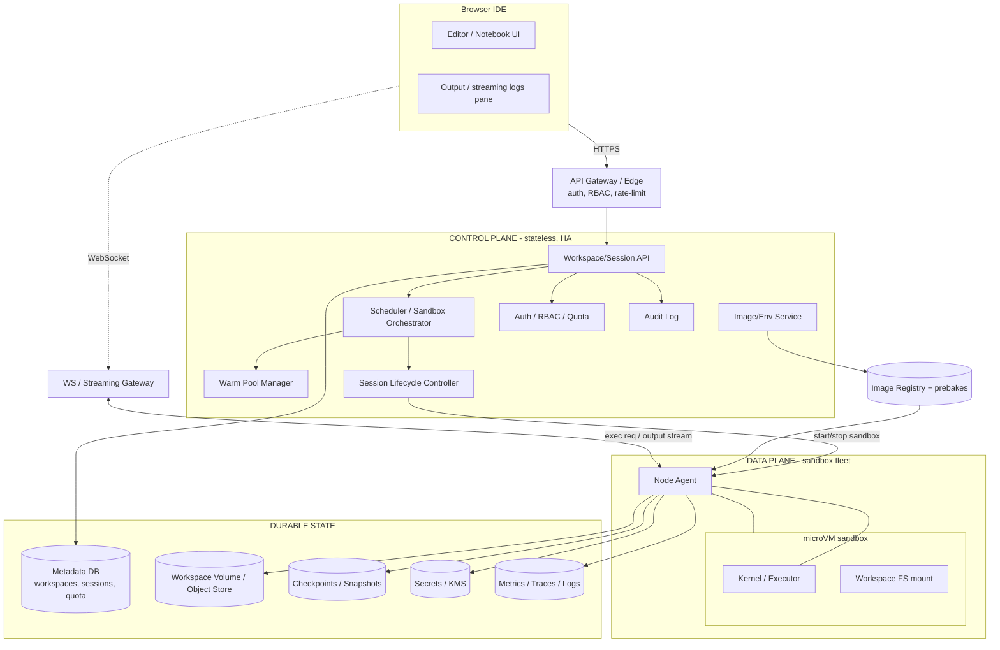
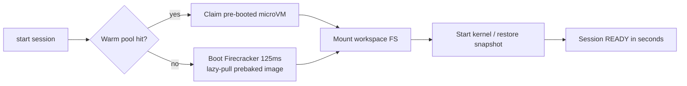
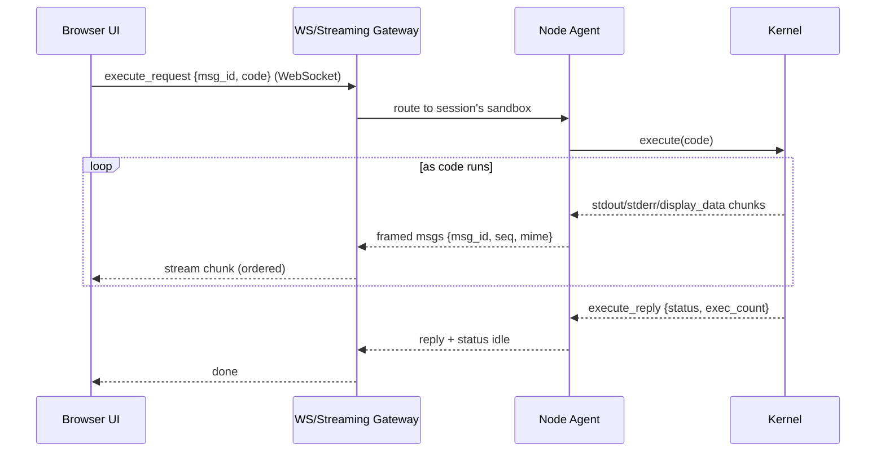
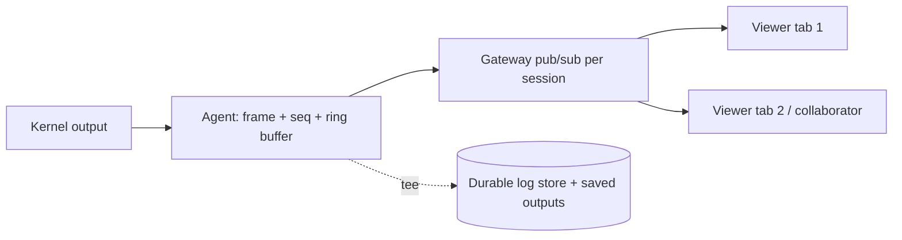
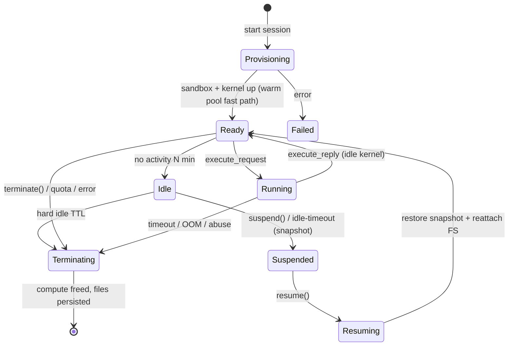
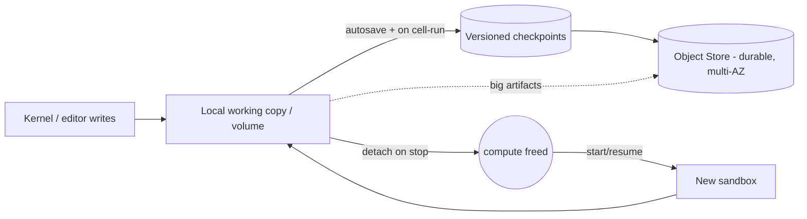
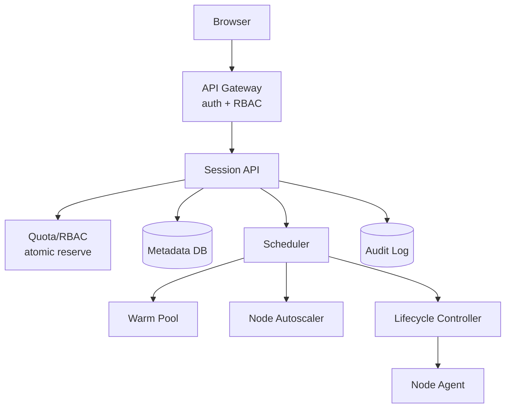
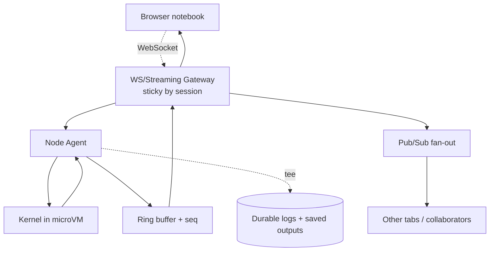
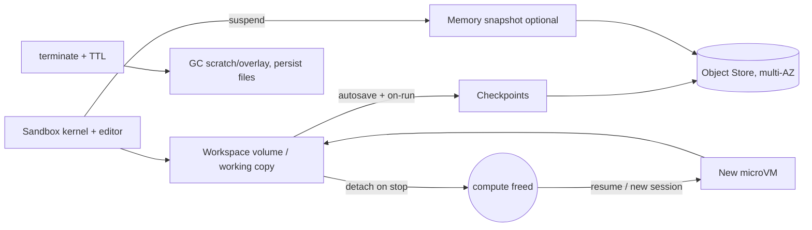

# Designing a Sandboxed Cloud IDE / Notebook (Colab-like)

> A complete, interview-ready walkthrough: assumptions → requirements → estimates → APIs → architecture → **compute substrate, isolation, output streaming, lifecycle, persistence** → failure handling → trade-offs. Use the headings as your whiteboard agenda. **Security (isolation) is primary**, and the signature feature is **near-real-time output/log streaming** of running cells — spend your time there.

> Think Google Colab / Jupyter / Deepnote / Replit / Hex. A browser-based, multi-tenant IDE where a user edits code and **runs cells/commands in an isolated sandbox**, watching stdout/stderr and rich output stream back live.

---

## 0. How to drive the interview (talk track)

1. **State assumptions** + clarify functional/non-functional requirements.
2. **Estimate** scale (users, concurrent sessions, start rate, output throughput).
3. **Split control plane vs data plane**; identify the **kernel/sandbox** as the core unit.
4. **Pick the compute substrate** (VM vs container vs microVM) — security-first.
5. **Define the isolation model**: filesystem, network, process, credentials.
6. **Design the output/log streaming path** (the signature feature).
7. **Define the session lifecycle**: create → run → idle → suspend/resume → terminate.
8. **Persist** workspace files + checkpoints.
9. **Failure + trade-offs.**

Keep saying *"here's the trade-off…"* — that's what's being graded.

---

## 1. Assumptions (state these up front)

- **Workspace = project/notebook**; a **session = one running sandbox** bound to a workspace.
- Code is **untrusted and arbitrary** (`pip install`, network calls, fork bombs, crypto-miners) — adversarial multi-tenant is the threat model.
- **Notebook/REPL model**: a long-lived **kernel** holds in-memory state; cells execute against it and return stdout/stderr + **rich output** (HTML, images, plots, tables).
- **Eventual consistency** is fine for files; **ordering** of streamed output within a cell must be preserved.
- A session is **more ephemeral** than a full dev box — minutes to hours, often idle, frequently recycled. Workspace **files** persist; **kernel memory** generally does not (unless we add suspend/resume).
- Single cloud, multi-region later. Free tier (small, capped) + paid tiers (bigger, GPU).
- Collaboration is **optional** — called out separately in §13.

---

## 2. Requirements

### Functional
- **Provision an isolated compute environment** per workspace/session.
- **Execute arbitrary user code safely** (sandboxed), cell-by-cell or as commands.
- **Stream execution output/logs** (stdout, stderr, rich MIME output) to the browser in **near real time**.
- **File operations**: upload/download, browse, and **persisted workspace state**.
- **Interrupt / restart** the kernel; **install packages**.
- (Optional) **Real-time collaboration** — co-editing + shared kernel.

### Non-functional (the stated priorities)
- **Strong tenant isolation** — *security is primary*. VM-grade boundary.
- **Reasonable startup latency** — new session ready in **a few seconds** (warm), not minutes.
- **Autoscaling + fair resource sharing** — many concurrent sandboxes; no tenant starves others.
- **Observability** — metrics, tracing, **audit logs**.
- **Reliability** — a crashed kernel/host shouldn't lose the user's *files*.

### Clarifying questions to ask the interviewer
- **Isolation bar** — adversarial multi-tenant on shared hosts (→ microVMs) or trusted/dedicated?
- **Session persistence** — must kernel **memory** survive idle/suspend (true resume), or only files?
- **GPU** needed (ML notebooks)? Affects scheduling/pools/cost.
- **Egress policy** — can user code reach the internet (`pip install`, API calls)? Usually yes-but-policed.
- **Max runtime / idle limits**, resource caps per tier?
- **Languages** — Python-first (Jupyter kernels) or polyglot?
- **Collaboration** in scope now or later?

---

## 3. Back-of-the-envelope estimation

| Quantity | Assumption | Result |
|---|---|---|
| **MAU** | — | 5,000,000 |
| **Concurrent sessions** | ~2% online at peak | **~100,000 sandboxes live** |
| **Session starts/day** | ~3 per active user | ~10–15M/day ≈ **~150/sec avg, ~1–2K/sec peak** |
| **Avg session** | 2 vCPU, 4–8 GB | 100k × 2 = **~200k vCPU**, ~600 TB RAM live |
| **Host packing** | 64 vCPU / 256 GB, ~16 small sandboxes/host | **~6,000+ hosts** at peak |
| **Output streaming** | active cells emit logs/plots | bursty KB/s–MB/s per session; **fan to 1+ viewers** |
| **Workspace storage** | ~1–5 GB/workspace, 10M workspaces | **tens of PB** (tiered, mostly cold) |
| **Idle ratio** | most sessions idle between runs | **idle-cull + suspend = top cost lever** |

**Takeaways that drive the design:**
1. **1–2K session starts/sec peak** → cold container/VM boot is too slow → **warm pools + prebaked images**.
2. **100K live sandboxes, adversarial code** → **microVM isolation** + strict resource caps for fair sharing.
3. **Output is bursty and ordered** → a **streaming pipeline** (kernel → broker → WebSocket) with backpressure, not request/response.
4. **Files must persist; memory usually not** → decouple durable **workspace volume/object store** from ephemeral kernels.

---

## 4. Architecture overview — control plane vs data plane



### Why this split (control vs data plane)?
- **Control plane** (stateless, HA): holds *desired state* in a metadata DB, schedules sandboxes, manages warm pools and lifecycle — reconciler/operator pattern. Restart/scale freely without killing running sessions.
- **Data plane**: worker hosts running each sandbox as a **microVM** with a **node agent** that launches kernels, mounts the workspace, and proxies the **exec ↔ output** stream.
- **Streaming bypasses the control plane**: cell-run requests and output flow client ↔ **WS/streaming gateway** ↔ agent ↔ kernel, so live output latency never depends on the orchestrator.

### Core components
- **Workspace/Session API** — CRUD workspaces, start/stop sessions, validate quota/RBAC.
- **Scheduler/Orchestrator** — place sandboxes (bin-pack, GPU/zone affinity), manage **warm pools**, autoscale nodes, enforce **fair-share**.
- **Session Lifecycle Controller** — drives the session **state machine**; reconciles desired vs actual; idle-culls.
- **Node Agent** — per-host daemon: launch/stop microVMs + kernels, mount FS, stream output, enforce cgroup caps, heartbeat.
- **Kernel/Executor** — runs user code (Jupyter kernel for Python, etc.), emits stdout/stderr + rich MIME output.
- **WS/Streaming Gateway** — terminates browser WebSockets, routes messages to the right sandbox, fans out output (and to collaborators).
- **Image/Env Service** — prebaked base images + per-workspace dependency layers.
- **Auth/RBAC/Quota, Audit, Observability** — multi-tenant control surfaces.

---

## 5. API sketch

REST/JSON for control; **WebSocket** for the live exec + output stream (the important one).

```http
# --- Workspaces & files (control) ---
POST   /v1/workspaces                         {name, template}      → {workspace_id}
GET    /v1/workspaces/{id}/files?path=/        → file tree
PUT    /v1/workspaces/{id}/files?path=/a.py    (body = bytes)        # upload/save
GET    /v1/workspaces/{id}/files?path=/a.py    → bytes               # download

# --- Sessions (sandbox lifecycle) ---
POST   /v1/workspaces/{id}/sessions  {resources:{vcpu,mem,gpu}}      → {session_id, ws_url}
GET    /v1/sessions/{sid}                       → {state, host, started_at}
POST   /v1/sessions/{sid}/suspend               # snapshot + free compute
POST   /v1/sessions/{sid}/resume                # restore
DELETE /v1/sessions/{sid}                       # terminate
POST   /v1/sessions/{sid}/interrupt             # SIGINT the kernel
POST   /v1/sessions/{sid}/restart               # fresh kernel, keep files
```

### WebSocket protocol (Jupyter-style message bus)
Client opens `wss://stream/v1/sessions/{sid}` and exchanges typed messages:

```jsonc
// client → server: run a cell
{ "type":"execute_request", "msg_id":"c1", "cell_id":"42", "code":"print(df.head())" }

// server → client: ordered stream for msg_id "c1"
{ "type":"status", "msg_id":"c1", "state":"busy" }
{ "type":"stream", "msg_id":"c1", "name":"stdout", "text":"  a  b\n0 1 2\n", "seq":1 }
{ "type":"display_data", "msg_id":"c1", "mime":"image/png", "data":"<base64>", "seq":2 }
{ "type":"error", "msg_id":"c1", "ename":"ValueError", "evalue":"...", "traceback":[...] }
{ "type":"execute_reply", "msg_id":"c1", "status":"ok", "exec_count":7 }
{ "type":"status", "msg_id":"c1", "state":"idle" }
```

**Design notes:**
- Every output carries `(msg_id, seq)` → the UI **orders** and **associates** output with the right cell, and can **resume** after a reconnect by requesting `seq > last_seen`.
- **Rich output** via MIME bundles (`text/plain`, `text/html`, `image/png`, `application/vnd.*`) → plots, tables, widgets.
- **Interrupt/restart** are control messages, not in-band, so they work even when stdout is flooding.

---

## 6. Compute substrate — VMs vs containers vs microVMs (focus area)

We execute **untrusted, adversarial** code from many tenants on shared hosts. The substrate choice **is** the security decision.

| Substrate | Boundary | Cold start | Density | Security (untrusted) | Verdict |
|---|---|---|---|---|---|
| **Plain container** (ns/cgroups) | **Shared host kernel** | ~ms | Highest | **Weak** — one kernel 0-day = full escape | ❌ not for adversarial multi-tenant |
| **gVisor** (userspace kernel) | Syscall interception | ~tens ms | High | Medium-strong (smaller attack surface, some perf cost) | ◑ good middle ground |
| **Kata / microVM (Firecracker)** ✅ | **Own guest kernel + hypervisor** | ~125 ms | High | **Strong (VM-grade)** | ✅ **recommended** |
| **Full VM** | Hypervisor | ~10s+ | Low | Strong | for GPU/heavy/dedicated |

**Recommendation: microVMs (Firecracker/Kata).** Each sandbox runs in its **own minimal VM with its own kernel** — VM-grade isolation at near-container speed and density. This is precisely why Colab-like products and serverless runtimes (AWS Lambda, Fly.io) use Firecracker. gVisor is an acceptable fallback where microVMs aren't available; **plain containers are not acceptable** for arbitrary untrusted code.

**Managing the substrate:**
- **Warm pools** of pre-booted microVMs per common size/image → claim-and-personalize instead of cold boot (kills startup latency).
- **Prebaked images** (base OS + interpreter + popular libs) cached node-local + regional pull-through; **lazy-pull** layers so the kernel starts before the whole image lands.
- **Snapshot/restore** of a pre-initialized VM (kernel imported, libs warm) → resume in well under a second.
- **Bin-packing + autoscaler** scales nodes with demand; **fair-share scheduler** caps per-tenant footprint.



---

## 7. Isolation model — filesystem, network, process, credentials (focus area)

Defense in depth *around* the microVM (security is primary):

### Filesystem
- **Read-only base image**; user writes land on a **per-session overlay** + the mounted **workspace volume** (only the user's own files).
- No host paths exposed; the guest sees only its rootfs + `/workspace`. Per-tenant **encryption at rest** (tenant-scoped KMS keys).
- **Disk quota** per session (stop a notebook from filling the host); scratch in tmpfs with caps.

### Network
- **Default-deny egress**; allowlist what's needed (e.g., the package mirror). Block the **cloud metadata endpoint** (169.254.169.254) and internal ranges → prevents SSRF to IAM/credential theft.
- Each sandbox on its **own virtual NIC / namespace**; **sandboxes cannot see each other** (no lateral movement).
- Egress through a **filtering proxy** for `pip`/`apt` (policy + audit); per-tenant bandwidth caps.

### Process / runtime
- **microVM = own kernel**; inside it, drop privileges, **seccomp**/syscall filtering, no `CAP_SYS_ADMIN`.
- **cgroup caps**: CPU shares, memory limit (OOM-kill the sandbox, not the host), **PID limit** (fork-bomb guard), CPU-time/wall-clock limits, IO throttling → **fair sharing** + DoS protection.
- **Hard timeouts** on cells/sessions; kill runaway kernels.

### Credentials
- **No host/cloud credentials inside the guest.** The **node agent (host-trusted)** performs any privileged cloud calls; the sandbox receives only **short-lived, narrowly-scoped** tokens (e.g., a signed URL to its own workspace bucket).
- **Secrets** (user-provided API keys) injected at runtime into **tmpfs/env**, never baked into images or persisted in clear; wiped on terminate.
- Every privileged action and connection is **audited**.

```mermaid
flowchart TB
    subgraph Host[Worker Host - trusted]
      AG[Node Agent<br/>holds cloud creds]
      subgraph A[microVM - Tenant A]
        KA[Own kernel] --> WA[user code]
      end
      subgraph B[microVM - Tenant B]
        KB[Own kernel] --> WB[user code]
      end
    end
    A -. default-deny egress .-> PX[Filtering egress proxy]
    B -. default-deny egress .-> PX
    PX -. block 169.254.169.254 / internal .-> X((denied))
    AG --> KMS[(KMS: short-lived scoped tokens)]
    A --- VOLA[(Tenant A workspace only)]
    B --- VOLB[(Tenant B workspace only)]
```

**One-liner:** *"Each sandbox is a Firecracker microVM with its **own kernel**, a read-only base + per-tenant workspace mount, **default-deny egress** that blocks the metadata endpoint, cgroup CPU/mem/PID caps, and **zero host credentials** inside — privileged cloud calls happen host-side via the agent with short-lived scoped tokens."*

---

## 8. Output / log streaming architecture (the signature feature)

The product *feels* like Colab because output appears **live, ordered, and resumable**. This is a streaming problem, not request/response.

### Path


### Key design decisions
- **WebSocket (bidirectional, low-latency)** for the live channel — not long-polling. SSE is a fallback for output-only.
- **Ordering & resume** — each chunk has `(msg_id, seq)`. The agent keeps a small **ring buffer** of recent output per cell; on reconnect the UI sends `last_seq` and replays the gap → **no lost or duplicated** output across flaky networks.
- **Backpressure** — a `while True: print(x)` can emit MB/s. Apply flow control: **rate-limit/coalesce** chunks (batch small writes every ~50 ms), **cap total output per cell** (truncate with "output limit reached"), and respect WS buffer high-water marks so a slow client can't OOM the gateway or kernel.
- **Rich output** — MIME bundles streamed the same way; large blobs (images, files) can be **offloaded to object storage** and streamed as a URL reference instead of inline base64.
- **Fan-out** (collaboration / multiple tabs) — the gateway **publishes** a session's output to all subscribers via an in-memory pub/sub (or Redis pub/sub across gateway nodes), so N viewers see the same live stream.
- **Durable logs** — tee the stream to a **log store** (and the notebook's saved outputs) for audit, post-hoc viewing, and the "reopen and see last run's output" experience. Separate **system logs** (kernel lifecycle, errors) from **user output**.
- **Stateful routing** — output is tied to a specific sandbox, so the WS gateway uses **sticky routing** (session_id → sandbox/agent) rather than round-robin.



**One-liner:** *"Output streams over a WebSocket as ordered `(msg_id, seq)` chunks with an agent-side ring buffer for gap-free reconnect, backpressure + per-cell caps so a runaway `print` loop can't melt the gateway, rich output offloaded to object storage, and a per-session pub/sub fan-out so multiple viewers (or collaborators) share one live stream — teed to a durable log store for replay and audit."*

---

## 9. Lifecycle management — create, run, idle, suspend/resume, terminate (focus area)



| Phase | Compute | Kernel memory | Workspace files | Cost | Resume |
|---|---|---|---|---|---|
| **Running** | Active | In RAM | Mounted, live | Full | — |
| **Idle** | Active (briefly) | In RAM | Mounted | Full | instant |
| **Suspended** | **Freed** | **Snapshotted** (optional) | Persisted | Storage only | sub-sec–seconds |
| **Terminated** | Freed | **Gone** | **Persisted** | Storage only | cold start |

- **Create** — fast path via warm pool (§6); mount workspace; start kernel; return WS URL.
- **Run** — exec messages over WS; kernel holds REPL state between cells.
- **Idle** — kernel goes quiet; after N minutes start reclaiming. **Idle culling is the #1 cost + fair-share lever** (most sessions idle).
- **Suspend/resume** — two options:
  - *Cheap:* **terminate the kernel, keep files**; resume = cold kernel (memory lost). Default for free tier.
  - *Premium:* **memory snapshot** (Firecracker snapshot to object store) → resume restores variables/imports exactly. Costs storage; great UX.
- **Terminate** — graceful kernel shutdown, **flush files + save outputs**, detach volume, free compute, GC overlay/scratch. Always persist the workspace.
- **Self-healing** — agent heartbeats; lifecycle controller reschedules sandboxes off dead hosts and reaps orphans.

---

## 10. Data persistence — workspace files & checkpoints (focus area)

**Principle: separate durable state from ephemeral compute. Kernels are cattle; the workspace is the pet.**

| Data | Store | Notes |
|---|---|---|
| **Workspace files** (notebooks, code, data) | **Network volume** (per workspace) *or* **object store** + local cache | Durable, detach/reattach across hosts; survives kernel/host loss |
| **Saved notebook outputs** | With the notebook (+ object store for big blobs) | "Reopen and see last run" |
| **Checkpoints / autosave** | Versioned object store | Periodic + on-edit; crash recovery, undo |
| **Memory snapshots** (suspend) | Object store | Optional true resume |
| **Large artifacts/datasets** | Object store, streamed | Don't bloat the volume; signed-URL access |
| **Metadata** (workspaces, sessions, quota) | Postgres (HA) | Source of truth |

- **Two models:**
  - **Network block volume per workspace** (EBS-like) — POSIX FS, mount on start, detach on stop, **snapshot** for checkpoints. Simple mental model; great for "it's just a filesystem."
  - **Object store + local working copy** — files live in S3; sandbox syncs a working copy on start and **writes back** (autosave/on-close). Cheaper, infinitely scalable, naturally versioned; sync adds complexity.
  - *Common hybrid:* object store as source of truth + a fast local/volume cache for live editing.
- **Autosave + checkpoints** — periodically and on cell-run, snapshot the notebook (content + outputs) to versioned storage → crash never loses more than a few seconds; users can restore.
- **Durability** — replicated (multi-AZ) volume/object store; checkpoints give point-in-time recovery.
- **Crash consistency** — `fsync`/journaling; flush on graceful terminate; filesystem-consistent snapshots.
- **GC** — reap scratch/overlay on terminate; expire orphaned volumes and old anonymous workspaces after retention.



**One-liner:** *"Files live on a replicated per-workspace volume (or object store) decoupled from the kernel, with periodic + on-run **checkpoints** to versioned storage — so a kernel crash, OOM, or host failure costs you a restart, never your notebook."*

---

## 11. Autoscaling & fair resource sharing

- **Warm-pool autoscaling** — keep a buffer of pre-booted microVMs per size; scale predictively (weekday/class-hour surges) so starts stay fast under load.
- **Node autoscaler + bin-packing** — add/remove hosts with demand; pack small sandboxes densely; **scale to zero** off-hours.
- **Fair-share scheduler** — per-tenant/per-org caps on concurrent sandboxes and total vCPU/RAM/GPU; **weighted fair queuing** so a heavy user can't starve others; **admission control** + queue under saturation (graceful "waiting for a runtime…").
- **Resource caps per session** — cgroup CPU/mem/PID/IO limits (also a security control) guarantee one notebook can't hog a host.
- **Cost levers** — **idle culling**, session TTLs, suspend-instead-of-run-idle, **spot/preemptible** hosts for free-tier (with checkpoint so preemption only costs a restart), GPU time-slicing/pools.

---

## 12. Observability (a stated requirement)

- **Metrics** — start latency p50/p99, **warm-pool hit rate**, sandboxes live, scheduler queue depth, kernel exec latency, output throughput, OOM/timeout rates, per-tenant usage → TSDB + SLOs/alerts.
- **Tracing** — trace the **start path** (API → schedule → boot → kernel → ready) and the **exec path** (request → kernel → first-output → done) to find slow stages. Propagate `session_id`/`msg_id`.
- **Logs** — separate **user output** (streamed/saved) from **system logs** (kernel/agent/control plane); centralized, per-tenant scoped.
- **Audit logs** — append-only, tamper-evident: session create/terminate, **code execution events**, file up/download, package installs, secret access, egress decisions, role/quota changes → SIEM + retention. Critical for a system running untrusted code.
- **Golden signal**: **time-to-ready** (start → first cell runnable) and **time-to-first-output** (run → first stream chunk).

---

## 13. Collaboration (optional — called out)

If included: **co-editing** via **CRDT/OT** (e.g., Yjs) over the same WebSocket layer for conflict-free shared text, plus a **shared kernel** so collaborators see the **same live output** (the §8 pub/sub already fans output to multiple subscribers). Add presence/cursors and per-user RBAC on the workspace. **Trade-off:** a shared kernel means shared mutable state and a shared blast radius (one user's `os.system` affects all) — fine within a trusted team, gated by workspace membership. Call it out as **v2** to keep the core scope focused.

---

## 14. Failure scenarios — *"what if X fails?"*

| Failure | Impact | Mitigation |
|---|---|---|
| **Kernel crashes / OOM** | Cell fails, memory lost | OOM-kill sandbox not host; surface error; **files + last checkpoint safe**; one-click restart |
| **Worker host dies** | Running sandboxes lost | Workspace is network-attached/object-store → **reschedule** elsewhere; memory lost unless snapshotted |
| **Control plane down** | Can't start/stop sessions | CP stateless + HA; **running sandboxes keep streaming** (data-plane independent) |
| **WS/streaming gateway dies** | Output stream drops | Multiple gateways; client **reconnects**, replays from `last_seq` via agent ring buffer |
| **Output flood** (`while True: print`) | Gateway/client overload | Backpressure, coalescing, **per-cell output cap**, truncate |
| **Image registry slow** | Cold starts stall | Node-local + regional cache, lazy-pull, warm pool absorbs |
| **Runaway / abusive code** (miner, fork bomb) | Host degraded / abuse | cgroup CPU/mem/PID/IO caps, timeouts, egress policy, anomaly detection → auto-suspend |
| **Tenant escape attempt** | Cross-tenant breach | microVM (own kernel) + default-deny egress + no host creds + seccomp |
| **Storage/AZ failure** | Risk to files | Multi-AZ replication + versioned checkpoints (DR restore) |
| **Start storm (class begins)** | Latency spike | Predictive warm-pool scaling + admission queue + fair-share |

**Guiding principle:** the **data plane outlives the control plane**, and **durable files outlive the kernel**. A crash should cost a *restart*, never the user's work.

---

## 15. Trade-off analysis (the money section)

| Axis | Choice A | Choice B | Guidance |
|---|---|---|---|
| **Isolation vs speed/density** | Full VM (strong, slow) | Container (fast, weak) | **microVM** — VM-grade isolation at near-container speed ✅ (gVisor as fallback; never bare containers for untrusted code) |
| **Startup vs cost** | Big warm pool (instant) | No pool (cheap, slow) | Pool sized to predicted demand + snapshots; scale-to-zero off-hours |
| **Suspend: files-only vs memory** | Terminate kernel (cheap, lose RAM) | Memory snapshot (instant resume, storage cost) | Files-only default; memory snapshot premium |
| **Streaming: WS vs polling** | WebSocket (live, bidirectional) | SSE/long-poll (simpler) | WS for the live exec channel; SSE fallback for output-only |
| **Output: inline vs offload** | Inline base64 (simple) | Object-store + URL (scalable) | Inline small, **offload large** blobs |
| **Persistence: volume vs object store** | Block volume (POSIX, simple) | Object store (cheap, versioned) | Hybrid: object store source-of-truth + local/volume cache |
| **Consistency vs availability** | Strong everywhere | Eventual reconcile | Strong for quota/RBAC/billing; eventual for fleet; available data plane under CP partition |

**CAP/PACELC framing:** **quota/RBAC/metadata** is **CP** (no double-spend, no privilege bypass). **Fleet state** is eventually consistent (controllers reconcile desired→actual). The **streaming data plane** is designed to **stay available** even when the control plane is partitioned — a running notebook keeps streaming.

**One-liner to say out loud:** *"I'd run each session as a **Firecracker microVM** (own kernel, default-deny egress, cgroup caps, no host creds) for security-first multi-tenant isolation, fronted by a **stateless HA control plane** that schedules from **warm pools + prebaked images** so starts take seconds. Cell execution and output ride a **WebSocket** as ordered `(msg_id, seq)` chunks with an **agent-side ring buffer** for gap-free reconnect, backpressure + per-cell caps to survive output floods, and per-session **pub/sub fan-out** for collaborators — teed to durable logs. **Files live on a replicated volume/object store with checkpoints**, decoupled from the kernel, so crashes cost a restart, not the user's work. Idle-culling, fair-share scheduling, and spot hosts keep it economical."*

---

## 16. Full system design (detailed)

End-to-end, split into **(A)** the control/start path, **(B)** the exec + output streaming data path, and **(C)** persistence & lifecycle.

### 16A. Control path — start a session



### 16B. Data path — execute & stream output



### 16C. Persistence & lifecycle



---

## 17. Networking, security & performance best practices

### Networking
- **WebSocket** for the live exec/output channel (bidirectional, low-latency); **SSE fallback** for output-only clients.
- **Sticky routing** `session_id → sandbox` at the streaming gateway; **TLS at edge**, HTTP/2/3 for the UI, **gRPC** agent↔control.
- **Per-sandbox network namespace**; **default-deny egress** through a filtering proxy; **block the metadata endpoint** (IAM/SSRF).
- **Per-gateway fan-out** of a session's output to multiple viewers via pub/sub.

### Security
- **microVM per session** (own kernel); **one session = one fresh sandbox, destroyed after** → no cross-tenant state leak.
- **No host creds in the guest**; short-lived scoped tokens (signed URL to the session's own bucket).
- **Read-only base + per-tenant overlay/workspace**; per-tenant **KMS encryption**.
- **seccomp, dropped caps, cgroup CPU/mem/PID/IO caps** (fork-bomb/miner guard); hard cell/session timeouts.
- **Secrets in tmpfs, masked in logs**; **audit code-execution events** (running untrusted code makes this essential).

### Performance
- **Warm pools + prebaked images + snapshot/restore** → seconds to first cell.
- **Output backpressure + per-cell caps + coalescing**; **offload large blobs** to object storage (stream a URL, not base64).
- **Agent-side ring buffer** for gap-free reconnect; **idle-cull + scale-to-zero**.

---

## 18. Staying current — modern & emerging approaches

- **Isolation:** **Firecracker** / **Kata** / **gVisor**; **WebAssembly (WASI, Pyodide)** for ultra-light or in-browser sandboxing.
- **Reference systems:** Google **Colab**, **Jupyter/JupyterHub + BinderHub**, **Deepnote**, **Hex**, **Replit** (Nix + Firecracker).
- **Protocols:** **Jupyter messaging protocol** (kernels), **Language Server Protocol**, **CRDTs** (Yjs/Automerge) for collaboration.
- **Streaming:** **WebTransport/HTTP3**, gRPC streaming for output.
- **GPU:** time-slicing / **MIG** / fractional GPUs for ML notebooks.
- **How I stay current:** Jupyter & Firecracker releases, Replit/Colab engineering blogs, KubeCon/PyCon talks.

---

## 19. Likely follow-up questions (rehearse these)
- Why a microVM over a container for arbitrary code? *(own kernel; bare containers are unsafe for untrusted code)*
- Output floods (`while True: print`) — how do you survive? *(backpressure + per-cell caps + coalescing)*
- Client reconnects mid-cell — no lost/duplicated output? *(`(msg_id, seq)` + agent ring buffer replay)*
- Does kernel memory survive idle? *(terminate-and-keep-files by default; memory snapshot for premium resume)*
- How do you start a session in seconds? *(warm pool + prebaked image + snapshot/restore)*
- Stop a notebook stealing node IAM creds? *(block the metadata endpoint; no host creds in guest)*
- Fair sharing across tenants? *(weighted fair queuing + cgroup caps + admission control)*
- Collaboration consistency? *(CRDT co-editing + shared kernel — call out the shared-blast-radius trade-off)*

---

## 20. Summary checklist (whiteboard recap)

- **Control plane vs data plane** — stateless HA orchestrator + sandbox fleet; data plane keeps streaming even if CP is down.
- **microVM substrate** (Firecracker) — own kernel per session; security-first for adversarial code (gVisor fallback, never bare containers).
- **Isolation** — read-only base + per-tenant FS, default-deny egress (block metadata endpoint), cgroup CPU/mem/PID caps, **no host creds in guest**, audited.
- **Output streaming** — WebSocket, ordered `(msg_id, seq)`, agent ring buffer for gap-free reconnect, backpressure + per-cell caps, rich-output offload, pub/sub fan-out, teed to durable logs.
- **Fast start** — warm pools + prebaked images + snapshot/restore = seconds ("restore, not build").
- **Lifecycle** — create → run → idle → suspend/resume (optional memory snapshot) → terminate; **idle-culling** is the top cost/fair-share lever.
- **Persistence** — files on replicated volume/object store + **checkpoints**, decoupled from the kernel; crash = restart, not data loss.
- **Autoscaling + fair-share** — predictive pools, bin-packing, weighted fair queuing, admission control, spot for free tier.
- **Observability** — time-to-ready / time-to-first-output SLOs, exec tracing, append-only audit of code execution.
- **CAP** — CP for quota/RBAC/billing; eventual fleet reconcile; available streaming data plane under partition.
