# Designing a Cloud DevBox Platform (Remote Dev Environments)

> A complete, interview-ready walkthrough: requirements → estimates → APIs → data model → lifecycle → **provisioning, isolation, persistence, connectivity** → multi-tenancy (quota/RBAC/audit/cost) → failure handling → trade-offs. Use the headings as your whiteboard agenda. The hard parts are **fast provisioning, strong isolation, and reliable persistence** — spend your time there.

> Think GitHub Codespaces / Gitpod / Coder / AWS Cloud9 / Replit. A managed service that hands a developer a ready-to-code remote machine in seconds, reachable from a **browser, SSH, or an IDE plugin** (VS Code Remote, JetBrains Gateway).

---

## 0. How to drive the interview (talk track)

1. **Clarify** product goals + functional/non-functional requirements.
2. **Estimate** scale (devs, concurrent boxes, provisioning rate, storage) to justify choices.
3. **Split control plane vs data plane** — the single most important architectural cut.
4. **Define the lifecycle** (create/start/stop/pause/resume/delete) as a state machine.
5. **Pick the isolation boundary** (VM vs container vs microVM) and justify.
6. **Make provisioning fast** (prebuilds, warm pools, snapshots, image caching).
7. **Persist reliably** (home dir volumes, snapshots, what survives stop/pause).
8. **Connect** the browser/SSH/IDE through a gateway/tunnel.
9. **Multi-tenancy**: quota, RBAC, audit, cost controls.
10. **Failure + trade-offs.**

Keep saying *"here's the trade-off…"* — that's what's being graded.

---

## 1. Problem & motivation

Give developers an **instant, reproducible, powerful** development machine that lives in the cloud instead of on their laptop.

**Why teams want this:**
- **Zero onboarding friction** — "works on my machine" dies; a new hire is coding in minutes from a template, not days of setup.
- **Reproducibility** — environment is defined as code (image + toolchain + dotfiles), identical for everyone.
- **Power & elasticity** — attach 32 vCPUs or a GPU for a build/ML task, then give it back.
- **Security** — source code and secrets stay in the cloud, never on an unmanaged laptop; centrally revocable.
- **Cost efficiency** — pause idle boxes; pay for what's used.

**What makes it hard:**
- **Fast provisioning** — a cold "create from template + clone repo + install deps" can take minutes; users expect **seconds**.
- **Strong isolation** — untrusted code (arbitrary `npm install`, Docker-in-Docker) from many tenants on shared hardware → must not let one box read/attack another or the host.
- **Reliable persistence** — a developer's uncommitted work and home dir **must survive** stop/pause/restart and host failures.
- **Stateful, long-lived, bursty** — unlike stateless web services, each box is a pet-ish stateful workload that can be paused for days and resumed.

---

## 2. Requirements

### Functional
- **Lifecycle**: create, **start, stop, pause, resume**, delete a dev box.
- **Templates**: predefined images (OS + toolchain) users instantiate from; org-custom templates.
- A dev box bundles: **OS image, language/toolchain deps, repo checkout, user home dir, secrets, allocated CPU/mem/storage, optional GPU**.
- **Access** via browser (web IDE), **SSH**, and **IDE plugins** (VS Code Remote, JetBrains Gateway).
- **Orgs & teams**, **quota enforcement**, **RBAC**, **audit logs**, **cost controls**.
- Resize / reconfigure resources; snapshot/restore.

### Non-functional (the stated optimization targets)
- **Fast provisioning** — warm start in **seconds**, cold create in well under a minute.
- **High availability** — control plane HA; a host failure must not lose a developer's data.
- **Scalability** — tens of thousands of **concurrent** boxes, thousands of provisions/min at peak.
- **Strong isolation** — VM-grade boundary between tenants.
- **Reliable persistence** — durable home dir / workspace; survives pause/stop/host loss.
- **Operational observability** — metrics, logs, traces, audit, cost attribution per box/team.

### Out of scope (name then park)
Source-control hosting itself, CI/CD pipelines, the IDE's editing features. We integrate with Git providers and IDEs; we don't rebuild them.

### Clarifying questions to ask the interviewer
- **Disposable vs persistent** — both? (Yes — ephemeral PR-review boxes *and* long-lived personal boxes.)
- **Isolation bar** — multi-tenant on shared hosts (need microVMs) or dedicated per-org hosts?
- **Pause semantics** — preserve **RAM state** (true hibernate/resume) or just stop the compute and keep disk?
- **GPU** — required? (Affects scheduling, pools, cost.)
- **Cloud** — single cloud, multi-cloud, or on-prem (Coder-style)? Affects the infra abstraction.
- **Max idle / cost policy** — auto-stop after N minutes idle? Hard org budgets?
- **Self-hosted runners vs our fleet** — do we run the compute or does the customer (BYO-cloud)?

---

## 3. Back-of-the-envelope estimation

Assume a large enterprise/SaaS scale:

| Quantity | Assumption | Result |
|---|---|---|
| **Developers (MAU)** | — | 1,000,000 |
| **Concurrent active boxes** | ~5% online at peak | **~50,000 concurrent** |
| **Provisions/day** | each dev starts ~2×/day | ~2M/day ≈ **~25/sec avg, ~200–500/sec peak** |
| **Avg box size** | 4 vCPU, 8–16 GB RAM | 50k × 4 = **~200k vCPU**, ~600 TB RAM live |
| **Host packing** | 64 vCPU / 256 GB hosts, ~8 boxes/host | **~6,000–8,000 hosts** at peak |
| **Workspace storage** | ~20 GB/box, 2M total boxes | **~40 PB** persistent volumes (tiered) |
| **Image/prebuild cache** | hundreds of templates × layers | TBs of cached images per region/node |
| **Idle ratio** | most boxes idle most of the time | **auto-pause is the #1 cost lever** |

**Takeaways that drive the design:**
1. **Hundreds of provisions/sec at peak** → cold-build is too slow → **warm pools + prebuilt snapshots**.
2. **600 TB live RAM, 40 PB disk** → separate **compute (ephemeral)** from **storage (durable)**; never co-fate them.
3. **Most boxes idle** → aggressive **auto-pause/hibernate** + bin-packing reclaims huge cost.
4. **Many tenants per host** → **microVM isolation** is non-negotiable.

---

## 4. Architecture overview — control plane vs data plane

The single most important cut: a **stateless, globally-aware control plane** that orchestrates, and a **regional data plane** of worker hosts that actually run boxes.

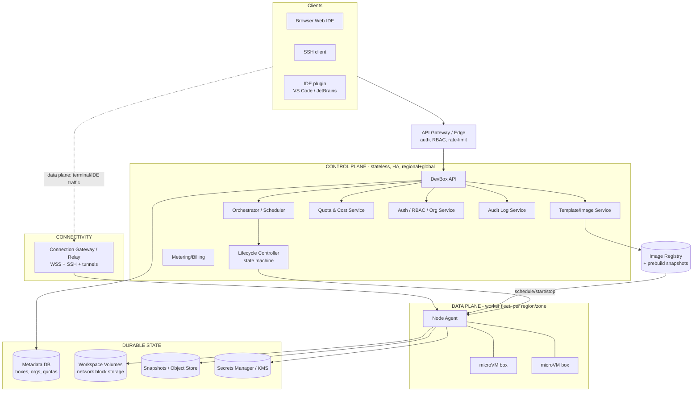

### Why this split?
- **Control plane is stateless & HA** — it holds *desired state* in a metadata DB and reconciles the fleet (Kubernetes-operator pattern). It can restart/scale without touching running boxes.
- **Data plane runs the workloads** — worker hosts with a **node agent** that launches microVMs, mounts volumes, fetches images, and reports health.
- **Data-plane traffic bypasses the control plane** — terminal/IDE bytes flow client ↔ **connection gateway** ↔ box, so user latency doesn't depend on (and isn't bottlenecked by) the orchestrator.

### Core components
- **DevBox API** — CRUD + lifecycle commands; validates against quota/RBAC.
- **Orchestrator/Scheduler** — places boxes on hosts (bin-packing, GPU/zone affinity), manages **warm pools** and node autoscaling.
- **Lifecycle Controller** — drives the box **state machine**; reconciles desired vs actual.
- **Template/Image Service** — builds/stores templates, **prebuilds**, and snapshots.
- **Node Agent** — per-host daemon: start/stop microVMs, attach storage, stream health/metrics, enforce cgroups.
- **Connection Gateway/Relay** — authenticated tunnel terminating browser WSS, SSH, and IDE connections; routes to the right box (even behind NAT).
- **Quota/Cost, RBAC/Org, Audit, Metering/Billing** — the multi-tenant control surfaces.

---

## 5. Data model & storage choices (polyglot persistence)

**Principle: separate compute from state. The box's *compute* is cattle (recreatable); its *workspace* is the pet that must persist.**

| Data | Store | Why |
|---|---|---|
| **Boxes, orgs, teams, templates, quotas** | Relational (Postgres, HA) | Strong consistency, transactions, relational RBAC/quota |
| **Box runtime state / placement** | Postgres + in-mem cache (or etcd) | Fast reconcile loop; source of truth for desired state |
| **Workspace / home dir** | **Network block volume** (EBS-like) per box | Durable, detach/reattach across hosts, snapshot-able |
| **Base images & prebuilds** | OCI **image registry** + content-addressed layer cache on nodes | Fast pulls, dedupe layers, cache near compute |
| **Snapshots (disk ± memory)** | Object store (S3/GCS) | Cheap, durable, for pause/resume & fast clone |
| **Secrets** | Secrets manager + **KMS envelope encryption** | Never in images or the DB in plaintext; short-lived injection |
| **Audit logs** | Append-only log → immutable store / SIEM | Tamper-evident, queryable, retention |
| **Metrics/Logs/Traces** | TSDB (Prometheus) + log store (Loki/ELK) + tracing | Observability + cost metering |

### Box record (metadata)
```
box {
  id, org_id, team_id, owner_id,
  template_id, state,               // CREATING/RUNNING/STOPPED/PAUSED/...
  resources { vcpu, mem_gb, disk_gb, gpu },
  host_id (nullable when not running),
  volume_id, snapshot_id,
  repo { url, ref, checkout_path },
  created_at, last_active_at, auto_stop_after, cost_to_date
}
```

### Workspace volume layout (what persists)
```
/home/<user>      ← user home: dotfiles, shell history, configs   (PERSIST)
/workspace        ← repo checkout + uncommitted work               (PERSIST)
/var, /usr, OS    ← from base image, reconstructable               (EPHEMERAL)
/tmp, build cache ← scratch                                        (EPHEMERAL, maybe cached)
secrets           ← injected at runtime via KMS, not on disk       (NEVER persisted in clear)
```
**The durable volume holds `/home` + `/workspace`.** The OS/toolchain come from the (immutable, cached) base image. This separation is what makes **stop = detach volume + kill compute** and **start = new compute + reattach the same volume** safe and fast.

---

## 6. Lifecycle — the box state machine

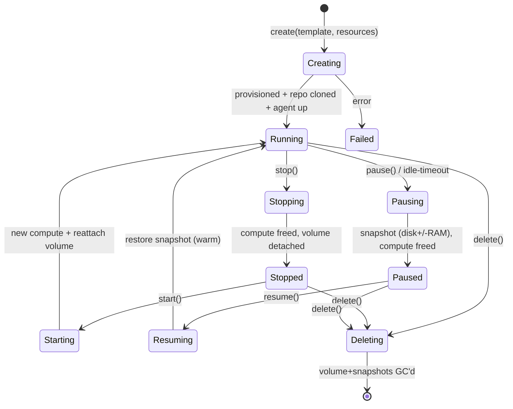

| Action | Compute | Workspace volume | RAM state | Cost | Resume speed |
|---|---|---|---|---|---|
| **Stop** | Freed | **Detached, kept** | Lost | Storage only | Seconds (boot + reattach) |
| **Pause** | Freed | Kept (or snapshotted) | **Snapshotted** | Storage only | **Sub-second–seconds** (restore) |
| **Resume** | New host | Reattach | Restored | Resumes compute | Fast |
| **Delete** | Freed | **GC'd** | — | Stops | n/a |

- **Stop** = graceful: flush disk, **detach** the network volume, release the host. Cheap to keep around.
- **Pause/hibernate** = snapshot the running state (disk and optionally **memory**), so resume drops you back exactly where you left off (open files, running servers). Memory snapshots make resume feel instant but cost more storage.
- **Idle auto-pause** is driven by the node agent watching CPU/tty/IDE activity → the biggest cost saver.

---

## 7. Data flow: create → provision → connect

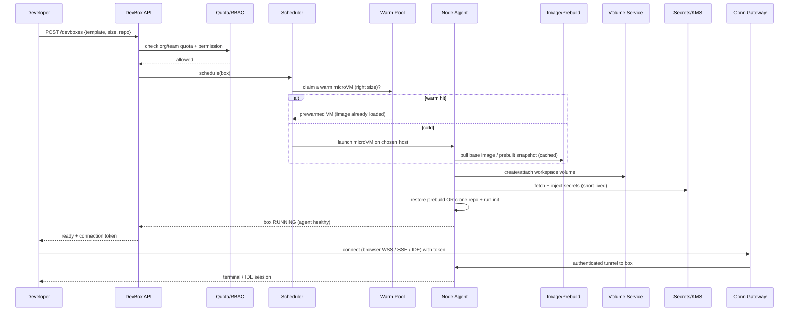

**The provisioning critical path** (and how we shrink each step):
1. **Schedule placement** — pick a host (bin-pack, zone/GPU affinity) → ms.
2. **Get compute** — **warm pool** hit = already-booted microVM → ~0; cold = launch microVM (Firecracker boots in ~125 ms).
3. **Get the filesystem** — **prebuilt snapshot** of the template (deps already installed) instead of `apt/npm install` at runtime → seconds vs minutes.
4. **Get the code** — repo already in the prebuild, or a fast shallow clone; cache the git mirror near the region.
5. **Inject secrets** — pulled from KMS at boot, mounted in-memory (tmpfs), never baked into the image.
6. **Signal ready + connect** — hand back a connection token; traffic flows through the gateway.

---

## 8. Fast provisioning (deep dive — a stated goal)

Cold "boot OS → install toolchain → clone repo → npm install" = minutes. Users expect **seconds**. Layered techniques:

1. **Prebuilds (the big one).** Build the template *ahead of time* — OS + toolchain + dependencies + repo + `postCreate` hooks — and store the result as a **snapshot/image**. Provisioning becomes *restore a snapshot*, not *run a build*. Rebuild prebuilds on template/branch changes (CI-style), so the common case is always warm.
2. **Warm pools.** Keep a buffer of **already-booted** generic microVMs per popular size/template. A create *claims* one and personalizes it (attach volume, inject secrets) instead of booting cold. The orchestrator autoscaler keeps the pool sized to demand (predictive: weekday-morning surge).
3. **microVM fast boot.** **Firecracker** microVMs boot in ~125 ms with a minimal kernel; pair with **snapshot/restore** to resume a pre-initialized VM state directly.
4. **Image/layer caching on nodes.** Content-addressed OCI layers cached on each host (and a regional pull-through cache) → near-zero pull for shared bases. **Lazy-pull** image layers (stream blocks on first access) so the box starts before the whole image is local.
5. **Copy-on-write storage.** Clone a box/template volume via **CoW snapshots** (overlay/ZFS/btrfs/EBS fast-snapshot) — instant "copy" of a 20 GB workspace without copying bytes.
6. **Local git mirror/cache.** Maintain a regional mirror of popular repos; shallow/partial clone (`--depth=1`, sparse checkout) to minimize fetch.

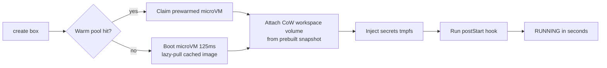

**One-liner:** *"I make the common path a **restore, not a build** — prebuilt template snapshots + a warm pool of Firecracker microVMs + copy-on-write volumes turn minutes of `npm install` into a couple of seconds."*

---

## 9. Strong isolation (deep dive — a stated goal)

We run **untrusted code from many tenants on shared hosts**. Containers alone share the host kernel → a kernel exploit escapes to other tenants. Options:

| Isolation | Boundary | Startup | Density | Security | Use |
|---|---|---|---|---|---|
| **Plain containers** (namespaces/cgroups) | Shared kernel | ~ms | Highest | **Weak** for untrusted multi-tenant | Trusted workloads only |
| **gVisor** (userspace kernel) | Syscall interception | ~ms | High | Medium-strong | Good middle ground |
| **Kata / microVM (Firecracker)** ✅ | **Own guest kernel + VM** | ~125 ms | High | **Strong (VM-grade)** | **Multi-tenant DevBoxes** |
| **Full VM** | Hypervisor | ~10s+ | Low | Strong | GPU/heavy, dedicated |

**Recommendation: microVMs (Firecracker/Kata).** Each box gets its **own kernel** inside a lightweight VM — VM-grade isolation with near-container speed and density. This is what Codespaces/Fly/AWS Lambda use for exactly this reason.

**Defense in depth around the microVM:**
- **Per-box network isolation** — its own veth/VLAN/overlay; **default-deny egress** with allowlists (block metadata endpoints, SSRF to cloud IAM, lateral movement). Boxes can't see each other.
- **Resource caps** — cgroups/VM limits on CPU, memory, **disk + network IO** to stop noisy-neighbor and fork-bomb DoS.
- **No host credentials in the guest** — the node agent (host side) handles cloud APIs; the box only gets **scoped, short-lived** tokens.
- **Seccomp/least-privilege** on the agent; read-only base image; secrets in tmpfs, wiped on stop.
- **Per-tenant encryption** — volumes and snapshots encrypted with tenant-scoped KMS keys.

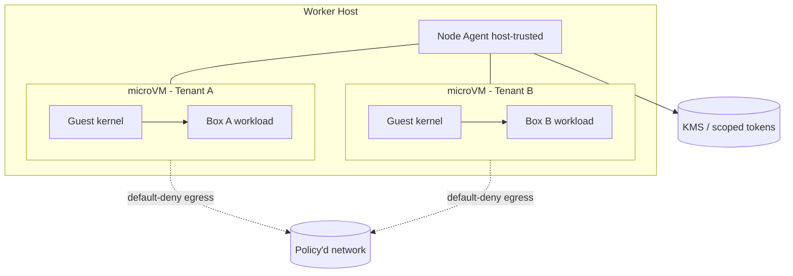

**One-liner:** *"Each box is a Firecracker microVM with its **own kernel**, default-deny egress, cgroup IO caps, and only short-lived scoped tokens — so a `sudo rm -rf` or a kernel exploit stays inside one disposable VM."*

---

## 10. Reliable persistence (deep dive — a stated goal)

A developer's uncommitted work **must not vanish** on stop, pause, host crash, or rescheduling.

- **Decouple storage from compute.** The workspace lives on a **network block volume** (EBS-like), independent of the host. Compute is disposable; the volume **detaches on stop and reattaches on start**, possibly on a *different* host. Host dies → reattach the volume elsewhere; no data loss.
- **Persist the right paths** — `/home` + `/workspace` on the durable volume; OS/toolchain come from the immutable image (reconstructable).
- **Snapshots** for pause/hibernate, fast cloning, and point-in-time backup → object store. Memory snapshot (optional) for instant resume.
- **Durability of the volume itself** — replicated block storage (multi-AZ) so a single disk/AZ failure doesn't lose data; periodic snapshot backups for DR.
- **Crash consistency** — `fsync`/journaling + filesystem-consistent snapshots; flush on graceful stop. Warn users uncommitted work isn't a substitute for `git push`.
- **Garbage collection** — on delete, GC volume + snapshots after a grace/retention window (undo-delete window). Reap orphaned volumes from failed creates.

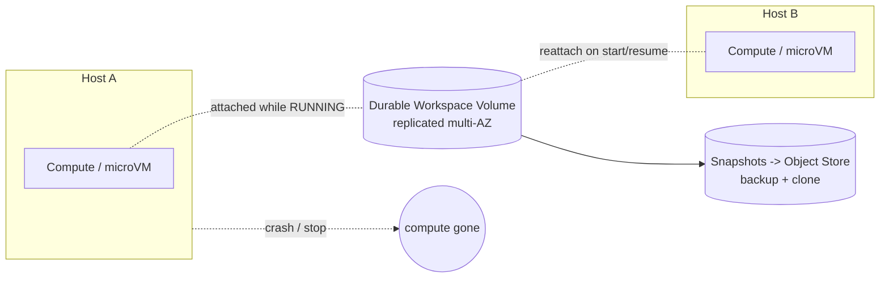

**One-liner:** *"Compute is cattle, the workspace is a pet — the home dir and repo live on a replicated network volume that detaches and reattaches across hosts, so a host crash costs you a reschedule, not your code."*

---

## 11. Connectivity — browser, SSH, IDE (the data plane)

How does a user reach a box that's on some random host, possibly behind NAT, securely?

- **Connection Gateway / Relay** — a globally reachable, authenticated entry point. The **node agent dials *out*** to the gateway and holds a persistent tunnel (WebSocket/QUIC), so boxes need **no public IP / inbound ports** (NAT-friendly, smaller attack surface).
- **Browser (web IDE)** — HTTPS/WSS to the gateway → routed to the box's agent → web IDE server (e.g., code-server) and terminal over a multiplexed channel.
- **SSH** — an **SSH gateway/proxy** terminates auth (short-lived certs / keys mapped to identity) and proxies to the box. Users get `ssh box-name@platform`.
- **IDE plugins** — VS Code Remote / JetBrains Gateway run a **remote agent inside the box** and tunnel through the same relay; the local IDE is just a thin client.
- **Port forwarding** — expose a dev server port via a per-box subdomain `https://3000-box-id.platform.dev`, auth-gated by RBAC.
- **Identity-aware** — every connection is authenticated and authorized (Zero-Trust); the gateway checks RBAC before bridging, and all sessions are audited.

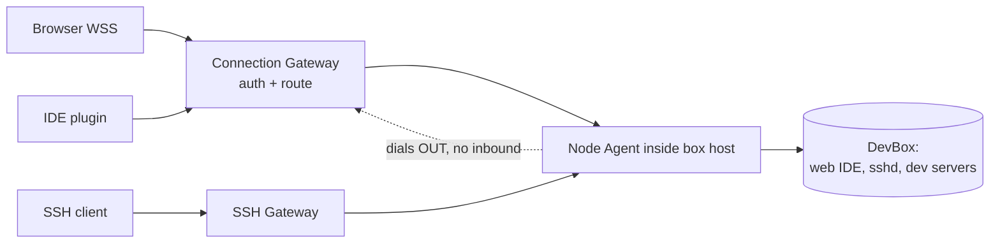

---

## 12. Multi-tenancy: orgs, RBAC, quota, audit, cost

### Org / team / RBAC
- Hierarchy: **Org → Teams → Users**, with **roles** (Owner, Admin, Member, Viewer) and **permissions** (create box, use template, manage quota, view others' boxes).
- Enforce at the API gateway on **every** lifecycle call. RBAC also gates **connection** (can this identity attach to this box / forwarded port?).

### Quota enforcement
- Limits per org/team/user: **max concurrent boxes, total vCPU/RAM/GPU, storage GB, monthly spend**.
- Checked **transactionally at create/start/resize** (reserve → commit) so two concurrent creates can't both pass the last slot (the read-modify-write race — use atomic reserve).
- Soft (warn) vs hard (block) limits; templates can pin allowed sizes per tier.

### Audit logs
- **Append-only, immutable** record of who did what: create/start/stop/delete, **connect/SSH sessions**, secret access, role changes, quota overrides. Tamper-evident, exported to SIEM, with retention. Essential for security and compliance.

### Cost controls (huge given idle ratios)
- **Auto-stop/auto-pause** idle boxes after N minutes (agent-detected inactivity) — the #1 lever.
- **Auto-delete** disposable boxes after TTL; expire stopped boxes after a retention window.
- **Budgets & alerts** per org/team; **metering** every box's vCPU·hr, GB·hr, GPU·hr → showback/chargeback and billing.
- **Right-sizing** suggestions; **bin-packing** + node autoscaler scales the fleet down off-hours; **spot/preemptible** hosts for disposable boxes (with checkpointing).

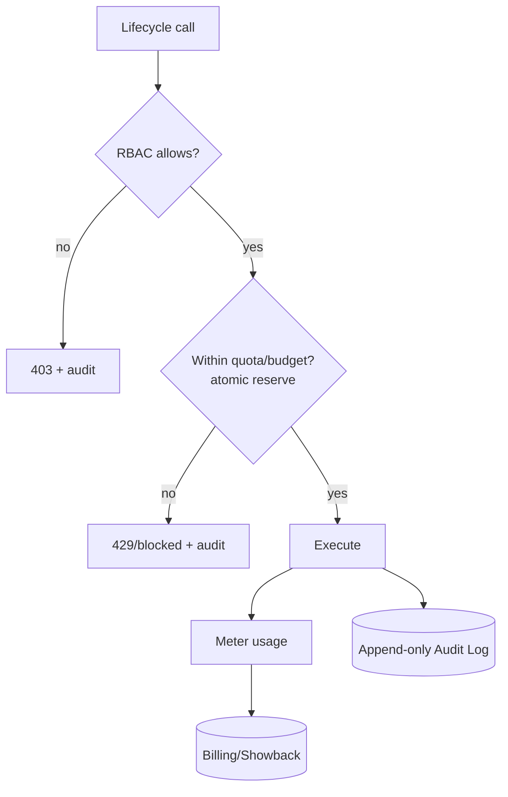

---

## 13. Observability (a stated goal)

- **Metrics** — control-plane (provision latency p50/p99, success rate, warm-pool hit rate, scheduler queue) and per-box (CPU/mem/disk/net, idle state) in a TSDB; SLOs + alerting.
- **Logs** — structured agent/box/control-plane logs centralized; per-tenant scoping.
- **Tracing** — distributed trace of the **provisioning path** (API → scheduler → agent → ready) to find the slow step.
- **Health & self-healing** — agent heartbeats; the lifecycle controller reconciles (restart crashed boxes, reschedule off dead hosts, reap orphans).
- **Cost observability** — usage metering doubles as the billing/showback signal.
- **Golden signal**: **"time-to-ready"** (create→connected) is the product's headline SLO.

---

## 14. Failure scenarios — *"what if X fails?"*

| Failure | Impact | Mitigation |
|---|---|---|
| **Worker host crashes** | Running boxes on it die | Volume is network-attached → **reschedule** box on a healthy host + reattach; RAM-only state lost (recover from last snapshot) |
| **Control plane down** | Can't create/manage boxes | CP is stateless+HA (multi-replica, multi-AZ); **running boxes keep running** (data-plane independent) |
| **Connection gateway down** | Can't reach boxes | Multiple gateways, health-checked, client reconnect; boxes redial |
| **Image registry slow/down** | Cold provisions stall | Node-local + regional cache; warm pool absorbs; lazy-pull |
| **Volume/storage AZ failure** | Risk to persistence | Multi-AZ replicated volumes + snapshot backups (DR restore) |
| **Quota race (double-spend)** | Over-allocation | **Atomic reserve** (transactional/conditional) at create/start |
| **Noisy neighbor / fork bomb** | Host degraded | cgroup CPU/mem/IO caps per microVM; per-box network limits |
| **Tenant escape attempt** | Cross-tenant breach | microVM (own kernel) + default-deny egress + no host creds in guest |
| **Provisioning storm (Mon 9am)** | Latency spike | Predictive warm-pool scaling + node autoscaler + admission queue |
| **Stuck/orphaned resources** | Cost leak | Reconcile loop GCs orphans; idle auto-stop; TTLs |

**Guiding principle:** the **data plane must outlive the control plane**, and **storage must outlive compute**. A control-plane outage should never disconnect a coding developer or lose their work.

---

## 15. Trade-off analysis (the money section)

| Axis | Choice A | Choice B | Guidance |
|---|---|---|---|
| **Isolation vs density/speed** | Full VM (strong, slow, low density) | Container (fast, dense, weak) | **microVM** (Firecracker) — VM-grade isolation at near-container speed ✅ |
| **Provision speed vs cost** | Big warm pool (instant) | No pool (cheap, slow) | Pool sized to predicted demand; CoW + prebuilds get speed without huge idle cost |
| **Pause: disk-only vs disk+RAM** | Stop (cheap, slower resume) | Hibernate (instant resume, more storage) | Offer both; default stop, hibernate for premium/active boxes |
| **Persistence vs cost** | Keep all volumes forever | Aggressive GC | Retention window + snapshot-to-object-store for cold boxes |
| **Multi-tenant hosts vs dedicated** | Shared (cheap, dense) | Dedicated per org (isolation, cost) | Shared + microVM by default; dedicated for high-security tiers |
| **Spot vs on-demand hosts** | Spot (cheap, preemptible) | On-demand (stable) | Spot for **disposable** boxes w/ checkpoint; on-demand for persistent |
| **Consistency vs availability** | Strong CP everywhere | Eventual reconcile | Strong for quota/RBAC/billing; eventual reconcile for fleet state |

**CAP/PACELC framing:** the **metadata/quota/RBAC** store is **CP** (must be correct — no double-spend, no privilege bypass). The **fleet reconciliation** is **eventually consistent** (controllers converge desired→actual). The **data plane** is designed to **stay available** even when the control plane is partitioned away.

**One-liner to say out loud:** *"I'd split a **stateless HA control plane** (API, scheduler, lifecycle controller, quota/RBAC/audit on Postgres) from a **regional data plane** of worker hosts running each box as a **Firecracker microVM** for strong isolation. Fast provisioning comes from **prebuilt template snapshots + warm pools + copy-on-write volumes**, turning minutes into seconds. The **workspace lives on a replicated network volume** decoupled from compute, so stop/pause/host-failure never lose work — compute is cattle, the volume is the pet. Users connect through an **outbound-dialed connection gateway** (browser/SSH/IDE) so boxes need no inbound ports. Quotas are enforced with **atomic reserves**, everything is **audited append-only**, and **idle auto-pause + bin-packing** controls cost."*

---

## 16. Full system design (detailed)

End-to-end, split into **(A)** the provisioning/control path, **(B)** the running/connect data path, and **(C)** the persistence & lifecycle path.

### 16A. Control path — create & schedule

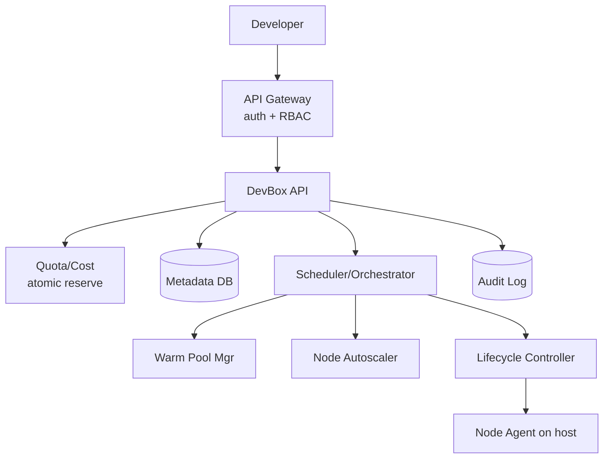

### 16B. Data path — running box & connectivity

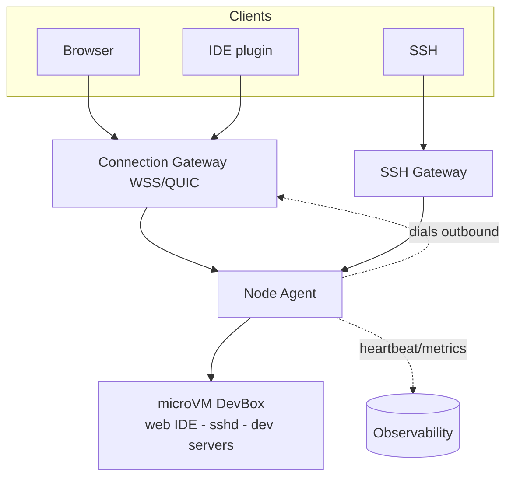

### 16C. Persistence & lifecycle path

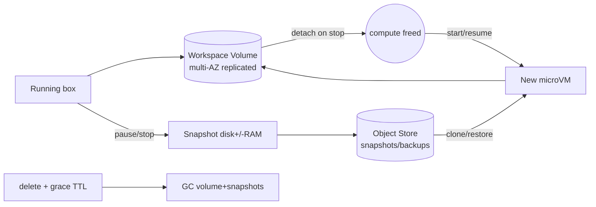

---

## 17. Networking, security & performance best practices

### Networking
- **Outbound-dialed connection gateway** — boxes hold a tunnel out; **no inbound ports** (NAT-friendly, smaller attack surface).
- **WSS/QUIC** for browser/IDE traffic; **SSH via a proxy** with short-lived certs mapped to identity.
- **Per-box network namespace/overlay**; **default-deny egress** + allowlist; **block the cloud metadata endpoint** (SSRF/IAM-credential theft).
- **Co-locate** compute with the workspace volume's AZ to minimize attach latency; per-box auth-gated subdomain port-forwarding.

### Security
- **microVM per box** (own kernel); **no host/cloud creds in the guest** — the agent holds them and hands out short-lived scoped tokens.
- **Secrets from KMS** injected to tmpfs, wiped on stop; **per-tenant volume/snapshot encryption**.
- **Identity-aware / Zero-Trust gateway** — RBAC checked before bridging; **all sessions audited**.
- **Read-only base image**, **signed images** (cosign/provenance), seccomp + least-privilege agent.
- **cgroup CPU/mem/IO caps** to contain noisy neighbors and abuse (crypto-mining).

### Performance
- **Prebuilt snapshots + warm pools + CoW volumes + lazy image pull** → seconds to ready ("restore, not build").
- **Firecracker snapshot/restore** for instant resume; node-local + regional **image layer cache**.
- **Idle auto-pause + bin-packing** for cost/perf; right-size suggestions.

---

## 18. Staying current — modern & emerging approaches

- **Isolation:** **Firecracker** / **Kata Containers** / Cloud Hypervisor microVMs; **gVisor** for syscall-level isolation.
- **Reference systems:** GitHub **Codespaces** (devcontainers), **Gitpod**, **Coder**, AWS (Lambda/Fargate on Firecracker).
- **Env as code:** `devcontainer.json` (Dev Container spec), **Nix/Nixpkgs** for reproducible toolchains.
- **Networking:** WireGuard/**Tailscale**-style mesh, **Cloudflare Tunnel**, relay-based reverse tunnels.
- **Storage:** CSI drivers, EBS multi-attach / fast snapshots, **ZFS/btrfs** copy-on-write.
- **IDE protocols:** VS Code Remote, JetBrains Gateway, SSH; browser IDE via code-server.
- **How I stay current:** Firecracker/Kata release notes, KubeCon talks, Codespaces/Gitpod engineering blogs.

---

## 19. Likely follow-up questions (rehearse these)
- microVM vs container vs gVisor — why microVM for untrusted code? *(own kernel = VM-grade isolation)*
- Host dies mid-session — does the user lose work? *(no — workspace is a network volume, reattach elsewhere)*
- How do you get sub-second provisioning? *(prebuilt snapshot + warm pool + CoW volume)*
- Pause vs stop — difference? *(pause snapshots RAM for instant resume; stop is disk-only)*
- How does a browser reach a box behind NAT? *(box dials out to the gateway; no inbound)*
- Stop a tenant stealing node IAM creds? *(block metadata endpoint; no host creds in guest)*
- Quota double-spend on concurrent creates? *(atomic/transactional reserve)*
- Cost control for idle boxes? *(idle auto-pause, TTL auto-delete, spot for disposable)*

---

## 20. Summary checklist (whiteboard recap)

- **Control plane vs data plane** — stateless HA orchestrator + regional worker fleet; data plane outlives the control plane.
- **microVM isolation** (Firecracker) — own kernel per box, default-deny egress, no host creds in guest, IO caps.
- **Fast provisioning** — prebuilt snapshots + warm pools + CoW volumes + lazy image pull = seconds, not minutes ("restore, not build").
- **Reliable persistence** — workspace on a **replicated network volume** decoupled from compute; snapshots for pause/clone/DR; compute=cattle, volume=pet.
- **Lifecycle state machine** — stop (detach volume), pause (snapshot RAM), resume (restore), delete (GC).
- **Connectivity** — outbound-dialed gateway for browser/SSH/IDE; no inbound ports; identity-aware + audited.
- **Multi-tenancy** — Org/Team/RBAC, **atomic quota reserves**, append-only **audit**, metering → billing.
- **Cost controls** — idle auto-pause, TTL auto-delete, bin-packing + autoscaling, spot for disposable.
- **Observability** — provision-latency/time-to-ready SLO, per-box metrics, tracing the provisioning path, self-healing reconcile.
- **CAP** — CP for quota/RBAC/billing; eventual reconcile for fleet; available data plane under CP partition.
