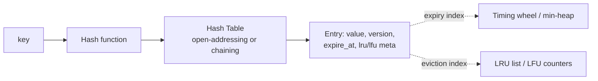
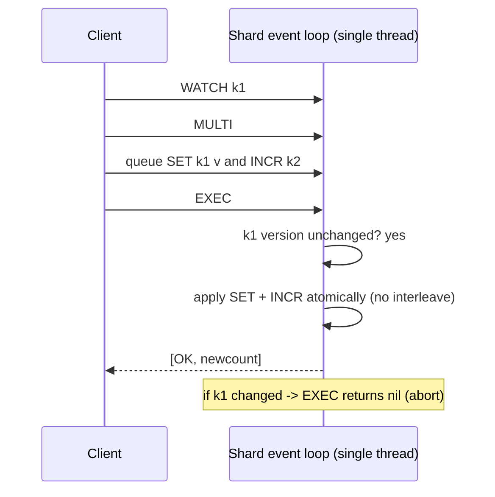
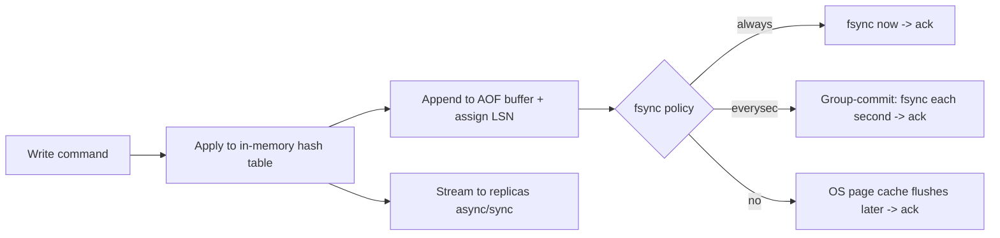
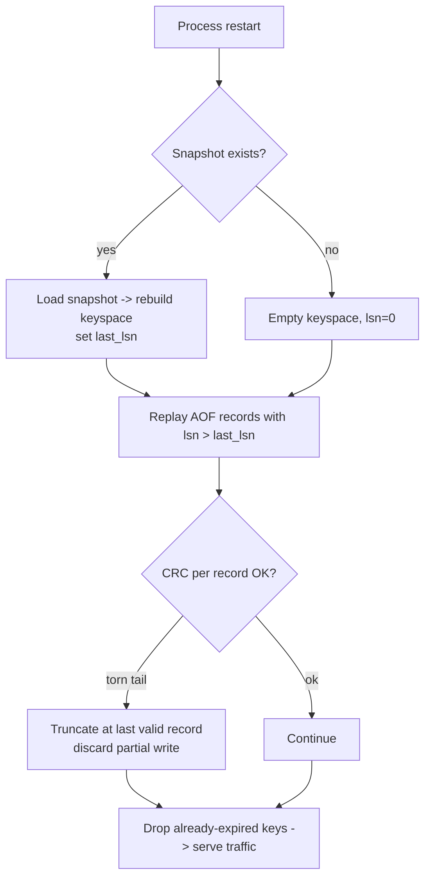
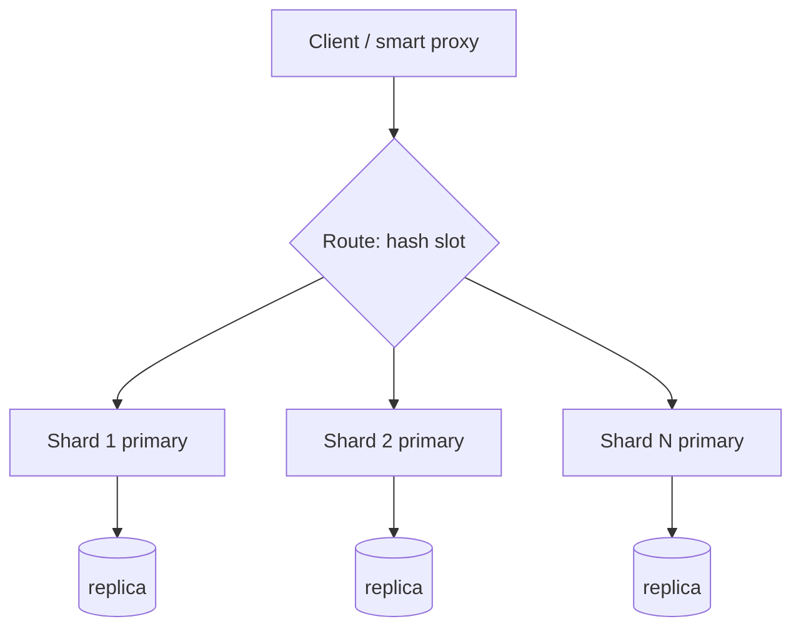
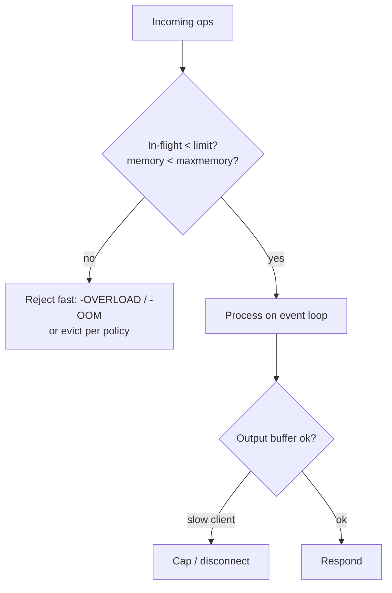

# Designing an In-Memory Key–Value Database (Redis-like)

> A complete, interview-ready walkthrough: requirements → estimates → APIs → in-memory structures → on-disk schemas → **concurrency, transactions, TTL, eviction → durability & crash recovery → replication & sharding → consistency → backpressure** → failure modes → trade-offs. Use the headings as your whiteboard agenda. The hard parts are **the concurrency model, durability vs latency, and consistency under replication/sharding** — spend your time there.

> Think Redis / Memcached / Aerospike. RAM-resident data for microsecond reads/writes, O(1) average ops, optional persistence (AOF + snapshots), and horizontal scale via sharding + replication.

---

## 0. How to drive the interview (talk track)

1. **Clarify** functional + non-functional requirements and the access pattern.
2. **Estimate** scale (QPS, keys, value sizes, RAM, network).
3. **Define the client API / wire contract.**
4. **Pick in-memory structures** (hash table + expiry index + eviction metadata) → O(1).
5. **Choose the concurrency model** (single-threaded event loop vs locks/sharded threads).
6. **Add durability** (AOF + snapshots) and the **crash-recovery** flow — and its latency trade-off.
7. **Scale out**: sharding + replication; state the **consistency** model.
8. **Handle overload** (backpressure) and **failure modes**; summarize **trade-offs**.

Keep saying *"here's the trade-off…"* — that's what's being graded.

---

## 1. Problem & motivation

A KV store that keeps data in **RAM** for high-throughput, low-latency `get/set/delete` with **O(1)** average cost, optional **persistence**, **TTL**, **CAS**, atomic multi-key ops within a shard, and horizontal scale.

**Why in-memory:** RAM access is ~100 ns vs ~100 µs for SSD vs ~10 ms for disk seek — **~1000× faster**. For caches, sessions, counters, rate-limit buckets, leaderboards, and queues, microsecond latency at high QPS is the whole point.

**What makes it hard:**
- **O(1) at p99**, not just average — avoid rehash stalls, GC pauses, lock contention, big-key blowups.
- **Durability vs latency** — every write to disk is safe but slow; the AOF fsync policy is the central trade-off.
- **Concurrency** — a hash table mutated by millions of ops/sec; single-thread simplicity vs multi-core throughput.
- **Memory is finite** — eviction policy + expiry must reclaim space without stalling.
- **Scale-out consistency** — replication lag and sharding break the "one box, one truth" simplicity.
- **Crash recovery** — rebuild state fast and correctly from snapshot + log.

---

## 2. Requirements

### Functional
- **Core ops**: `set(key, value[, ttl])`, `get(key)`, `delete(key)`.
- **CAS** — conditional update by **version** or **expected value** (optimistic concurrency).
- **TTL expiration** — keys auto-expire.
- **Atomic multi-key operations within a shard** (mini-transactions / `MULTI…EXEC`).

### Non-functional
- **O(1)** average reads/writes; tight p99.
- **Expiration tracking** (timing wheel or min-heap).
- **Memory management + eviction** (LRU/LFU).
- **Durability** — append-only log (AOF) + periodic **snapshots**.
- **Concurrency control** — single-threaded event loop *or* fine-grained locks/sharded threads.
- **Crash recovery** procedure.
- **Replication + sharding** for scale.
- **Consistency** guarantees (stated explicitly).
- **Backpressure** under overload.
- **Observability** — logs, metrics, tracing.

### Clarifying questions to ask the interviewer
- **Durability bar** — can we lose the last ~1 s of writes on crash (cache), or must every ack be durable (system of record)? *(Sets the fsync policy.)*
- **Consistency** — strong (sync replication) or eventual (async, like Redis)? Read-your-writes?
- **Value size** — small (counters, sessions) or large blobs? Affects memory + eviction.
- **Eviction** — is it a **cache** (evict under pressure) or a **store** (reject writes when full)?
- **Multi-key transactions** — within a shard only, or cross-shard (distributed txn)?
- **Single region or geo-distributed?**

---

## 3. Back-of-the-envelope estimation

| Quantity | Assumption | Result |
|---|---|---|
| **Target QPS** | high-throughput cache | **~1M ops/sec per node** (Redis does ~100k–1M+ on one core) |
| **Keys/node** | — | ~100M keys |
| **Avg entry** | ~64 B key + ~256 B value + ~80 B overhead | ~400 B → 100M × 400 B ≈ **~40 GB** data |
| **RAM/node** | data + replication buffers + fragmentation (~1.5×) | **~64 GB** box |
| **Value sizes** | small-object dominated | keep big values rare; chunk/externalize blobs |
| **Network** | 1M ops × ~400 B | ~400 MB/s ≈ **~3.2 Gbps** → 10/25 GbE NIC |
| **AOF write rate** | ~300k writes/sec × ~50 B record | ~15 MB/s → trivial sequential SSD; **fsync cadence** is the real cost |
| **Cluster** | 1 TB dataset / 40 GB per shard | **~25 shards** (× replicas) |

**Takeaways that drive the design:**
1. **~1M ops/sec/core** → a **single-threaded event loop** per shard avoids lock overhead; scale by **adding shards/cores**, not threads on one map.
2. **RAM is the budget** → eviction + expiry must be cheap and incremental (no stop-the-world).
3. **fsync is the latency knob** → batch/group-commit; choose per-write vs per-second durability.
4. **1 TB > one box** → **shard**; replicate each shard for HA.

---

## 4. Client API (wire contract)

Simple request/response over TCP (a compact binary protocol like RESP; pipelining for throughput).

```
SET key value [EX ttl_seconds] [NX|XX]      → OK | (nil)
GET key                                       → value | (nil)
DEL key                                       → 1 | 0
TTL key                                       → seconds | -1 (no ttl) | -2 (missing)
EXPIRE key ttl                                → 1 | 0

# CAS — optimistic concurrency
CAS key expected_value new_value              → OK | CAS_MISMATCH
CASV key expected_version new_value           → OK,new_version | CAS_MISMATCH   # version-based
INCR key                                       → new_int        # atomic counter

# Atomic multi-key (within a shard)
MULTI                                          # begin
  SET a 1
  INCR b
EXEC                                           → [results] | ABORT   # all-or-nothing
# optimistic variant:
WATCH k1 k2 ; MULTI ; ... ; EXEC               → nil if a watched key changed
```

**Design notes:**
- **CAS** returns a typed mismatch (not a generic error) so clients can retry the read-modify-write loop.
- **Versioned CAS** — each key carries a monotonically increasing **version**; `CASV` succeeds only if the version matches → lock-free optimistic updates, ABA-safe.
- **Pipelining** — clients batch many commands per round-trip (the main throughput lever at 1M QPS).
- **Idempotency** — `SET`/`DEL` are naturally idempotent; client request IDs let proxies dedup retries.

---

## 5. In-memory data structures & algorithms (O(1))



### Primary index — hash table (O(1) avg)
- A **hash table** maps key → entry; average O(1) `get/set/delete`. Use a good hash (xxHash/SipHash — SipHash resists hash-flooding DoS).
- **Incremental rehash** (Redis-style two-table) — on growth, migrate buckets a few at a time on each op so resizing never stalls the world (protects p99). Load factor target ~0.7.
- **Entry** holds: `value`, **version** (for CAS), **expire_at** (0 = none), and **eviction metadata** (LRU timestamp / LFU counter).

### Expiration tracking
| Approach | How | Trade-off |
|---|---|---|
| **Lazy expiry** | Check `expire_at` on access; if past, delete + return nil | Free, but dead keys linger in RAM until touched |
| **Min-heap** by `expire_at` | Pop due keys | O(log n) per op; exact next-expiry |
| **Timing wheel** ✅ | Buckets by time slot; advance a hand each tick | **O(1)** insert/expire; great for many TTLs |
| **Active sampling** (Redis) | Periodically sample N keys with TTL, evict expired | Probabilistic, bounded CPU |

**Recommended:** **lazy expiry + active background sweep** (timing wheel or sampled scan). Lazy handles the hot path for free; the background sweep reclaims cold expired keys so they don't waste RAM — bounded per tick to avoid spikes.

### Eviction policy (when memory is full)
- **LRU** (approximate, Redis-style sampling) — evict least-recently-used; cheap, good default. Exact LRU = an intrusive doubly-linked list (move-to-head on access).
- **LFU** — least-frequently-used (with decay) for skewed/hot-key workloads.
- **TTL-aware** (`volatile-lru`) or **random** as policies; **noeviction** = reject writes when full (store, not cache).
- Maintain eviction metadata **inline** in the entry → O(1) update on access.

### Values
- Small values inline; **large values chunked**/externalized to avoid copy/allocation spikes and big-key stalls. Specialized structures (lists, sets, sorted sets) as needed, each O(1)/O(log n).

---

## 6. On-disk schemas — AOF & snapshot (durability formats)

Persistence is **optional** but, when on, two complementary mechanisms:

### Append-Only File (AOF) — the write log
Every mutating command is appended as a record (the operation, not the whole dataset).
```
AOF record (binary, length-prefixed):
┌────────┬──────────┬─────────┬──────────┬───────────┬──────────┬─────────┐
│ magic  │ rec_len  │ lsn     │ op (1B)  │ key_len   │ key …    │ val …   │
│        │          │ (u64)   │ SET/DEL/ │           │          │ +ttl    │
│        │          │         │ EXPIRE/  │           │          │ +ver    │
│        │          │         │ CAS      │           │          │         │
└────────┴──────────┴─────────┴──────────┴───────────┴──────────┴─────────┘
         + CRC32 per record (detect torn/corrupt tail)
```
- **Append-only, sequential** → fast on SSD; the **LSN** (log sequence number) orders writes and drives replication + recovery.
- **fsync policy** (the durability knob): `always` (every write — safest, slowest), `everysec` (group-commit each second — Redis default, lose ≤1 s), `no` (OS flushes — fastest, least safe).
- **AOF rewrite/compaction** — periodically rewrite the log to the minimal set of commands reproducing current state (drop overwritten/expired keys) so it doesn't grow unbounded.

### Snapshot (point-in-time dump)
A compact serialization of the whole keyspace at an instant (Redis RDB-style).
```
Snapshot file:
[ header: magic, version, created_at, last_lsn ]
[ repeated: key_len, key, type, value, expire_at, version ]
[ footer: count, CRC ]
```
- Produced by **fork + copy-on-write** (snapshot the child's frozen memory while the parent keeps serving) or a background thread → no long stall.
- **`last_lsn`** records where the snapshot ends so recovery knows which AOF tail to replay.

**AOF + snapshot together:** snapshot = fast bulk restore; AOF = the durable tail since the snapshot. Best of both: quick recovery + minimal data loss.

---

## 7. Concurrency, transactions & atomic multi-key (focus area)

### The model: single-threaded event loop per shard ✅
- **One thread owns a shard's hash table**, processing commands from an **event loop** (epoll/kqueue) over many connections.
- **No locks, no races, no deadlocks** on the data — each command runs to completion atomically. This is why Redis is fast *and* simple: removing lock contention often beats multi-threading for in-RAM ops.
- **Scale across cores** by running **many shards (one event-loop thread each)**, partitioning the keyspace → linear scale without shared-memory locking. I/O (network read/parse, TLS) can use helper threads; the **data mutation stays single-threaded per shard**.

| Model | Pros | Cons |
|---|---|---|
| **Single-threaded event loop** ✅ | No locks, simple, atomic ops free, great p99 | One core per shard → scale via sharding |
| **Multi-threaded + fine-grained locks** | Uses all cores on one keyspace | Lock contention, deadlocks, complex; cache-line bouncing |
| **Sharded threads (lock per shard)** | Parallel, bounded contention | Cross-shard ops need coordination |

**Recommendation:** **single-threaded per shard, scale by sharding.** It makes **atomicity, CAS, and multi-key EXEC trivially correct** (they just run start-to-finish on the owning thread).

### Atomic multi-key (within a shard)
Because one thread owns the shard, a `MULTI…EXEC` block **queues commands then executes them as one uninterrupted unit** → all-or-nothing, no interleaving.
- **Optimistic `WATCH`** — watch keys, build the transaction, `EXEC` aborts if any watched key changed since `WATCH` (compare versions) → lock-free optimistic concurrency for read-modify-write across keys.
- **CAS** is the single-key special case: succeed iff `version`/`value` matches, then bump version — all on the owning thread, so no lost updates.
- **Constraint:** atomic multi-key requires the keys be **on the same shard**. Use **hash tags** (`{user1}:profile`, `{user1}:cart`) so related keys co-locate → multi-key txns stay shard-local.



**Cross-shard transactions** (if required) need **2-phase commit / Raft-replicated txn coordinator** — expensive; call out the trade-off and prefer keeping a transaction within one shard via hash tags.

---

## 8. Durability & crash recovery (focus area)

### Write path with durability

- **Group commit** — batch many writes into one fsync (amortize the ~ms fsync over thousands of ops) → durability with high throughput.
- **Order**: apply in memory → append to AOF → (per policy) fsync → ack. With `always`, ack only after fsync (durable); with `everysec`, ack early (fast, ≤1 s loss window).

### Crash-recovery flow

1. **Load the latest snapshot** (fast bulk restore) → keyspace + `last_lsn`.
2. **Replay the AOF tail** (records with `lsn > last_lsn`) to reapply writes since the snapshot.
3. **CRC-check each record**; a crash mid-write leaves a **torn tail** → truncate at the last valid record (that write was never acked under `always`, or is within the ≤1 s loss window under `everysec`).
4. **Drop expired keys** (TTL passed during downtime), then accept traffic.
- **Recovery time** ∝ snapshot size + AOF tail length → frequent snapshots keep the tail (and recovery) short.

---

## 9. Replication & sharding (focus area)

### Sharding (horizontal scale, partition the keyspace)
- **Hash partitioning** — `shard = hash(key) mod N`, or better **consistent hashing** / **hash slots** (Redis Cluster = 16,384 slots) so adding/removing nodes moves a **minimal** fraction of keys.
- Each shard is an independent single-threaded keyspace → cores/nodes scale linearly.
- **Hash tags** keep related keys on one shard for atomic multi-key ops.
- **Resharding** — move slots between nodes with live migration (copy + delta + cutover); clients follow **MOVED/ASK** redirects or use a routing proxy.



### Replication (HA per shard)
- **Primary–replica per shard.** Primary streams its write log (LSN-ordered) to replicas; replicas apply in order.
- **Async (default, Redis-like)** — ack the client immediately, replicate in background → **low latency**, but a primary crash can lose the un-replicated tail → **eventual consistency**.
- **Semi-sync / sync** — ack only after ≥1 replica acks → **stronger durability**, higher latency. Tunable (`WAIT n`).
- **Failover** — a **sentinel/cluster manager** (or Raft) health-checks primaries; on failure, **promote a replica** and repoint clients. Replicas also **serve reads** (read scaling) at the cost of staleness.
- **Quorum option** — for strong consistency, replicate via **Raft/Paxos** (majority ack) — used by strongly-consistent KV stores (etcd, TiKV); higher latency, no lost acked writes.

---

## 10. Consistency guarantees & trade-offs (focus area)

- **Within a shard (single thread):** **linearizable** — ops are totally ordered and atomic; CAS/EXEC are correct. This is the strong island.
- **Across replicas (async):** **eventual consistency** — a replica may lag; reads from replicas can be stale; a failover can lose the un-replicated tail. Default for cache-like deployments (favor latency/availability).
- **Across shards:** **no global transaction/order** by default — each shard is its own consistency domain. Cross-shard atomicity needs 2PC/Raft (opt-in, costly).
- **Tunable knobs:**
  - **Read-your-writes** → read from primary (or wait for replica LSN ≥ write LSN).
  - **Stronger durability** → `WAIT`/semi-sync or Raft quorum.
  - **Lower latency** → async replication + `everysec` fsync.

**CAP/PACELC framing:** a single shard is **CP** (linearizable, but unavailable during failover). The replicated system is typically run **AP/eventual** (async replication: stay available + fast, tolerate staleness) — or **CP** if you choose quorum replication. **PACELC:** *else* (no partition) you still trade **Latency vs Consistency** via the fsync + replication-ack settings.

| Want | Setting | Cost |
|---|---|---|
| Lowest latency | async replication, `fsync no/everysec` | may lose recent writes; stale replica reads |
| No lost acked writes | sync/quorum replication, `fsync always` | higher write latency |
| Read-your-writes | read from primary or wait LSN | less read scaling |
| Strong cross-shard txn | 2PC / Raft coordinator | much higher latency/complexity |

---

## 11. Backpressure under overload (focus area)

At 1M QPS, overload **will** happen — degrade gracefully, never melt down.

- **Bounded queues + admission control** — cap the per-connection command pipeline and global in-flight; when full, **reject fast** (busy/`-OOM`/`-OVERLOAD`) instead of unbounded buffering.
- **Memory limit + eviction/`noeviction`** — at `maxmemory`, either evict (cache) or **reject writes** (store) with a clear error; never OOM-kill the process.
- **Client output-buffer limits** — slow consumers (e.g., replicas, pub/sub) get capped buffers; disconnect abusers rather than ballooning RAM.
- **Connection/request rate limits** + **max-clients** cap; **slowlog** to catch expensive commands (big `KEYS`, large-value ops).
- **Flow control to replicas** — if a replica lags, throttle or signal the primary; don't let replication backlog exhaust memory.
- **Load shedding** — under sustained overload, shed low-priority traffic (e.g., reads) to protect writes/replication; **circuit-break** at the client/proxy.
- **Avoid p99 stalls** — incremental rehash, incremental expiry, fork-based (CoW) snapshots, no synchronous big-key deletes (lazy/async free) so one fat operation can't block the loop.



---

## 12. Observability (a stated requirement)

- **Metrics** — ops/sec by type, **p50/p99/p999 latency**, hit/miss ratio, **memory used vs maxmemory + fragmentation**, evictions/sec, expired keys/sec, keyspace size, **replication lag (LSN delta)**, AOF fsync time, connected clients, rejected/over-limit ops → TSDB + SLOs/alerts.
- **Logs** — slowlog (commands over a threshold), rewrites/snapshots, failovers, evictions, errors; structured.
- **Tracing** — propagate a request/trace id through proxy → shard → replica for cross-node latency attribution; sample to bound overhead.
- **Health/introspection** — `INFO`-style stats, latency histograms, hot-key/big-key detection, per-command stats.
- **Golden signals** — p99 latency, hit ratio, memory headroom, replication lag.

---

## 13. Failure modes — *"what if X fails?"*

| Failure | Impact | Mitigation |
|---|---|---|
| **Process crash** | In-RAM data gone | Recover from **snapshot + AOF replay**; replica takes over meanwhile |
| **Primary node dies** | Shard write-unavailable | **Failover**: promote replica, repoint clients; async tail may be lost (eventual) |
| **fsync/disk slow or full** | Write stalls / AOF can't flush | Group commit; alert on fsync latency; switch to `everysec`; cap AOF, alert on disk |
| **Torn AOF write (crash mid-append)** | Corrupt tail | **CRC per record** → truncate at last valid record on recovery |
| **Memory pressure / maxmemory** | Risk of OOM | Eviction policy or reject writes; bounded buffers; never OOM the process |
| **Hot key** | One shard/core saturated | Client-side cache, key splitting, replica reads, LFU |
| **Big key / big op** | Event-loop stall (p99 spike) | Chunk large values; **lazy/async free**; incremental ops |
| **Replica lag** | Stale reads, weak durability | Monitor LSN delta; read-from-primary for RYW; throttle on backlog |
| **Network partition** | Split-brain risk | Quorum/sentinel decides primary; minority steps down (CP) |
| **Hash-flood DoS** | Degraded to O(n) buckets | **SipHash** seeded per-process; key/size limits |
| **Resharding** | Migration errors | Live slot migration + MOVED/ASK redirects; idempotent moves |

**Guiding principle:** a single shard is a **strongly-consistent, recoverable island**; the cluster trades some consistency for availability and latency, and **degrades (evict/shed/redirect) rather than crashes**.

---

## 14. Trade-off analysis (the money section)

| Axis | Choice A | Choice B | Guidance |
|---|---|---|---|
| **Concurrency** | Single-thread event loop (simple, no locks) | Multi-thread + locks (all cores) | **Single-thread per shard**, scale by sharding ✅ |
| **Durability** | `fsync always` (safe) | `everysec`/`no` (fast) | `everysec` group-commit default; `always` for system-of-record |
| **Persistence** | AOF (small loss window, slower restart) | Snapshot (fast restore, more loss) | **Both** — snapshot for bulk + AOF tail for recency |
| **Replication** | Async (low latency, may lose tail) | Sync/quorum (no loss, slower) | Async for cache; quorum for strong durability |
| **Consistency** | Linearizable (CP, quorum) | Eventual (AP, async) | Per shard CP; cluster usually AP — tunable |
| **Eviction** | Evict (cache) | noeviction/reject (store) | Match to whether it's a cache or source of truth |
| **Expiry** | Lazy (free, lingers) | Active sweep/wheel (reclaims, CPU) | **Both** — lazy + bounded background sweep |
| **Memory vs accuracy** | Exact LRU (linked list) | Approx LRU (sampling) | Approximate — near-exact, far cheaper |

**One-liner to say out loud:** *"I'd build it as **single-threaded event-loop shards** over a **hash table with incremental rehash** for O(1) ops with tight p99, **lazy + background TTL expiry**, and **approximate-LRU eviction**. Durability is **AOF with group-commit fsync (everysec by default, always for systems of record) plus fork-CoW snapshots**, recovered as *snapshot → replay AOF tail → truncate torn record*. Scale is **hash-slot sharding** (hash tags keep multi-key txns shard-local, where the single thread makes MULTI/EXEC and CAS trivially atomic) with **primary–replica replication per shard — async for latency, quorum for strong durability**. A single shard is **linearizable (CP)**; the cluster is **tunably AP/eventual** via the fsync + replication-ack knobs, and it **sheds load (bounded queues, eviction, output caps) rather than melting** under overload."*

---

## 15. Networking, security & performance best practices

### Networking
- **Compact binary protocol** (RESP-like) over TCP; **pipelining** to amortize round-trips at high QPS; optional **RDMA/kernel-bypass (DPDK)** for extreme throughput.
- **TLS** with session resumption; co-locate clients/proxy/nodes in one AZ to keep RTT µs-low.
- **Smart client / proxy routing** (slot-aware) to hit the owning shard directly; connection pooling + keep-alive.

### Security
- **AuthN** (ACL users/passwords, mTLS); **per-key/command ACLs**; disable dangerous commands (`FLUSHALL`, `KEYS`) in prod.
- **SipHash-seeded** hashing to stop **hash-flooding** DoS; key/value **size limits**.
- **Network isolation** (private subnet, no public exposure — the classic unauthenticated-Redis breach); encrypt snapshots/AOF at rest.

### Performance
- **O(1) structures**, incremental rehash/expiry, **fork-CoW** snapshots, **lazy/async free** of big keys → no event-loop stalls.
- **Group-commit fsync**; **approximate LRU/LFU**; per-core sharding for linear scale.
- **NUMA-aware** pinning; jemalloc/tcmalloc to curb fragmentation.

---

## 16. Staying current — modern & emerging approaches

- **Reference systems:** **Redis** (+ Redis Cluster, AOF/RDB), **Memcached** (multi-threaded, slab), **Aerospike** (SSD-optimized), **DragonflyDB** (multi-threaded, shared-nothing), **KeyDB** (multi-threaded Redis fork).
- **Strongly-consistent KV:** **etcd**, **TiKV**, **FoundationDB** (Raft/Paxos, distributed txns).
- **Memory:** jemalloc/tcmalloc, **NUMA**, huge pages; persistent memory tiers; **tiered RAM+SSD** (Redis on Flash, Aerospike).
- **Concurrency:** io_uring, DPDK/kernel-bypass, lock-free/shared-nothing per-core designs (DragonflyDB, Seastar).
- **Consistency:** Raft/Paxos, CRDTs (Redis active-active / geo), leases.
- **How I stay current:** Redis/Dragonfly/Aerospike engineering blogs, the Raft & FoundationDB papers, USENIX/VLDB talks, and benchmarking before adopting.

---

## 17. Likely follow-up questions (rehearse these)
- Single-threaded but fast — how? *(in-RAM O(1) + no lock contention; scale via sharding)*
- How do you keep p99 low during a resize? *(incremental rehash — migrate a few buckets per op)*
- `fsync always` vs `everysec`? *(durability vs throughput; ack-after-fsync vs ≤1 s loss window)*
- Crash mid-write to the AOF? *(CRC per record → truncate the torn tail on recovery)*
- Atomic update across two keys? *(same shard via hash tags; MULTI/EXEC on the single owning thread)*
- Lost-update protection? *(versioned CAS / WATCH optimistic concurrency)*
- Primary dies with un-replicated writes? *(async = may lose the tail (eventual); use quorum/WAIT for none)*
- Memory full — then what? *(evict per policy for a cache; reject writes for a store)*
- Hot key saturating one core? *(replica reads, client cache, key splitting, LFU)*
- Strong consistency across the cluster? *(Raft/quorum per shard + 2PC across shards — call out the latency cost)*

---

## 18. Summary checklist (whiteboard recap)

- **O(1) ops** — hash table with **incremental rehash**; entry holds value + version + expire_at + eviction meta.
- **TTL** — **lazy expiry + bounded background sweep** (timing wheel / sampling).
- **Eviction** — **approximate LRU/LFU**; `noeviction` for a store, evict for a cache.
- **Concurrency** — **single-threaded event loop per shard** → atomic ops, CAS, MULTI/EXEC free; scale by sharding.
- **Atomic multi-key** — shard-local via **hash tags**; `WATCH`/version for optimistic txns.
- **Durability** — **AOF (group-commit fsync) + fork-CoW snapshots**; LSN orders writes.
- **Recovery** — **snapshot → replay AOF tail (lsn>last) → CRC-truncate torn record → drop expired → serve**.
- **Scale** — **hash-slot sharding** + **primary–replica per shard**; async (latency) vs quorum (durability).
- **Consistency** — per-shard **linearizable (CP)**; cluster **tunably AP/eventual** (PACELC: latency vs consistency).
- **Backpressure** — bounded queues, eviction/reject, output-buffer caps, load shedding → degrade, don't melt.
- **Observability** — p99 latency, hit ratio, memory headroom, **replication lag (LSN)**, fsync time, evictions.
