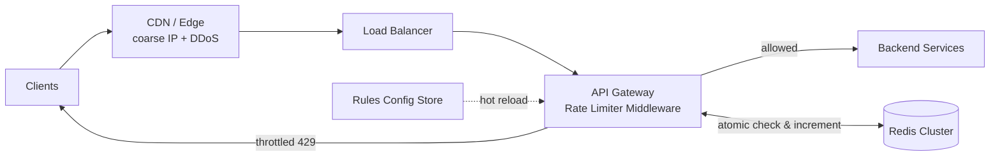
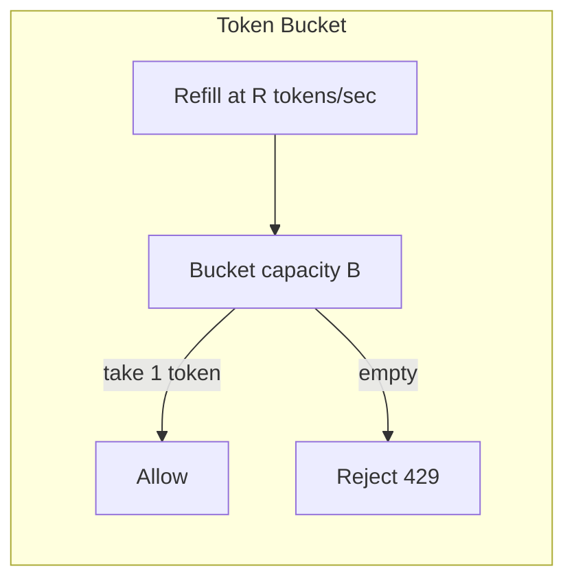
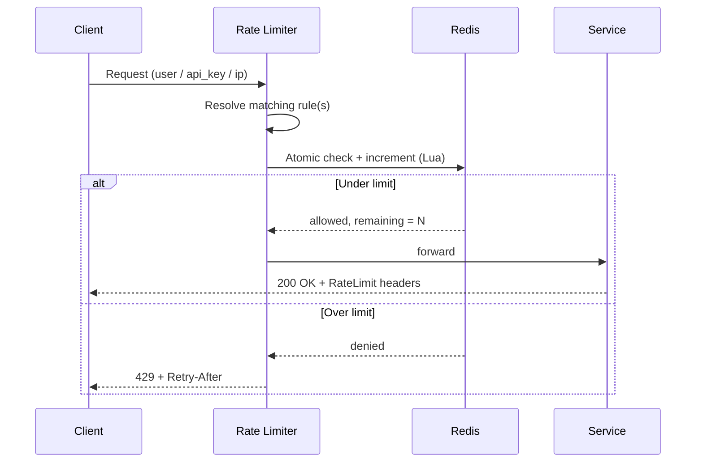
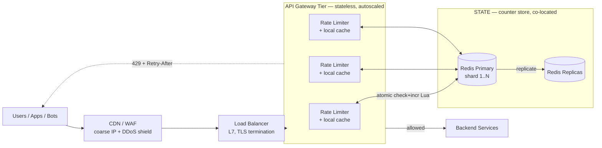
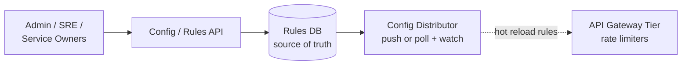
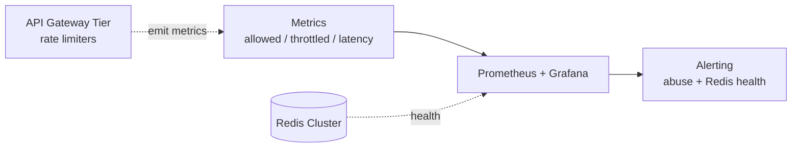
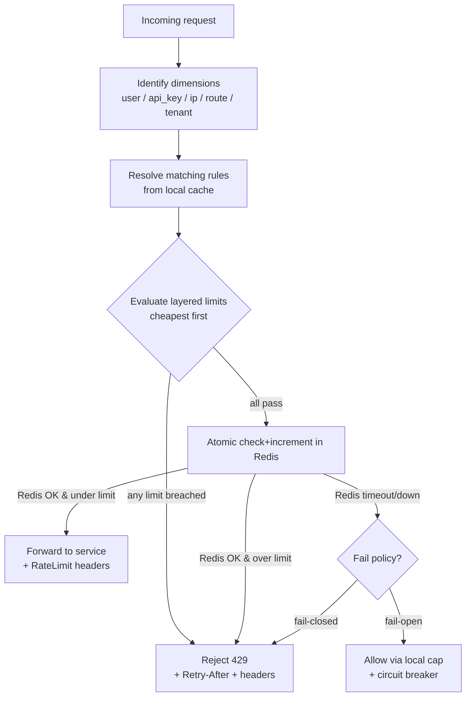

# Designing a Distributed Rate Limiter

> A complete, interview-ready walkthrough: requirements → estimates → API → algorithms → architecture → distributed challenges → failure handling → trade-offs. Use the headings as your whiteboard agenda.

---

## 0. How to drive the interview (talk track)

1. **Clarify** functional + non-functional requirements (don't assume).
2. **Estimate** scale (QPS, keys, memory) to justify choices.
3. **Define the API / contract** and where the limiter lives.
4. **Pick an algorithm** and explain why (trade-offs vs alternatives).
5. **Go distributed**: shared state, atomicity, race conditions, latency.
6. **Handle failure**: Redis down, hot keys, network partitions.
7. **Summarize trade-offs** (consistency vs availability vs latency).

Keep saying *"here's the trade-off…"* — that's what's being graded.

---

## 1. Problem & motivation

A **rate limiter** controls how much traffic a client/service may send within a window. Excess traffic is **throttled** (HTTP `429 Too Many Requests`).

**Why we need it:**
- **Protect** backends from overload / cascading failures.
- **Security**: blunt brute-force, credential stuffing, scraping, L7 DoS.
- **Cost control**: cap usage of expensive downstreams (3rd-party APIs, LLM tokens, DB).
- **Fairness / QoS**: stop one noisy tenant from starving others.
- **Monetization**: enforce plan tiers (Free = 100/min, Pro = 10k/min).

---

## 2. Requirements

### Functional
- Throttle requests that exceed a configured limit (e.g., `100 req/min per user`).
- **Configurable rules** per dimension: user ID, API key, IP, endpoint, tenant, plan tier.
- Support **multiple limits at once** (e.g., 10/sec **and** 1000/hour).
- Return a clear signal when throttled (`429` + `Retry-After`).
- Rules are **hot-reloadable** without redeploy.

### Non-functional
- **Low latency**: add only single-digit ms to each request.
- **High availability**: the limiter must not become a single point of failure that takes down the app.
- **Scalable**: millions of req/sec, 100M+ unique keys.
- **Accurate enough**: small over-count at boundaries is usually acceptable.
- **Distributed-correct**: consistent decisions across many limiter instances.

### Clarifying questions to ask the interviewer
- Per-user, per-IP, per-API-key, or global limits? (Often **all**, layered.)
- Hard limit (reject) or soft limit (queue/delay)?
- Is **approximate** counting acceptable, or must it be exact?
- Single region or **multi-region**? Global budget or per-region?
- On limiter failure, do we **fail-open** (allow) or **fail-closed** (deny)?

---

## 3. Back-of-the-envelope estimation

Assume **1B requests/day**:
- Average ≈ `1e9 / 86,400` ≈ **~12k req/sec**; peak (5×) ≈ **~60k req/sec**.
- Each check = 1–2 Redis ops (read + atomic increment).
- **Memory**: ~100M active keys × (≈16B key + 8B counter + overhead ≈ 100B) ≈ **~10 GB** → fits in a small Redis cluster, fully in-memory.
- Counters are short-lived (TTL = window), so memory stays bounded.

**Takeaway:** an in-memory store (Redis) easily handles this; the real challenges are **atomicity, latency, and failure handling**, not raw storage.

---

## 4. Where does the rate limiter live?

| Placement | Pros | Cons |
|---|---|---|
| **Client-side** | No server cost | Untrusted, easily bypassed/tampered — never the only defense |
| **In-app middleware** | Full request context (user, route) | Couples limiter to every service; duplicated logic |
| **API Gateway / dedicated edge** ✅ | Centralized, language-agnostic, also does auth/TLS/routing | Extra hop; must be HA |

**Recommendation:** a **dedicated middleware at the API Gateway** (Envoy, Kong, NGINX, AWS API Gateway, Cloudflare). Push coarse IP/DDoS limits to the **CDN/edge**; do fine-grained per-user/key limits at the gateway.



---

## 5. API & response contract

**Config / rules API (control plane):**
```
POST /v1/rules
{
  "key": "plan:pro",
  "dimension": "api_key",
  "limit": 10000,
  "window_seconds": 60,
  "algorithm": "token_bucket",
  "burst": 2000
}
```

**Enforcement (data plane)** is transparent — the limiter inspects each request and either forwards it or returns:

```
HTTP/1.1 429 Too Many Requests
Retry-After: 12
X-RateLimit-Limit: 100
X-RateLimit-Remaining: 0
X-RateLimit-Reset: 1717612800
```

Returning `X-RateLimit-*` headers on **successful** responses too lets well-behaved clients self-throttle.

---

## 6. Algorithms (know all five + trade-offs)

| Algorithm | Memory | Burst handling | Accuracy | Notes / used by |
|---|---|---|---|---|
| **Token Bucket** | Low (2 fields/key) | Allows bursts up to bucket size | Good | Smooth, intuitive. *Stripe, AWS* |
| **Leaky Bucket** | Low (queue) | Smooths to constant out-rate | Good | Adds latency; can starve new reqs. *Shopify* |
| **Fixed Window** | Lowest (1 counter) | **Bad** — 2× burst at edges | Coarse | Simplest; boundary spike problem |
| **Sliding Window Log** | **High** (timestamp/req) | Exact | **Best** | Stores every timestamp; costly memory |
| **Sliding Window Counter** ✅ | Low | Smooths edges | ~99.99% | Weighted prev+curr window. *Cloudflare* |

### Token Bucket (recommended default)
- Bucket of capacity `B`, refilled at `R` tokens/sec. Each request consumes 1 token; empty ⇒ reject.
- **Pros:** memory-efficient, allows controlled bursts, easy to reason about.
- **Cons:** two parameters (`B`, `R`) to tune.

### Fixed Window — the boundary problem
With `100/min`, a client can send 100 at `00:00:59` and another 100 at `00:01:00` → **200 in ~1s**. This is why we prefer sliding approaches.

### Sliding Window Counter (recommended when accuracy matters)
Approximate the rolling window by weighting the previous fixed window:

```
count = curr_window_count
      + prev_window_count * (overlap_fraction_of_prev_window_still_in_view)
allow if count < limit
```
Smooths the edge spike, uses ~2 counters per key, and Cloudflare measured error well under 1%.



---

## 7. Distributed design — the hard part

With many limiter instances behind a load balancer, **counter state must be shared and updated atomically**.

### 7.1 Where to keep counters
- **Centralized Redis (cluster)** — single source of truth; atomic ops; TTL eviction.
- Use **Redis Cluster** sharded by key for horizontal scale; replicas for HA.

### 7.2 Race conditions (the classic bug)
Naïve `GET` → check → `SET` is a **read-modify-write race**: two instances both read `99`, both allow, count becomes `101`.

**Fixes (pick atomic):**
- **`INCR` + `EXPIRE`** (fixed window) — `INCR` is atomic.
- **Lua script** — runs atomically on the Redis server (best for token/sliding-window logic).
- **Sorted sets** (`ZADD`/`ZREMRANGEBYSCORE`/`ZCARD`) for sliding-window log.
- Avoid distributed **locks** — correct but slow; they kill throughput.

### 7.3 Latency
- **Co-locate** Redis with limiters (same AZ/region) to keep RTT ~sub-ms.
- For ultra-low latency, allow a **local in-memory cache** with periodic sync (trade accuracy for speed).



---

## 8. Reference implementations (Redis)

### Fixed window (simple, atomic)
```
key = "rl:{user}:{window_start_epoch}"
count = INCR key
if count == 1:        # first hit in this window
    EXPIRE key window_seconds
if count > limit:
    reject (429)
else:
    allow
```

### Token bucket (atomic via Lua — avoids races)
```lua
-- KEYS[1] = bucket key
-- ARGV: capacity, refill_rate, now_ms, requested(=1)
local b   = redis.call("HMGET", KEYS[1], "tokens", "ts")
local cap = tonumber(ARGV[1])
local rate= tonumber(ARGV[2])      -- tokens per ms
local now = tonumber(ARGV[3])
local req = tonumber(ARGV[4])

local tokens = tonumber(b[1]) or cap
local ts     = tonumber(b[2]) or now
tokens = math.min(cap, tokens + (now - ts) * rate)   -- refill

local allowed = tokens >= req
if allowed then tokens = tokens - req end

redis.call("HMSET", KEYS[1], "tokens", tokens, "ts", now)
redis.call("PEXPIRE", KEYS[1], math.ceil(cap / rate))
return allowed and 1 or 0
```
Lua guarantees the **refill + check + decrement** happen as one atomic step.

---

## 9. Failure scenarios — *"what if X fails?"*

| Failure | Impact | Mitigation |
|---|---|---|
| **Redis node down** | Can't read counters | Replicas + **Sentinel/Cluster** failover; **circuit breaker** → local fallback |
| **Redis cluster unreachable** | Global enforcement lost | Decide policy: **fail-open** (availability) vs **fail-closed** (protection); usually fail-open with a local cap |
| **Hot key** (one viral user/IP) | Single shard overloaded | Local pre-aggregation, key splitting/sharding, edge IP limits |
| **Limiter instance dies** | Capacity loss | Stateless instances behind LB; just add more |
| **Network partition** | Split-brain counts | Accept eventual consistency / over-count; reconcile after heal |
| **Clock skew** | Wrong windows | Use Redis server time (`TIME`) as source of truth |

**Fail-open vs fail-closed:** for most user-facing APIs, **fail-open** (allow traffic if the limiter is down) preserves availability — losing rate limiting briefly is better than an outage. For abuse-sensitive endpoints (login, payments), **fail-closed**.

---

## 10. Scaling the system

- **Limiter tier:** stateless → scale horizontally behind the LB.
- **Redis:** **Cluster** sharded by key; add shards as keys grow; replicas for reads/HA.
- **Hot keys:** two-tier counting — buffer locally per node, flush deltas to Redis every few ms (trades a little accuracy for huge throughput).
- **Multi-region:**
  - *Independent regional limits* (simple, low latency, but global budget can be exceeded) — usually fine.
  - *Global budget* (strong, but needs cross-region coordination → latency) — only if strictly required.
- **Layered limits:** global → per-service → per-tenant → per-user → per-IP, evaluated cheapest-first.

---

## 11. Trade-off analysis (the money section)

| Axis | Choice A | Choice B | Guidance |
|---|---|---|---|
| **Consistency vs Latency** | Centralized Redis (accurate) | Local cache + async sync (fast, approximate) | Most APIs accept slight over-count → favor latency |
| **Availability vs Protection** | Fail-open | Fail-closed | Fail-open for general APIs; fail-closed for auth/payments |
| **Accuracy vs Memory** | Sliding-window **log** | Sliding-window **counter** | Counter ≈ same accuracy, far less memory → preferred |
| **Burst tolerance vs Smoothness** | Token bucket (bursts ok) | Leaky bucket (constant rate) | Token bucket for APIs; leaky for steady downstreams |
| **Simplicity vs Correctness** | Fixed window | Sliding window | Sliding avoids 2× boundary burst |

**One-liner to say out loud:** *"I'd start with a token-bucket limiter at the API gateway, counters in a co-located Redis Cluster updated atomically via Lua, fail-open on Redis outage with a conservative local cap, and move to local pre-aggregation only if hot keys or latency force it."*

**CAP framing:** the counter store forces a choice under partition — **fail-open = AP** (stay available, risk over-admitting) vs **fail-closed = CP** (stay correct, risk rejecting valid traffic). Most rate limiters lean **AP**: availability of the protected service usually matters more than perfectly exact counts.

---

## 12. Full system design (detailed)

End-to-end view, split into three diagrams for clarity: **(A)** the hot request path
(data plane + state), **(B)** the control plane (rule management), and
**(C)** observability.

### 12A. Data plane — the hot request path



### 12B. Control plane — rule management (cold path)



The Rules API + DB are the source of truth; the distributor pushes (or limiters poll +
watch) so rules hot-reload into every limiter with **no redeploy**.

### 12C. Observability



Per-decision metrics (allowed / throttled / latency) drive dashboards and abuse alerts;
Redis health feeds the same monitoring so on-call sees failover early.

### Request decision logic (inside each limiter)



**Components recap**
- **CDN / WAF (edge):** coarse IP-based + DDoS protection before traffic hits us.
- **Load Balancer:** L7 routing + TLS, spreads load across limiter instances.
- **Rate Limiter middleware:** stateless, evaluates layered rules, allow/deny, emits metrics.
- **Redis Cluster:** atomic counters, TTL eviction, sharded by key + replicated for HA.
- **Control plane:** Rules API + DB are the source of truth; a distributor hot-reloads rules into limiters (push or poll-and-watch), so no redeploy is needed.
- **Observability:** per-decision metrics drive dashboards, abuse alerts, and Redis health checks.

---

## 13. Networking, security & performance best practices

### Networking
- **Terminate TLS at the edge/LB**; keep limiter→Redis traffic on a private network in the same AZ to minimize RTT.
- **Connection pooling + keep-alive** to Redis — reuse connections instead of reconnecting per request.
- **Pipeline / `MULTI` / single Lua call** to batch ops and cut round-trips (one atomic call beats several).
- **Tight timeouts** on the Redis call (e.g., 5–10 ms) so a slow store can't stall the request path; then apply the fail-open/closed policy.
- **Retries with capped exponential backoff + jitter** — never unbounded; retry storms amplify outages.
- **Anycast/CDN** to absorb volumetric attacks close to the client.

### Security
- **Don't trust client-supplied identity.** Derive the IP from the real connection or a *validated* `X-Forwarded-For` — the header is spoofable, so attackers rotate it to dodge per-IP limits.
- **Secure the control plane.** AuthN + RBAC + audit on the rules API so limits can't be tampered with or silently disabled.
- **Layered defense.** Coarse IP/DDoS at the edge/WAF + fine-grained per-identity limits at the gateway; stricter **fail-closed** limits on auth/payment endpoints (brute force, credential stuffing).
- **The limiter must be cheap.** Reject over-limit traffic *before* expensive work (auth, DB) so the limiter isn't itself a DoS amplifier.
- **Avoid info leaks.** Don't let `RateLimit-*` headers or error messages reveal whether an account/key exists (enumeration).

### Performance
- **O(1) atomic ops**, no distributed locks (see §7.2).
- **L1 local cache** for hot keys + async flush (see §10) to shed Redis load.
- **Pre-resolve rules** from a local cache; never hit the control plane on the hot path.
- **TTL every key** so memory stays bounded; **sample** metrics to keep observability overhead low.

---

## 14. Staying current — modern & emerging approaches

- **Managed / cloud-native:** AWS API Gateway usage plans & throttling, Cloudflare Rate Limiting, Azure API Management, GCP Apigee, Kong/Tyk — offload limiting to the platform when it fits.
- **Service mesh:** Envoy's **global rate-limit service (RLS)** backed by Redis, deployed via Istio — limiting as a sidecar concern with no app changes.
- **Battle-tested algorithms/libraries:** **GCRA** (Generic Cell Rate Algorithm) via the **`redis-cell`** module; app-side libs like **bucket4j**, **resilience4j**, Guava `RateLimiter` (Java), `golang.org/x/time/rate` (Go).
- **Emerging:** **eBPF/XDP** for L3/L4 limiting at kernel/line speed; **WASM** filters in Envoy; **CRDT-based counters** for multi-region eventual consistency without coordination.
- **Standards:** the IETF **`RateLimit` header fields** draft is standardizing `RateLimit-Limit/Remaining/Reset` — prefer it over ad-hoc `X-RateLimit-*`.
- **How I stay current:** engineering blogs (Cloudflare, Stripe, AWS Builders'), conference talks, and prototyping + benchmarking before adopting.

---

## 15. Likely follow-up questions (rehearse these)
- Token bucket vs sliding window — when each? *(burst tolerance vs strict accuracy)*
- How do you make the counter update atomic? *(`INCR`/Lua, not GET+SET)*
- Redis goes down — what now? *(fail-open + circuit breaker + local cap)*
- One user sends 1M req/sec to one key — hot key mitigation? *(edge limit + local pre-agg + key split)*
- Multi-region global limit — how? *(coordination cost vs per-region budgets)*
- How do you limit on multiple dimensions at once? *(evaluate layered rules, reject on first breach)*
- Exactly-once vs approximate counting trade-off?
```
