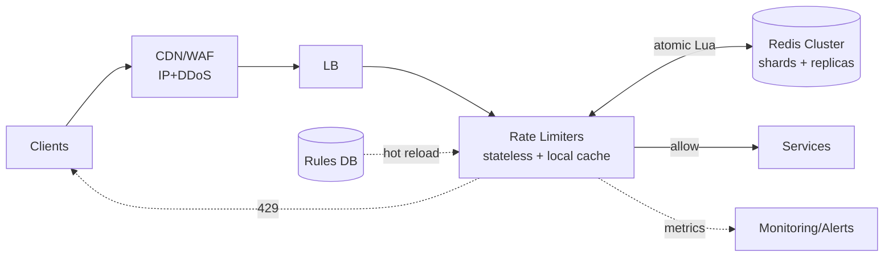

# Distributed Rate Limiter — One-Page Cheat Sheet

> Print: open in VS Code → Markdown preview → ⌘P / Print → Save as PDF. Dense by design.

## Talk track (order on whiteboard)
**Clarify → Estimate → Placement → Algorithm → Distributed/atomicity → Failure → Trade-offs**

## Requirements
- **Functional:** throttle over-limit traffic; configurable rules per user/IP/API-key/tenant/route; multiple simultaneous limits (10/s **and** 1k/h); return `429`; hot-reloadable rules.
- **Non-functional:** single-digit-ms latency; HA (not a SPOF); millions req/s, 100M+ keys; approximate counting OK.
- **Ask:** per-user vs IP vs global? hard vs soft? exact vs approx? multi-region? **fail-open vs fail-closed?**

## Estimation (1B req/day)
- ~12k req/s avg, ~60k peak (5×). Check = 1–2 Redis ops.
- 100M keys × ~100B ≈ **~10 GB** → small Redis cluster, in-memory, TTL-bounded.
- *Conclusion:* storage is easy; **atomicity + latency + failure** are the hard parts.

## Placement
Client (untrusted) ✗ · In-app middleware (coupled) ~ · **API Gateway (dedicated)** ✅ · Edge/CDN for coarse IP+DDoS.

## Algorithms
| Algo | Mem | Burst | Accuracy | Use |
|---|---|---|---|---|
| **Token bucket** ✅ | Low | Allows bursts | Good | Default for APIs (Stripe/AWS) |
| Leaky bucket | Low | Constant out-rate | Good | Smooth downstreams; adds latency |
| Fixed window | Lowest | **2× edge spike** | Coarse | Simplest only |
| Sliding log | High | Exact | Best | Costly (timestamp/req) |
| **Sliding counter** ✅ | Low | Smoothed | ~99.99% | Accuracy w/o memory (Cloudflare) |

- **Token bucket:** capacity `B`, refill `R`/s; take 1/req; empty ⇒ `429`. Memory-light, controlled bursts.
- **Fixed-window bug:** 100 at `00:59` + 100 at `01:00` = 200 in ~1s → use sliding.

## Distributed correctness (the hard part)
- **Shared state:** centralized **Redis Cluster** (sharded by key, replicas, TTL eviction).
- **Race:** `GET→check→SET` lets two nodes both read 99 → over-count. **Fix = atomic:**
  - `INCR`+`EXPIRE` (fixed window) · **Lua** (token/sliding, atomic refill+check+decrement) · `ZADD/ZCARD` (sliding log).
  - **Avoid distributed locks** (kill throughput).
- **Latency:** co-locate Redis with limiters (same AZ); optional local cache + async sync (trade accuracy for speed).

## Atomic fixed-window (Redis)
```
key = rl:{user}:{window_start}
c = INCR key
if c == 1: EXPIRE key window
allow if c <= limit else 429
```

## Failure — "what if X fails?"
| Failure | Mitigation |
|---|---|
| Redis node down | Replicas + Sentinel/Cluster failover; circuit breaker → local fallback |
| Cluster unreachable | **Fail-open** (avail) vs **fail-closed** (protect); usually fail-open + local cap |
| Hot key | Edge IP limit + local pre-aggregation + key splitting |
| Instance dies | Stateless behind LB → add more |
| Partition | Accept eventual over-count; reconcile after heal |
| Clock skew | Use Redis `TIME` as source of truth |

**Fail-open** general APIs (availability > brief loss of limiting) · **Fail-closed** login/payments.

## Scaling
- Limiter tier **stateless** → scale horizontally. Redis **Cluster** sharded; add shards as keys grow.
- **Hot keys:** two-tier — buffer locally, flush deltas every few ms.
- **Multi-region:** per-region budgets (simple, fast) vs global budget (coordination → latency).
- **Layered limits:** global → service → tenant → user → IP, cheapest-first, reject on first breach.

## Trade-offs (say "here's the trade-off…")
| Axis | A | B | Pick |
|---|---|---|---|
| Consistency↔Latency | Central Redis | Local+async | Latency (slight over-count OK) |
| Availability↔Protection | Fail-open | Fail-closed | Open for APIs / closed for auth |
| Accuracy↔Memory | Sliding **log** | Sliding **counter** | Counter |
| Burst↔Smooth | Token | Leaky | Token for APIs |
| Simple↔Correct | Fixed | Sliding | Sliding |

## Architecture (one glance)


## Closing one-liner
*"Token-bucket limiter at the API gateway, counters in co-located Redis Cluster updated atomically via Lua, fail-open with a conservative local cap on Redis outage, and local pre-aggregation only if hot keys or latency demand it."*
