# Designing a Slack-like Team Messaging System (Real-Time Focus)

> A complete, interview-ready walkthrough: requirements → estimates → entities → APIs → architecture → **real-time delivery, missed-message recovery, ordering, fan-out** → notifications → cold start → storage/scaling → failure handling → trade-offs. Use the headings as your whiteboard agenda. The hard parts are **real-time delivery, ordering, and recovering missed messages across reconnects** — spend your time there.

> Think Slack / Microsoft Teams / Discord. Persistent connections deliver messages to channels and DMs in real time; clients must never lose or reorder messages, even across disconnects and offline periods.

---

## 0. How to drive the interview (talk track)

1. **Clarify** functional + non-functional requirements.
2. **Estimate** scale (users, concurrent connections, messages/sec, fan-out).
3. **Model entities** (users, workspaces, channels, DMs, messages) + their keys.
4. **Define the APIs** (send/receive) and the **real-time transport** (WebSocket).
5. **Walk the send path**: client → gateway → persist → fan-out → deliver.
6. **Nail ordering** (per-channel sequence) and **missed-message recovery** (cursor + backfill).
7. **Notifications** + the latency/correctness/UX trade-offs.
8. **Cold start** after offline.
9. **Storage, queues, fan-out, scale**; then **failure + trade-offs**.

Keep saying *"here's the trade-off…"* — that's what's being graded.

---

## 1. Problem & motivation

Real-time team chat: users in **workspaces** exchange messages in **channels** (group) and **DMs** (1:1 / small group), delivered to all members' devices **instantly**, durably, and **in order** — surviving disconnects, offline periods, and multi-device usage.

**What makes it hard:**
- **Persistent connections at scale** — millions of always-on WebSockets, not request/response.
- **Fan-out** — one message to a 50k-member channel must reach every online member's device(s) fast.
- **Ordering** — everyone in a channel must see messages in the **same order**; no gaps, no duplicates.
- **Reliability across disconnects** — flaky networks are the norm; a client must **recover exactly the messages it missed**.
- **Multi-device** — the same user on phone + laptop must stay in sync (read state, delivery).
- **Cold start** — opening the app after hours offline must sync efficiently without downloading everything.

The central tension: a message must be **durably stored, globally ordered within its channel, and pushed in real time** — then **reconcilable** when a client was away.

---

## 2. Requirements

### Functional
- **Send/receive messages** in channels and DMs; edits, deletions, threads, reactions, attachments.
- **Real-time delivery** to all online members' devices (persistent connection).
- **Missed-message recovery** — fetch everything missed while disconnected.
- **Ordering** — consistent per-channel order across all clients.
- **Presence & typing indicators**; read receipts / unread counts.
- **History** — scrollback / search of past messages.
- **Notifications** — push to offline/background devices (mobile/desktop/email).

### Non-functional
- **Low latency** — p99 end-to-end delivery < ~200 ms for online users.
- **High availability** — chat must stay up; degrade gracefully.
- **Durability** — an acked message is **never lost**.
- **Scalable** — 10M+ concurrent connections, millions of msgs/sec at peak fan-out.
- **Ordered & exactly-once *to the UI*** — no gaps, no dupes after dedup.
- **Eventual consistency** acceptable for presence/read-state; **strong ordering** within a channel.

### Clarifying questions to ask the interviewer
- **Channel size** — small teams or **giant** channels (50k+)? (Changes fan-out strategy.)
- **Ordering guarantee** — strict per-channel total order, or causal? (Assume **per-channel total order**.)
- **Delivery semantics** — at-least-once + client dedup (→ exactly-once UI), acceptable? (Yes.)
- **Retention** — forever, or N days? Affects storage + search.
- **Multi-device** sync required? (Yes.)
- **E2E encryption**? (Assume server-side encryption at rest, not E2E, like Slack — say so.)
- **Global** users → multi-region? (Yes → regional gateways, home-region per workspace.)

---

## 3. Back-of-the-envelope estimation

| Quantity | Assumption | Result |
|---|---|---|
| **DAU** | — | 50M |
| **Concurrent connections** | ~40% online, ~1.5 devices | **~30M live WebSockets** |
| **Messages sent/day** | ~20 msgs/active user | ~1B/day ≈ **~12K/sec avg, ~50–100K/sec peak** |
| **Fan-out factor** | avg ~50 recipients/msg (channels) | **~50B deliveries/day ≈ ~600K/sec avg, several M/sec peak** |
| **Connections per gateway** | ~100K WS/node | **~300 gateway nodes** for 30M conns |
| **Message size** | ~1 KB metadata + text | ~1 TB/day text; attachments to object store |
| **Storage** | 1B msgs/day × 1 KB × retention | **~PB-scale** message store (sharded, tiered) |
| **Read:write** | history reads + delivery >> sends | delivery (fan-out) dominates → optimize the **push path** |

**Takeaways that drive the design:**
1. **30M persistent connections** → a dedicated, horizontally-scaled **connection/gateway tier** decoupled from business logic.
2. **Fan-out is the bottleneck** (millions of deliveries/sec) → a **message queue + fan-out service**, not synchronous loops.
3. **Per-channel ordering** at this rate → assign a **monotonic sequence per channel** at persist time.
4. **PB-scale history** → wide-column store partitioned by channel + time; attachments in object store + CDN.

---

## 4. Core entities & data model

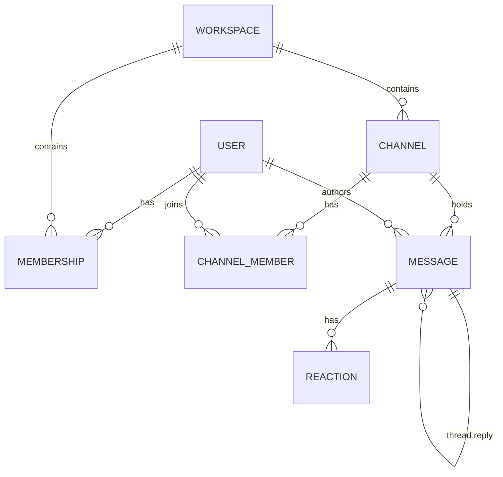

| Entity | Key fields | Notes |
|---|---|---|
| **User** | `user_id`, name, avatar, status | Global identity |
| **Workspace** | `workspace_id`, name, plan | Tenant boundary; users belong via membership |
| **Membership** | `(workspace_id, user_id)`, role | Workspace-level RBAC |
| **Channel** | `channel_id`, workspace_id, type (public/private), name | DMs modeled as a channel with type=`dm` |
| **ChannelMember** | `(channel_id, user_id)`, last_read_seq | **last_read_seq drives unread + recovery** |
| **Message** | `message_id`, channel_id, **seq**, sender_id, ts, body, type, thread_id, edited, deleted | `seq` = per-channel monotonic order |
| **Reaction** | `(message_id, user_id, emoji)` | |

**DMs = channels.** A 1:1 DM is just a channel with two members (type `dm`); group DM = small private channel. This **unifies the send/deliver/order/recover paths** — you implement them once.

### Message identity & ordering keys
```
message_id : globally unique, client-generated UUID (idempotency/dedup)
seq        : per-channel monotonically increasing integer (ORDERING)
ts         : server timestamp (display + tie-break, NOT ordering)
```
- **`message_id`** (client UUID) → **idempotency**: retries don't duplicate; clients dedup on it.
- **`seq`** (server-assigned, per channel) → **the ordering and recovery cursor**. "Give me everything in channel C with `seq > my_last_seq`."

---

## 5. APIs

### Real-time transport (WebSocket — the primary path)
Client holds a persistent **WebSocket** to a gateway; messages flow both ways as framed events.

```jsonc
// client → server: send a message
{ "type":"send", "channel_id":"C1", "client_msg_id":"u-9f3a", "body":"deploying now 🚀" }

// server → client: ack with assigned order
{ "type":"ack", "client_msg_id":"u-9f3a", "message_id":"m_77", "channel_id":"C1", "seq":3412, "ts":... }

// server → client: a new message in a subscribed channel
{ "type":"message", "channel_id":"C1", "message_id":"m_78", "seq":3413, "sender":"U2", "body":"..." }

// client → server: heartbeat / cursor checkpoint
{ "type":"ping", "cursors":{ "C1":3413, "C2":901 } }

// server → client: presence / typing
{ "type":"presence", "user":"U2", "state":"online" }
{ "type":"typing", "channel_id":"C1", "user":"U2" }
```

### REST/HTTP (history, recovery, management — not the hot push path)
```http
POST /v1/channels/{id}/messages        {client_msg_id, body}      # send (fallback if WS down)
GET  /v1/channels/{id}/messages?after_seq=3413&limit=50          # backfill missed / scrollback
GET  /v1/channels/{id}/messages?before_seq=3000&limit=50         # history (older)
POST /v1/channels/{id}/read            {up_to_seq:3413}           # advance read cursor
GET  /v1/sync?since=<cursor_token>                                # cold-start multi-channel delta
POST /v1/channels {workspace_id, type, members}                  # create channel / DM
```

**Why both WS and REST?** WebSocket carries the **live** push (low latency); REST carries **bulk history & recovery** (cursor-paginated, cacheable, retry-friendly). Sends can go over either — WS when connected, REST as a fallback — both idempotent via `client_msg_id`.

---

## 6. Architecture overview

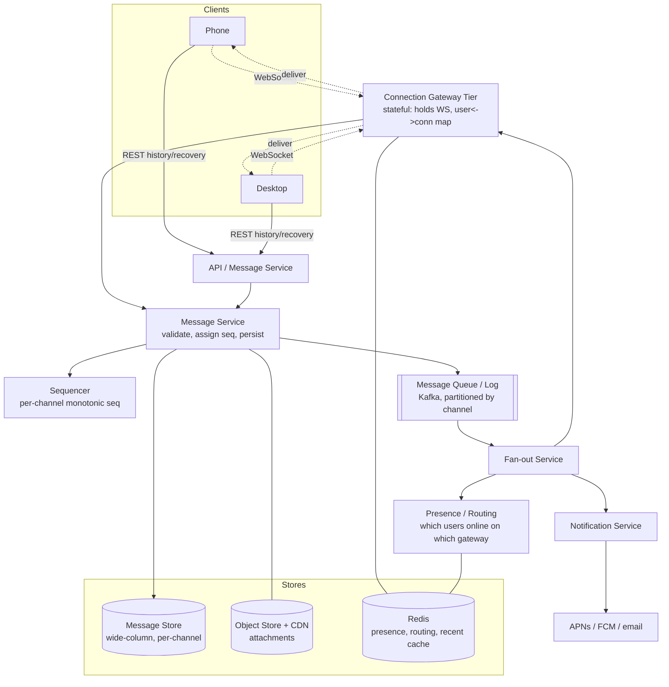

### Component responsibilities
- **Connection Gateway** — terminates WebSockets; maintains the **user → connection(s) → gateway** routing map (in Redis); pushes events to connected devices. *Stateful but disposable* — on disconnect the client reconnects (possibly to another gateway) and recovers.
- **Message Service** — validates, **assigns per-channel `seq`**, persists the message (durability **before** ack), publishes to the queue. The point of truth for "the message exists."
- **Sequencer** — hands out monotonic per-channel sequence numbers (see §8).
- **Message Queue/Log (Kafka)** — durable, **partitioned by channel_id** → preserves per-channel order and decouples persist from fan-out; absorbs spikes; replayable.
- **Fan-out Service** — for each message, find recipients, look up who's online & on which gateway (presence/routing), and deliver; enqueue notifications for offline users.
- **Presence/Routing** — tracks online users and their gateway(s) in Redis (TTL heartbeats).
- **Notification Service** — push (APNs/FCM), desktop, email for offline/background users.
- **Stores** — message store (durable history), Redis (presence/routing/recent-message cache), object store + CDN (attachments).

---

## 7. Data flow: send → persist → fan-out → deliver

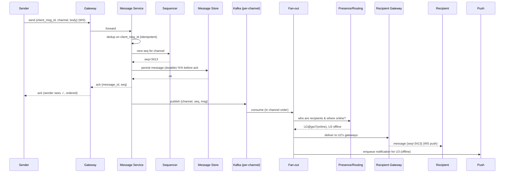

**Key points:**
1. **Persist before ack.** The sender isn't told "delivered/ordered" until the message is **durable** and has a `seq`. Guarantees an acked message is never lost.
2. **Idempotent send.** `client_msg_id` dedup means a retried send (flaky network) doesn't create duplicates.
3. **Kafka partitioned by channel** → fan-out consumes a channel's messages **in seq order**, so delivery preserves order.
4. **Fan-out is async + decoupled** → the sender's ack isn't blocked on delivering to 50k recipients.
5. **Online → push via gateway; offline → notification queue.**

---

## 8. Message ordering (focus area)

**Goal: every client in a channel sees the same order, with no gaps or duplicates.** Wall-clock timestamps are *not* reliable ordering (clock skew, concurrent sends) — use a **per-channel monotonic sequence**.

### Assign a per-channel `seq` at persist time
- The **Message Service** (via the Sequencer) assigns `seq = last_seq(channel) + 1` atomically when persisting.
- **Total order per channel**; `seq` is the contract for both **display order** and **recovery cursor**.
- Cross-channel order is **not** guaranteed (and not needed) — ordering is *per channel*, which is the natural unit.

### How to implement the sequencer (options)
| Approach | How | Trade-off |
|---|---|---|
| **DB atomic counter / conditional write** | `UPDATE channels SET last_seq=last_seq+1 RETURNING` or Cassandra LWT | Simple, strongly consistent; the channel row is a hot spot for very busy channels |
| **Single-partition Kafka per channel** | Kafka offset = order | Order = partition offset for free; ties ordering to the log |
| **Per-channel owner (sharded actor)** | One service instance owns a channel, assigns seq in memory, persists | Fast, no DB contention; needs ownership/failover (consistent hashing) |
| **Logical clock (Lamport/snowflake)** | Monotonic ID | Globally unique + roughly ordered; for strict per-channel, still reconcile via seq |

**Recommended:** a **per-channel sequencer** (sharded by `channel_id` via consistent hashing so one owner serializes a channel) writing to a **Kafka partition keyed by channel_id**. Order is then preserved end-to-end: assign → log → fan-out → deliver, all per-channel ordered.

### Client-side ordering & gap detection
- Client tracks `last_seq` per channel. Incoming `seq` should be `last_seq + 1`.
- **Gap** (`seq > last_seq + 1`) → client missed messages → **trigger backfill** `GET ?after_seq=last_seq` (§9).
- **Duplicate/old** (`seq <= last_seq`) → dedup/ignore (at-least-once delivery → **exactly-once at the UI**).

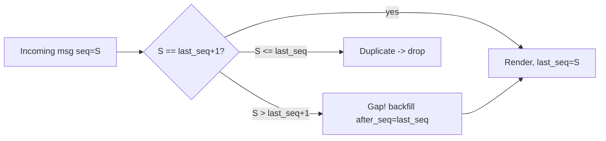

**One-liner:** *"Order is a **per-channel monotonic `seq`** assigned at persist time by a channel-sharded sequencer over a channel-keyed Kafka partition — timestamps are display-only. Clients detect gaps when `seq` skips and backfill; duplicates are dropped, giving exactly-once at the UI."*

---

## 9. Missed-message recovery (focus area)

Disconnects are constant (subway, sleep, app background). A reconnecting client must get **exactly what it missed** — efficiently.

**The mechanism: per-channel cursors + backfill by `seq`.**

1. **Client persists `last_seq` per channel** (the highest contiguous seq it has rendered).
2. **On reconnect**, the client sends its cursors (per channel, or a compact bundle) — or calls `GET /v1/sync?since=cursor`.
3. **Server computes the delta**: for each channel, return messages with `seq > last_seq` (paginated).
4. **Client applies** them in order, advances `last_seq`, then resumes live push.
5. **Live + backfill reconciliation** — messages arriving live during backfill are buffered and **deduped by `seq`/`message_id`** so nothing is lost or doubled.

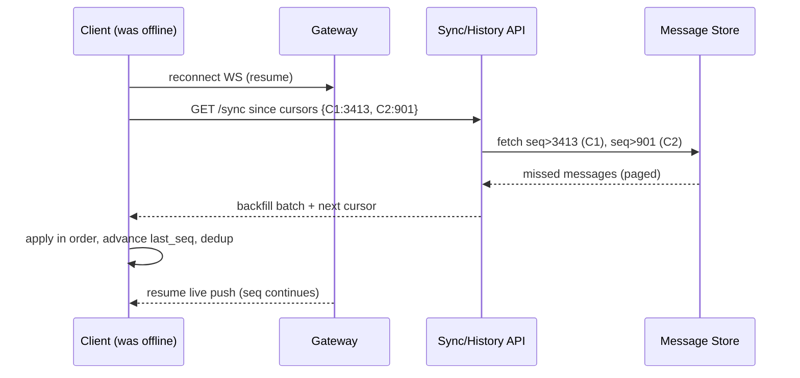

**Design choices & guarantees:**
- **At-least-once delivery + idempotent client** (dedup on `message_id`/`seq`) → **no loss, no duplicates** at the UI.
- **Server doesn't need per-client outboxes** for history — the **durable message store + seq cursor** *is* the recovery log. (For brief blips, a short per-connection replay buffer in the gateway avoids a DB hit.)
- **Bounded backfill** — page the delta; if a client is *way* behind (offline for days), fall back to **cold start** (§11) rather than streaming millions of messages.
- **Acks both ways** — server acks sends (durable); clients ack/advance read cursors so the server knows what's delivered/read (drives unread counts + notification suppression).

**One-liner:** *"The durable per-channel message log **is** the recovery mechanism — clients keep a `last_seq` cursor and on reconnect pull `seq > last_seq`, dedup by id, then resume live. No message is lost because we persist before ack; none is duplicated because the client dedups."*

---

## 10. Fan-out & delivery at scale (focus area)

One message → potentially tens of thousands of recipient **devices**. Naive "loop and send synchronously" doesn't scale.

### Fan-out strategies (mirror the social-feed push/pull trade-off)
| Strategy | How | Best for |
|---|---|---|
| **Fan-out on write (push)** | On send, deliver to every **online** member's gateway now | Normal channels; real-time feel ✅ |
| **Fan-out on read (pull)** | Store once; members read the channel log on open | **Huge channels** (50k+), mostly-offline members |
| **Hybrid** ✅ | Push to online members; **offline → notification + pull on cold start**; giant channels → pull | Real-world default |

- **Online members** → push immediately via their gateway(s) (look up presence/routing in Redis).
- **Offline members** → **don't push**; enqueue a **notification** and let them **pull** (recover) on return. Saves the vast majority of wasted deliveries.
- **Giant channels** → avoid fan-out write amplification: members **read the shared channel log** (pull) rather than copying the message into 50k inboxes. The channel's recent messages are cached once (Redis) and served to many — the **celebrity/hot-channel** pattern.

### Delivery path mechanics
- **Presence/routing table** (Redis): `user → {gateway, conn_ids}` with heartbeat TTL. Fan-out asks "who's online and where," then sends each gateway a batched delivery for its connected recipients.
- **Per-gateway batching** — one network call carries many recipients on the same gateway.
- **Backpressure** — if a client is slow, buffer briefly then drop to "reconnect & backfill" rather than blocking fan-out.
- **Multi-region** — workspace has a **home region**; gateways are regional; cross-region delivery goes via replicated Kafka.

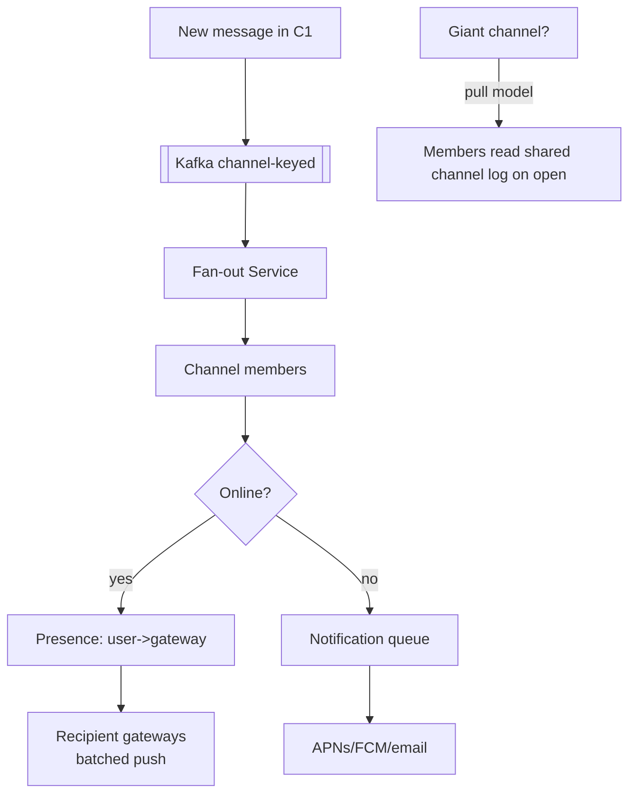

---

## 11. Cold start (focus area)

User opens the app after being offline for hours/days. Goal: **fast, bounded sync** — usable UI in a moment, not a multi-GB download.

**Strategy: sync state, lazy-load history.**
1. **Bootstrap** — fetch the **workspace/channel list + per-channel unread counts and latest seq** in one `GET /v1/sync` (compact: "C1 has 14 unread, latest seq 3500; your last_seq 3486"). Cheap; renders the sidebar immediately.
2. **Prioritize visible/active channels** — backfill **only the channel the user opens first** (and maybe DMs / @-mentions), `seq > last_seq`, newest page first. Other channels load on demand (when opened) or lazily in the background.
3. **Bounded recovery** — if a channel is thousands behind, **don't stream all of it**; show "you're caught up to here," load the most recent page, and page older on scroll. Unread **counts** come from `latest_seq - last_read_seq` without fetching bodies.
4. **Notifications already summarized** the important stuff (mentions/DMs) → cold start confirms & clears them.
5. **Snapshot/caching** — recent messages per channel cached in Redis/CDN so cold-start reads are fast and don't hammer the message store.

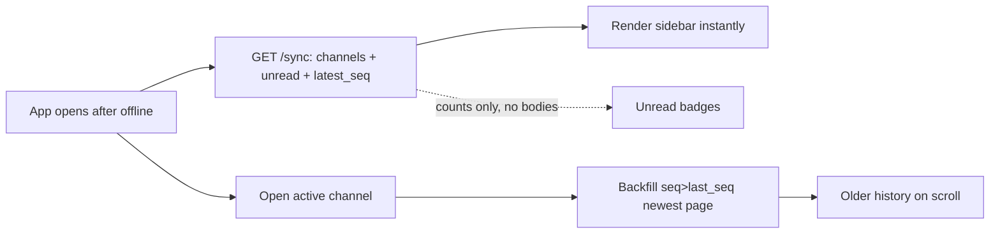

**Trade-off:** unread **counts** (cheap, from seq math) vs full message **bodies** (lazy). Compute badges from `latest_seq - last_read_seq`; fetch bodies only when a channel is opened. Avoids the "download everything" cold-start tax.

**One-liner:** *"Cold start syncs **metadata + unread counts from seq cursors** instantly, then **lazily backfills** only the channel the user actually opens — counts are `latest_seq − last_read_seq`, so badges are free and history is paid for on demand."*

---

## 12. Notifications & the latency/correctness/UX trade-offs (focus area)

Notifications target **offline/background** devices (the online path is the WebSocket push). The interesting part is the **trade-offs**.

- **Who gets notified** — only if the user is **not actively viewing** that channel on an online device (suppress if they're already reading it). Respect **mentions-only / muted / DND** preferences.
- **Multi-device coordination** — if delivered+read on the laptop, **suppress/clear** the phone push. Requires read-state sync (read cursors broadcast to the user's devices).
- **Channels** — APNs/FCM (mobile), desktop notifications, email digests for long-offline.

### The three-way tension
| Want | Pull | Tension |
|---|---|---|
| **Low latency** | Fire push immediately on send | May notify for a message the user already saw elsewhere, or that later gets deleted/edited → **incorrect/annoying** |
| **Correctness** | Wait to confirm still-unread + not-viewed-elsewhere + not-deleted | Adds delay (debounce window) → **higher latency** |
| **UX** | Batch/debounce ("3 new messages"), respect DND, dedup across devices | Coalescing adds delay; too much → feels laggy; too little → notification spam |

**Resolution — a short debounce + suppression window:**
- Hold a brief window (e.g., a few seconds) before pushing: lets **read-state from another device** suppress it, **edits/deletes** cancel it, and **bursts coalesce** ("Alice sent 3 messages"). Costs a little latency for much better correctness/UX.
- **DMs / @mentions → near-immediate** (latency matters most); **noisy channels → batched/digested** (UX matters most). Tune per type.
- **Idempotent notifications** (dedup key per message+device) so retries don't double-buzz.

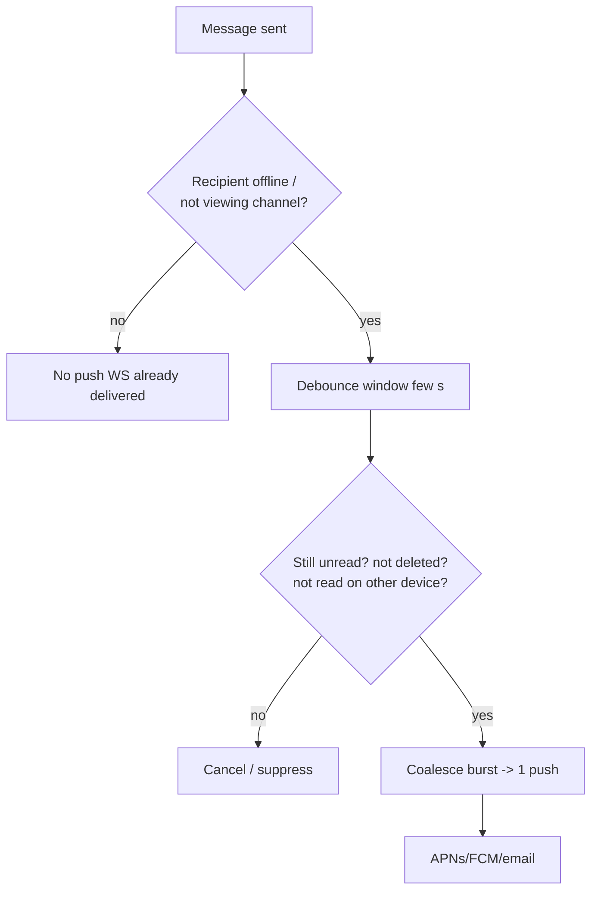

**One-liner:** *"Online delivery goes over the socket; **notifications are for offline/background only**, gated by a short debounce-and-suppress window so reads on another device, edits, and deletes can cancel them and bursts coalesce — DMs/mentions fire fast (latency), noisy channels batch (UX), all idempotent (correctness)."*

---

## 13. Storage choices

| Data | Store | Why |
|---|---|---|
| **Messages** (history) | Wide-column (Cassandra/HBase/Bigtable), partition `channel_id`, cluster by `seq` | Massive write volume, ordered range scans per channel (`seq > X`), horizontal scale |
| **Channel/user/membership metadata** | Relational (Postgres) or wide-column | Relational RBAC, transactions for seq counter |
| **Recent messages / hot channels** | Redis cache | Sub-ms reads for live + cold-start + giant-channel pull |
| **Presence / routing** | Redis (TTL heartbeats) | Ephemeral, fast `user→gateway` lookups |
| **Attachments** | Object store (S3) + CDN | Blobs never in the message DB; edge delivery |
| **Message log / pipeline** | Kafka (partition by channel) | Durable ordered log; decouples persist↔fan-out; replay |
| **Search index** | Elasticsearch (async from Kafka) | Full-text history search |
| **Notifications outbox** | Queue + store | Reliable async push |

**Message store schema (wide-column):**
```
messages_by_channel (
  channel_id   partition key,
  seq          clustering key ASC,     -- ordered scans: seq > last_seq
  message_id, sender_id, ts, body, type, thread_id, edited, deleted
)
```
Partitioning by `channel_id` + clustering by `seq` makes **both** hot paths cheap: deliver/recover = a forward range scan `seq > cursor`; history = a backward scan. Very large/old partitions are bucketed by time and tiered to cold storage.

---

## 14. Scalability considerations

- **Connection tier scales independently** — ~100k WS/node; add nodes behind an L4/L7 LB; sticky enough that a user's devices land predictably, but **any gateway can serve any user** (routing via Redis) so failover is cheap.
- **Stateless business services** — Message/Fan-out/Notification scale horizontally; state lives in Kafka/DB/Redis.
- **Kafka partitioning by channel** — parallelism across channels while preserving per-channel order; rebalance partitions as load grows.
- **Hot/giant channels** — switch to **pull** (shared cached log) to avoid fan-out write amplification; replicate the hot channel cache across Redis replicas.
- **Sharding** — message store sharded by `channel_id`; presence sharded by `user_id`.
- **Multi-region** — regional gateways for low RTT; **workspace home region** owns ordering; cross-region via replicated Kafka; presence is regional with a global directory.
- **Backpressure & graceful degradation** — queues absorb spikes; under extreme load, shed non-critical (typing/presence) before messages; slow clients fall back to reconnect+backfill.
- **Read scaling** — recent-message cache + read replicas; cold start uses counts (seq math) not bulk bodies.

---

## 15. Failure scenarios — *"what if X fails?"*

| Failure | Impact | Mitigation |
|---|---|---|
| **Client disconnects** | Misses live messages | Reconnect + **backfill by `seq` cursor**; brief gateway replay buffer for blips |
| **Gateway node dies** | Its connections drop | Clients reconnect to another gateway (routing via Redis) + recover; stateless-ish tier |
| **Message Service down** | Sends fail | Client retries (idempotent `client_msg_id`); HA replicas; persist-before-ack means no half-sent state |
| **Kafka lag/backlog** | Delivery delayed | Consumers autoscale; ordering preserved (log); eventual delivery; live feel degrades gracefully |
| **Sequencer/owner failover** | Risk of seq gap/dup | Persist seq with the message + conditional writes; new owner resumes from `max(seq)` in store |
| **Duplicate delivery** (at-least-once) | Client sees dupes | **Dedup on `message_id`/`seq`** → exactly-once at UI |
| **Presence stale** | Push to a dead conn | TTL heartbeats; failed push → mark offline → notification path |
| **Hot channel storm** | Fan-out overload | Pull model + cached shared log + replicas |
| **Region outage** | Workspace unreachable | Replicated Kafka + store; failover home region; clients reconnect & recover |
| **Notification storm** | Spam / double-buzz | Debounce/coalesce + idempotent dedup key + DND |

**Guiding principle:** **persist before ack** (never lose an acked message) + **at-least-once + client dedup** (exactly-once UI) + **cursor recovery** (heal any gap). The system favors **durability and ordering**; presence/typing are best-effort.

---

## 16. Trade-off analysis (the money section)

| Axis | Choice A | Choice B | Guidance |
|---|---|---|---|
| **Delivery semantics** | Exactly-once on the wire (hard, slow) | At-least-once + client dedup | **At-least-once + dedup** → exactly-once at the UI ✅ |
| **Ordering** | Global total order (bottleneck) | **Per-channel** order | Per-channel `seq` — the natural unit, scalable ✅ |
| **Fan-out** | Push to all (fast, costly) | Pull on read (cheap, slower) | **Hybrid**: push online, pull for giant/offline |
| **Recovery** | Per-client server outbox | **Durable log + seq cursor** | Cursor on the shared log — no per-client state ✅ |
| **Notification** | Instant (low latency) | Debounced (correct/UX) | Debounce + suppress; DMs fast, channels batched |
| **Consistency** | Strong everywhere | Eventual for presence/read-state | Strong **ordering**; eventual presence/typing |
| **Connection** | Long-poll (simple) | **WebSocket** (live, bidirectional) | WebSocket for push; REST for history/recovery |
| **Timestamp vs seq** | Order by `ts` (skew bugs) | Order by **`seq`** | `seq` orders; `ts` is display-only |

**CAP framing:** chat leans **AP for delivery/presence** (stay available; reconcile via backfill) but needs **CP-ish ordering within a channel** (the per-channel sequencer is the consistency anchor). Acked-message **durability is non-negotiable**.

**One-liner to say out loud:** *"Clients hold **WebSockets** to a scalable gateway tier; a send is **persisted and assigned a per-channel `seq` before it's acked**, published to a **channel-partitioned Kafka log**, and **fanned out** to online members' gateways (offline → notifications). **Ordering** is the per-channel `seq`; **recovery** is a `seq` cursor — on reconnect a client pulls `seq > last_seq` from the durable log and dedups by `message_id`, giving no loss and exactly-once at the UI. Giant channels switch to a **pull** model, cold start syncs **unread counts from seq math** and lazy-loads bodies, and notifications use a **debounce-and-suppress** window to trade a little latency for correctness and UX."*

---

## 17. Full system design (detailed)

End-to-end, split into **(A)** the send/persist/order path, **(B)** the fan-out/delivery path, and **(C)** reconnect/recovery + notifications.

### 17A. Send → persist → order

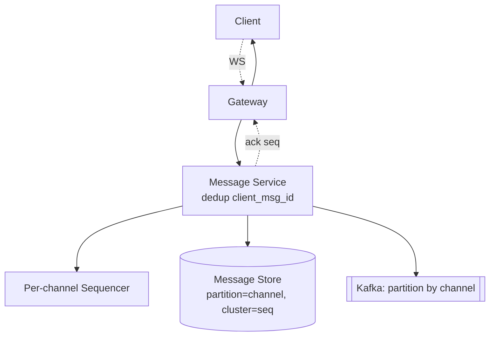

### 17B. Fan-out → delivery

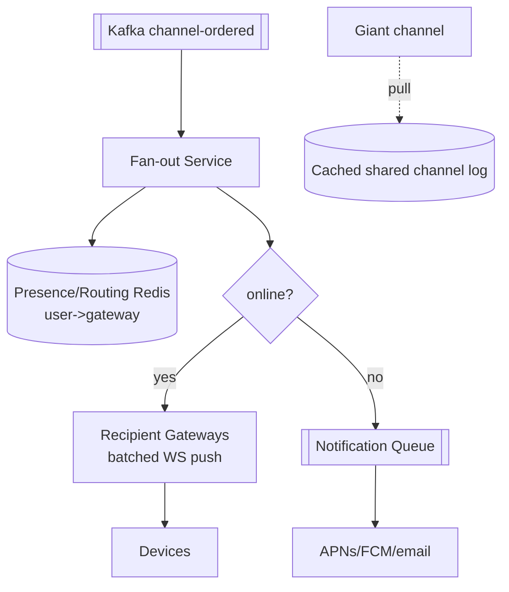

### 17C. Reconnect, recovery & cold start

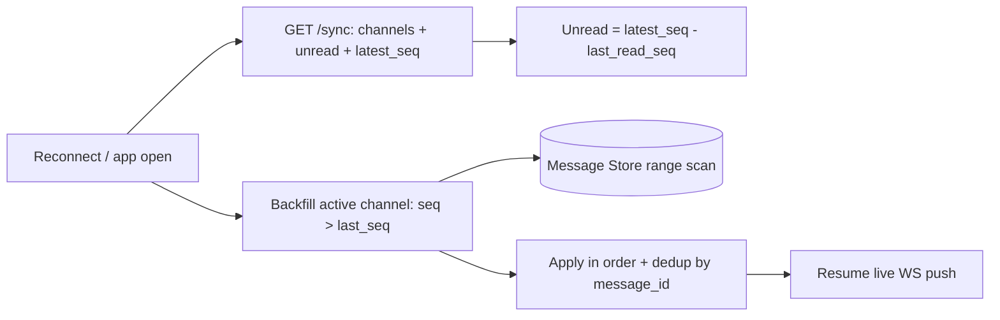

---

## 18. Networking, security & performance best practices

### Networking
- **Persistent WebSocket per device** with heartbeats + idle timeout; **auto-reconnect with backoff + jitter**.
- **Independent gateway tier** (~100k conns/node) behind an L4/L7 LB; **routing via Redis** so any gateway can serve any user (cheap failover).
- **TLS at the edge**; **HTTP/3 (QUIC)** for mobile resilience; **gRPC** internal; **per-gateway batched fan-out** (one call, many recipients).
- **Multi-region** — regional gateways for low RTT; workspace **home region owns ordering**; **replicated Kafka** cross-region.

### Security
- **AuthN/Z on connect and per-channel** (RBAC: can this user read/post this channel?).
- **Server-side encryption at rest**; **per-workspace data isolation** (tenant boundary).
- **DLP / content + attachment scanning**; **signed expiring URLs** for files; malware scan on upload.
- **Rate-limit sends** + abuse/spam detection; avoid presence/user enumeration leaks.
- **Audit** security-relevant events (channel access changes, admin actions).

### Performance
- **Per-channel `seq` + channel-keyed Kafka** → ordered, parallel fan-out.
- **Hybrid fan-out**: push to online members, **pull a cached shared log** for giant channels.
- **Recent-message cache** (Redis); **cold start = unread counts from `seq` math**, lazy-load bodies.
- **Client dedup** on `message_id`/`seq` → exactly-once at the UI; **bounded** cursor backfill.

---

## 19. Staying current — modern & emerging approaches

- **Reference systems:** **Slack** (channel servers + Flannel edge cache), **Discord** (Elixir/Erlang gateways, **ScyllaDB**), **WhatsApp/Signal** (Erlang/BEAM).
- **Stores:** Cassandra/**ScyllaDB**/Bigtable for messages, **Redis** for presence, **Kafka/Pulsar** for the ordered log.
- **Transport:** WebSocket, **HTTP/3/QUIC**, **MQTT** for mobile push, gRPC streaming.
- **Push:** **APNs/FCM**, Web Push; silent/background push for sync.
- **Patterns:** **CRDTs** for offline edits, **event sourcing**, the **transactional outbox** for reliable fan-out.
- **How I stay current:** Discord/Slack/Signal engineering blogs, Erlang/Elixir at-scale talks, distributed-systems papers.

---

## 20. Likely follow-up questions (rehearse these)
- How do you guarantee per-channel ordering? *(monotonic `seq` at persist time, not wall-clock timestamps)*
- Client offline for a day — recover missed messages? *(`seq` cursor backfill; fall back to cold start if far behind)*
- At-least-once delivery — how do you avoid duplicates? *(dedup on `message_id`/`seq` → exactly-once UI)*
- A 50k-member channel — fan-out? *(switch to pull: members read one cached shared log)*
- Notification correctness vs latency? *(short debounce + suppress window; DMs fast, channels batched)*
- A gateway node dies — do users drop messages? *(reconnect to another gateway via Redis routing + backfill)*
- Multi-device read-state sync? *(broadcast read cursors to the user's devices)*
- Sequencer hot spot on a busy channel? *(channel-sharded owner / Kafka partition offset as order)*

---

## 21. Summary checklist (whiteboard recap)

- **Entities** — users, workspaces, channels, DMs(=channels), messages; **DMs unified as channels**.
- **Transport** — WebSocket for live push; REST for history/recovery; sends idempotent via `client_msg_id`.
- **Ordering** — **per-channel monotonic `seq`** assigned at persist time (channel-sharded sequencer + channel-keyed Kafka); timestamps display-only.
- **Recovery** — durable log + **`seq` cursor**; reconnect pulls `seq > last_seq`, dedups by id → no loss, exactly-once UI.
- **Persist before ack** — an acked message is never lost; **at-least-once + client dedup**.
- **Fan-out** — hybrid: push to online via presence/routing, offline → notifications, **giant channels → pull** a cached shared log.
- **Cold start** — sync metadata + **unread counts from seq math**, lazy-load bodies on open.
- **Notifications** — offline/background only; **debounce + suppress** (read-elsewhere/edit/delete cancel; bursts coalesce); DMs fast, channels batched.
- **Storage** — wide-column messages (partition=channel, cluster=seq), Redis presence/cache, Kafka log, object store + CDN attachments, ES search.
- **Scale** — independent connection tier (~100k WS/node), stateless services, channel-partitioned Kafka, multi-region home-region ordering.
- **CAP** — AP for delivery/presence; per-channel sequencer is the consistency anchor; durability non-negotiable.
