# Designing an In-Memory SQL Database (SQLite/VoltDB-like)

> A complete, interview-ready walkthrough: requirements → estimates → SQL surface → **query engine (tokenizer → parser → AST → optimizer → executor)** → **storage structures (row/column, heaps, tuples)** → **indexes (hash, B+-tree, inverted)** → **execution of WHERE / JOIN / ORDER BY** → **transactions (MVCC) & isolation → durability (WAL) & recovery → replication & sharding → consistency → backpressure** → failure modes → trade-offs. Use the headings as your whiteboard agenda. The hard parts are **the query-planning pipeline, the join/sort/index algorithms, and isolation under concurrency** — spend your time there.

> Think SQLite (single-file, embeddable), VoltDB / SingleStore (in-memory NewSQL), H2/HSQLDB, or a RAM-resident Postgres. Tables live in RAM for microsecond row access; a real parser/planner turns SQL text into an execution tree; indexes (including **inverted indexes**) turn `O(n)` scans into `O(log n)` / `O(1)` lookups.

---

## 0. How to drive the interview (talk track)

1. **Clarify** the SQL surface (which statements/predicates), data model, and read/write mix (OLTP vs OLAP).
2. **Estimate** scale (rows, row size, RAM, QPS, query latency target).
3. **Define the SQL/wire contract** — what statements and types we support.
4. **Design the query engine pipeline** — tokenizer → parser → AST → binder → logical plan → **cost-based optimizer** → physical plan → executor (iterator/Volcano model).
5. **Pick storage structures** — tables as row store (OLTP) or column store (OLAP); tuples, heaps, free lists.
6. **Pick indexes** — **hash** (point `=`), **B+-tree** (range + `ORDER BY`), **inverted index** (full-text / multi-valued / set predicates).
7. **Execute WHERE / JOIN / ORDER BY** — predicate eval, index selection, **join algorithms** (nested-loop / hash / sort-merge), **sorting** (introsort + top-K heap + external merge).
8. **Add transactions** — **MVCC + snapshot isolation**, then **durability (WAL)** + crash recovery.
9. **Scale out** — partition (shard) + replicate; state the **consistency** model and distributed-join strategy.
10. **Handle overload** (backpressure) and **failure modes**; summarize **trade-offs**.

Keep saying *"here's the trade-off…"* and *"this is `O(...)` because…"* — that reasoning is what's being graded.

---

## 1. Problem & motivation

A relational engine that keeps tables in **RAM** for high-throughput, low-latency SQL: `INSERT`, `SELECT … WHERE … JOIN … ORDER BY … LIMIT`, with **secondary indexes** (including an **inverted index** for search) and **ACID transactions**.

**Why in-memory:** RAM access is ~100 ns vs ~100 µs for SSD vs ~10 ms for a disk seek — **~1000× faster**. For OLTP (orders, sessions, ledgers), real-time analytics, and feature stores, microsecond row access at high QPS is the whole point. Removing the buffer-pool/disk-page indirection also simplifies the hot path.

**What makes it hard:**
- **Parsing & planning** — turn arbitrary SQL text into a *correct* and *cheap* execution plan. The same query has many plans with wildly different cost.
- **Algorithmic choice at runtime** — the right **join** (nested-loop vs hash vs sort-merge) and **sort** (in-place vs top-K vs external) can be the difference between 1 ms and 10 s.
- **Indexes earn their keep** — they make reads fast but cost write amplification and memory; choosing *which* index to build and *when the planner uses it* is the crux.
- **Concurrency + isolation** — many transactions mutating shared tables/indexes must appear isolated (ACID) without killing throughput → **MVCC**.
- **Durability vs latency** — RAM is volatile; the **WAL fsync policy** is the central durability trade-off.
- **Scale-out** — partitioning breaks single-node joins and transactions; distributed joins and commits are expensive.

---

## 2. Requirements

### Functional
- **DDL**: `CREATE TABLE` (typed columns, `PRIMARY KEY`, `NOT NULL`), `CREATE INDEX` (incl. `INVERTED`/full-text).
- **DML**: `INSERT`, `UPDATE`, `DELETE`.
- **Queries**: `SELECT` with
  - **`WHERE`** — comparison (`= < > <= >= != `), `AND/OR/NOT`, `IN`, `BETWEEN`, `LIKE`, `IS NULL`, and **full-text `MATCH`** (uses the inverted index).
  - **`JOIN`** — `INNER`, `LEFT/RIGHT/FULL OUTER` on equi- and range predicates.
  - **`ORDER BY`** (multi-key, ASC/DESC), **`LIMIT/OFFSET`** (top-K), **`GROUP BY` + aggregates** (`COUNT/SUM/AVG/MIN/MAX`), `DISTINCT`.
- **Transactions**: `BEGIN / COMMIT / ROLLBACK` with **ACID**.
- **Indexes**: hash (equality), B+-tree (range/order), **inverted** (search).

### Non-functional
- **Latency**: point lookups **µs**; indexed queries **sub-ms**; analytical scans bounded & predictable.
- **Throughput**: ~100k–1M simple ops/sec/node; pipelined/batched.
- **ACID** with a clearly stated **isolation level** (default **snapshot / repeatable-read** via MVCC).
- **Durability**: **write-ahead log (WAL)** + periodic **checkpoints/snapshots**; defined crash-recovery.
- **Concurrency control**: MVCC (readers never block writers).
- **Scalability**: partitioning (shard) + replication.
- **Consistency** guarantees stated explicitly (single-node linearizable; cluster tunable).
- **Backpressure** under overload; **observability** (logs/metrics/tracing); **security** (authN/Z, injection-safe).

### Clarifying questions to ask the interviewer
- **Workload** — OLTP (many tiny point/looked-up txns) or OLAP (few big scans/joins)? *(Row store vs column store; iterator vs vectorized execution.)*
- **Durability bar** — can we lose the last ~1 s on crash, or must every commit be durable? *(WAL fsync policy.)*
- **Isolation** — read-committed, snapshot, or serializable? *(MVCC vs SSI vs locking.)*
- **Scale** — fits one node (single-process, like SQLite) or must shard across nodes (NewSQL)?
- **Search** — do we need true full-text (tokenize/stem/rank) or just multi-valued/`IN` acceleration? *(Inverted-index richness.)*
- **SQL coverage** — full SQL or a pragmatic subset (no windows/CTEs/subqueries to start)?
- **Schema** — fixed/typed (relational) or schemaless/JSON columns?

---

## 3. Back-of-the-envelope estimation

| Quantity | Assumption | Result |
|---|---|---|
| **Rows** | mid-size OLTP+search | **~1B rows** total |
| **Avg row** | ~10 cols, ~200 B incl. overhead | 1B × 200 B ≈ **~200 GB** raw |
| **Indexes** | PK + 3 secondary (~40 B entry) + 1 inverted | ~+120 GB → **~320 GB** with indexes |
| **RAM/node** | data + indexes + MVCC versions + work mem (~1.6×) | shard so each node holds **~64–128 GB** |
| **Nodes** | 320 GB / ~80 GB usable per node | **~4–8 shards** (× replicas) |
| **QPS** | point/looked-up reads | **~500k–1M/node**; analytical queries far fewer but heavier |
| **Latency target** | indexed | **p99 < 1 ms** point/indexed; analytics bounded |
| **WAL rate** | 200k writes/s × ~80 B record | ~16 MB/s sequential SSD — trivial; **fsync cadence** is the real cost |
| **Inverted index** | 1B rows × ~20 terms, postings delta+varint | tens of GB — **compression matters** |

**Takeaways that drive the design:**
1. **Indexes dominate both speed and memory** → be deliberate about which to build; the **optimizer must actually use them**.
2. **200 GB+ won't fit one box at the RAM budget** → **partition**; replicate each shard for HA.
3. **Join/sort cost is super-linear** → pick the right algorithm and **push predicates down** to shrink inputs early.
4. **fsync is the latency knob** → group-commit the WAL; choose per-commit vs per-second durability.

---

## 4. SQL surface & client contract

Clients send SQL text (or **prepared statements** with bound parameters) over a connection; the server returns a typed result set (or row count). **Prepared statements are mandatory for safety + speed** (parse/plan once, execute many; bound params ⇒ no SQL injection).

```sql
-- DDL
CREATE TABLE users (
  id        BIGINT PRIMARY KEY,
  name      TEXT NOT NULL,
  age       INT,
  city      TEXT,
  bio       TEXT
);
CREATE INDEX idx_users_city ON users (city);          -- B+-tree (range/order)
CREATE INDEX idx_users_age  ON users USING HASH (age);-- hash (equality)
CREATE INVERTED INDEX ftx_bio ON users (bio);          -- full-text / search

-- DML
INSERT INTO users (id, name, age, city, bio)
VALUES (1, 'Ada', 36, 'London', 'computing pioneer');

-- Query: WHERE + JOIN + ORDER BY + LIMIT
SELECT u.name, o.total
FROM users u
JOIN orders o ON o.user_id = u.id          -- equi-join
WHERE u.age > 30 AND u.city = 'London'      -- sargable predicates
ORDER BY o.total DESC
LIMIT 20;                                    -- top-K

-- Full-text search (inverted index)
SELECT id, name FROM users
WHERE bio MATCH 'computing & (pioneer | scientist)';

-- Transactions
BEGIN;
  UPDATE accounts SET bal = bal - 100 WHERE id = 1;
  UPDATE accounts SET bal = bal + 100 WHERE id = 2;
COMMIT;            -- atomic: both or neither

-- Prepared (injection-safe, plan-cached)
PREPARE q AS SELECT * FROM users WHERE city = ? AND age > ?;
EXECUTE q ('London', 30);
```

**Design notes:**
- **Prepared statements**: parse + plan once, cache the plan, bind params per execution → faster and **injection-proof** (params are values, never concatenated into SQL).
- **Typed result sets** with column metadata; **cursors/streaming** for large results so we don't materialize everything.
- **Explicit transactions** (`BEGIN/COMMIT`) plus **autocommit** for single statements.
- **`EXPLAIN`** returns the chosen plan + cost estimates — essential for the interviewer to probe your optimizer.

---

## 5. The query engine pipeline (focus area)

This is the heart of the system — converting SQL **text** into an executable, *cheap* plan. A classic multi-stage compiler.

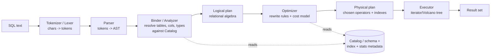

### 5.1 Tokenizer (lexer)
- A **finite-state machine** scans characters → **tokens**: keywords (`SELECT`), identifiers (`users`), literals (`30`, `'London'`), operators (`>`, `=`), punctuation. Skips whitespace/comments; classifies number/string/identifier. `O(n)` in query length.

### 5.2 Parser → AST
- **Recursive-descent** parser for statements + **Pratt / precedence-climbing** for expressions (handles `AND/OR/NOT`, comparison, arithmetic precedence cleanly).
- Output is an **Abstract Syntax Tree** (a **Composite**: a `SelectStmt` node with `from`, `where` (expression tree), `joins`, `orderBy`, `limit`). Syntax errors are reported here with position.

```
        SelectStmt
        /    |    \
   projlist  from   where ───────────────┐
              |                           │
           Join(INNER, on=...)         AND
            /        \               /     \
        users      orders        (age>30) (city='London')
```

### 5.3 Binder / semantic analysis
- Resolve identifiers against the **Catalog** (table exists? columns exist? `u` alias?), **type-check** expressions, expand `*`, validate functions/aggregates. Annotates the AST with types and resolved column references. Errors: unknown column, type mismatch, ambiguous name.

### 5.4 Logical plan (relational algebra)
- Convert the bound AST to a **logical operator tree**: `Project(σ_predicate(Join(Scan users, Scan orders)))` etc. Operators: **Scan, Filter (σ), Project (π), Join (⋈), Aggregate, Sort, Limit, Distinct**. This is *what* to compute, not *how*.

### 5.5 Optimizer (the brains)
Two complementary techniques:
- **Rule-based rewrites (heuristics)** — always-good transforms:
  - **Predicate pushdown** — push `Filter` below `Join`/into `Scan` so we touch fewer rows early (biggest single win).
  - **Projection pushdown** — drop unneeded columns early (less data copied).
  - **Constant folding / simplification**, `IN`→ semi-join, subquery decorrelation, **join reordering** for small star schemas.
- **Cost-based optimization (CBO)** — enumerate physical alternatives and pick the cheapest using **table statistics** (row counts, **histograms**, distinct-value counts):
  - **Access path**: full scan vs **index scan** (is the predicate *sargable* and selective?).
  - **Join algorithm**: nested-loop vs hash vs sort-merge (§8).
  - **Join order**: which table drives — minimize intermediate cardinality (dynamic programming over join sets, e.g. Selinger; greedy for many tables).
  - **Cost = f(rows scanned, comparisons, memory, output cardinality)**; selectivity from histograms.

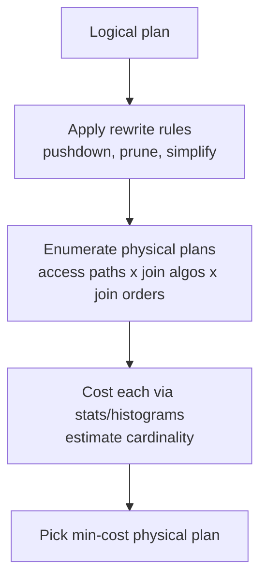

### 5.6 Physical plan → executor (Volcano / iterator model)
- Each physical operator implements a uniform **iterator interface**: `open()`, `next() → row | EOF`, `close()`. The plan is a **tree of iterators**; calling `next()` on the root pulls rows lazily up the tree (**pull-based, pipelined** — no full materialization unless an operator must block, e.g. Sort/Hash-build).

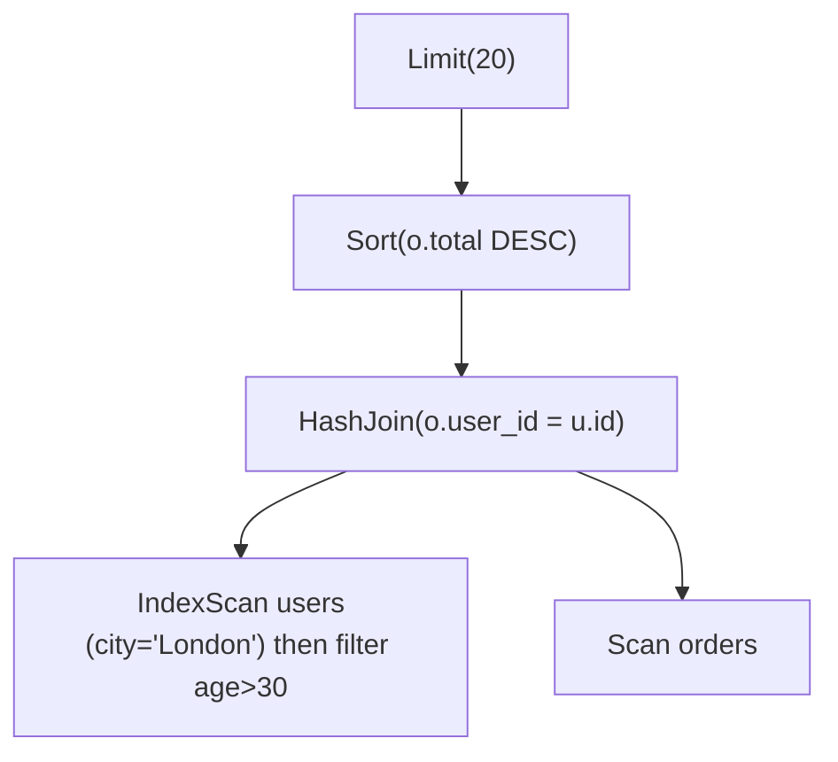

- **Blocking vs streaming operators**: `Filter`, `Project`, `NestedLoop`, `Limit`, `MergeJoin` stream; `Sort`, `HashJoin(build side)`, `Aggregate`, `Distinct` must **buffer** (pipeline breakers).
- **Vectorized / compiled execution** (OLAP): instead of one row per `next()`, pass **batches of columns** (amortize per-call overhead, SIMD-friendly), or JIT-compile the plan to machine code (HyPer/SingleStore). Mention as the high-throughput evolution of the iterator model.

### 5.7 OOP design patterns in the engine (interview gold)
| Pattern | Where it's used |
|---|---|
| **Composite** | AST nodes; expression trees; the operator/plan tree |
| **Interpreter** | Expression evaluation (`Expr.eval(row) → value`) |
| **Visitor** | Walking/rewriting the AST & logical plan (optimizer rules, `EXPLAIN`, type-checking) |
| **Iterator** | Volcano executor operators (`open/next/close`) |
| **Strategy** | Pluggable join algorithm & access path chosen by the optimizer |
| **Factory** | Build physical operators / index objects from plan nodes |
| **Builder** | Assemble the plan tree; fluent query construction |
| **Adapter** | Uniform `StorageEngine` / `Index` interface over row store, column store, inverted index |
| **Singleton** | Catalog, buffer/version manager, lock manager |
| **Observer** | Index maintenance & triggers/CDC on row change; stats invalidation |

---

## 6. In-memory storage structures (focus area)

### 6.1 Catalog (schema metadata)
A **system table** mapping table name → `{columns (name,type,nullable), PK, indexes, statistics}`. Drives binding + planning. Itself stored like any table (so DDL is just DML on system tables).

### 6.2 Table heap — where rows live
- A table is a growable collection of **tuples** (rows). Options:
  - **Array/slab of fixed-size slots** + a **free list** of vacated slots → `O(1)` insert/delete by **RowID** (slot index). Great for OLTP point access; stable RowIDs are what indexes point to.
  - **Page/block layout** (slotted pages) if mirroring disk format for easy persistence.
- **RowID (tuple id)** is the stable handle; **every index maps key → RowID(s)**, and the heap maps RowID → tuple. One indirection, `O(1)`.

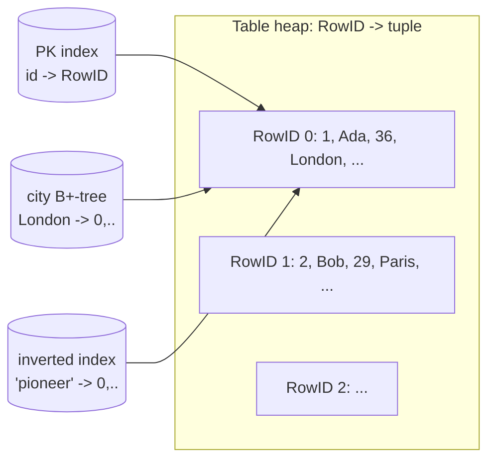

### 6.3 Tuple layout
- **Fixed-width columns inline** (ints, timestamps); **variable-width (TEXT/BLOB)** stored as `(offset, len)` into a row-local var-area or interned/dictionary-encoded. A **null bitmap** marks nulls. Column order chosen to minimize padding (alignment).

### 6.4 Row store vs column store
| | **Row store** (NSM) | **Column store** (DSM) |
|---|---|---|
| Layout | whole row contiguous | each column contiguous |
| Best for | **OLTP**: point reads, full-row insert/update | **OLAP**: scans/aggregates over few columns |
| `SELECT *` of one row | 1 cache-friendly fetch | gather from N arrays |
| `SUM(col)` over 1B rows | reads all columns | reads **one** column → cache + **SIMD** + compression |
| Compression | modest | **excellent** (RLE, dictionary, bit-pack on homogeneous data) |

**Guidance:** default **row store** for an OLTP engine; offer **column store** (or a hybrid/HTAP) when analytical scans dominate. Say which workload you're optimizing for.

### 6.5 Complexity of core ops
| Op | Structure | Complexity |
|---|---|---|
| Insert row | heap append + free list | `O(1)` + `O(#indexes · index-insert)` |
| Point lookup by PK | hash / B+-tree | `O(1)` / `O(log n)` |
| Range scan | B+-tree leaf walk | `O(log n + k)` (k = matches) |
| Full scan + filter | heap | `O(n)` |
| Update/delete | locate + heap edit + index upkeep | lookup + `O(#indexes)` |

---

## 7. Indexes — hash, B+-tree, inverted (focus area)

> An index is an auxiliary structure mapping **column value(s) → RowID(s)**. It trades **write amplification + memory** for **read speed**. The optimizer decides whether using it beats a scan.

### 7.1 Hash index — equality only, `O(1)`
- Hash table `value → RowID(s)`. **Best for point equality** (`WHERE age = 30`, PK lookups). **Cannot** do ranges or `ORDER BY` (no order). Incremental rehash to avoid p99 stalls.

### 7.2 B+-tree index — ranges, ordering, `O(log n)`
- Balanced tree; **all values in sorted leaves linked in a list**. Supports:
  - **Equality** `= ` and **range** `>`, `<`, `BETWEEN`, prefix `LIKE 'Lon%'` → `O(log n + k)`.
  - **`ORDER BY` for free** — scan leaves in order ⇒ **no separate sort** (huge for `ORDER BY … LIMIT`).
  - **Composite keys** `(city, age)` serve `WHERE city=? AND age>?` and ordered output by that prefix.
- **Skip list** is a lock-friendly, simpler alternative with the same `O(log n)` (used by MemSQL/RocksDB memtable) — easy concurrent inserts.

### 7.3 Inverted index — search / full-text / multi-valued (the explicit ask)
The structure behind search engines (Lucene/Elasticsearch) and `MATCH`/`IN`/array-contains acceleration.

**Build:** for each indexed text/array column, **tokenize** (split, lowercase, optional **stemming**/stop-word removal) → for each **term**, keep a **posting list** = the **sorted list of RowIDs** containing it. A **dictionary** (hash or B+-tree) maps `term → posting list`.

```
Dictionary (term -> postings)         Posting lists (sorted RowIDs, delta+varint compressed)
┌───────────┬───────────────┐         "computing": [0, 5, 5(→? deltas), ...] + skip pointers
│ computing │ ─────────────►│ ──────► [0, 5, 41, 88, ...]
│ pioneer   │ ─────────────►│ ──────► [0, 12, 41, ...]
│ scientist │ ─────────────►│ ──────► [7, 41, 90, ...]
└───────────┴───────────────┘         (optionally store term freq / positions for ranking & phrases)
```

**Why sorted posting lists?** Boolean queries become **merge operations** on sorted lists:
- **AND** (`computing & pioneer`) → **intersection** of two sorted lists.
- **OR** → **union**; **NOT** → difference.
- Intersection of sorted lists is a **linear merge** `O(n+m)`; with **skip pointers** (or galloping/exponential search) it's **near `O(min(n,m))`** when one list is much shorter — start from the **smallest list** to minimize work.

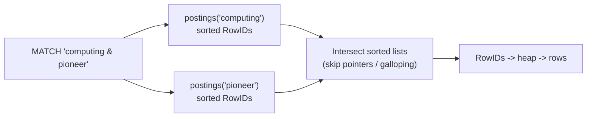

**Extras:**
- **Compression** — store **deltas** between RowIDs (gaps are small) + **varint/bit-packing** → the index shrinks dramatically (critical at 1B rows).
- **Ranking** — store **term frequency** (and doc length) to score with **TF-IDF / BM25** for `ORDER BY relevance`; **positions** enable **phrase** queries (`"computing pioneer"`).
- **General use** — the same structure accelerates **multi-valued columns** (tags), `IN (...)`, and `array @> contains`, not just text.
- **Maintenance** — on `INSERT/UPDATE/DELETE`, re-tokenize and update postings (often **batched/segment-merged** like Lucene to keep writes cheap; deletes via a **tombstone/liveness bitmap** applied at query time).

### 7.4 When the optimizer uses an index
- A predicate is **sargable** (Search-ARGument-able) if it can seek an index: `col = v`, `col > v`, `col BETWEEN`, `col LIKE 'p%'`, `col MATCH …`. **Non-sargable**: `WHERE f(col) = v`, `col LIKE '%x%'`, `col != v` → usually forces a scan.
- The optimizer uses an index only when it's **selective enough** (returns a small fraction). Reading 60% of rows via index random-access is **slower** than a sequential full scan — CBO weighs this with statistics. **Covering indexes** (index holds all needed columns) avoid the heap fetch entirely.

| Index | Best for | Supports `ORDER BY`? | Cost |
|---|---|---|---|
| **Hash** | `=`, PK point lookups | ❌ | `O(1)`; equality only |
| **B+-tree / skip list** | `=`, ranges, prefix, ordering | ✅ (ordered scan) | `O(log n + k)`; write upkeep |
| **Inverted** | full-text `MATCH`, multi-valued, `IN` | via score/sort | `~O(min list)` intersect; build/merge cost |

---

## 8. Executing WHERE, JOIN, ORDER BY (focus area)

### 8.1 WHERE — predicate evaluation + index selection
- The `WHERE` clause is an **expression tree** (Composite); a **Filter** operator calls `Expr.eval(row)` (Interpreter) returning a 3-valued boolean (`TRUE/FALSE/NULL` — SQL three-valued logic). **Short-circuit** `AND`/`OR`; **cheap, selective predicates first**.
- **Index vs scan** decided by the optimizer (§7.4). For `WHERE a=? AND b>?`, prefer a **composite index** `(a,b)`; otherwise seek the most selective single-column index, then **filter the residual** predicates on the fetched rows.
- **Multiple indexes** can combine via **bitmap AND/OR** of RowID sets (bitmap index scan) before touching the heap.

### 8.2 JOIN — three core algorithms
| Algorithm | How | Complexity | Best when |
|---|---|---|---|
| **Nested-loop** | for each outer row, scan inner | `O(n·m)` | tiny tables; non-equi/`<` joins |
| **Index nested-loop** | for each outer row, **index-seek** inner | `O(n · log m)` | inner has an index on the join key; selective |
| **Hash join** ✅ | build hash on **smaller** input, probe with larger | `O(n + m)` | **equi-joins**, no useful order, inputs fit RAM |
| **Sort-merge** | sort both on key, merge in lockstep | `O(n log n + m log m)` | inputs already sorted/indexed, **range joins**, or output must be ordered |

```mermaid
flowchart TB
    subgraph HashJoin
      B[Build phase: hash smaller input<br/>key -> rows] --> P[Probe phase: stream larger input,<br/>look up matches O(1) avg]
    end
```
- **Hash join** is the OLTP/in-memory default for equi-joins (linear, RAM is cheap). **Build the smaller side** to minimize the hash table. If it doesn't fit, **grace/partitioned hash join** spills partitions.
- **Index nested-loop** wins when the outer is small/selective and the inner key is indexed (turn `O(n·m)` into `O(n·log m)`).
- **Sort-merge** shines when an index already yields sorted input (no sort needed) or for **range/inequality** joins and when downstream `ORDER BY` wants that order anyway (sort once, reuse).
- **Outer joins** = same algorithms with null-padding for unmatched rows; **join reordering** (optimizer) minimizes intermediate cardinality.

### 8.3 ORDER BY — sorting (and avoiding it)
- **Avoid the sort entirely** if a **B+-tree index** already provides the requested order → just scan it in order (and stop early under `LIMIT`). This is the single biggest `ORDER BY` optimization.
- Otherwise:
  - **In-memory sort** — **introsort** (quicksort + heapsort fallback to guarantee `O(n log n)` worst case) or a stable merge sort for multi-key/stable needs. `O(n log n)`.
  - **Top-K with `LIMIT k`** — keep a **bounded min/max-heap of size k** while streaming → **`O(n log k)`** time, **`O(k)`** memory (don't sort all n to return 20).
  - **External merge sort** — if the set exceeds work memory, sort runs that fit RAM, write sorted runs, then **k-way merge** with a heap → `O(n log n)` with bounded memory (the spill path; rarer in an in-memory DB but needed for huge intermediates).
- **Multi-key** `ORDER BY a ASC, b DESC` → comparator chains column comparisons with per-column direction.

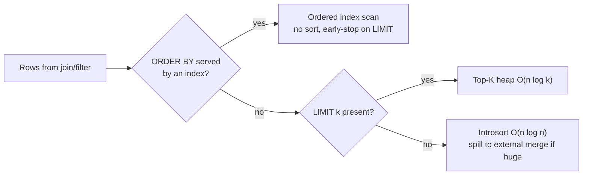

### 8.4 GROUP BY / aggregates / DISTINCT
- **Hash aggregation** — hash by group key, accumulate `COUNT/SUM/…` per group → `O(n)`; or **sorted aggregation** if input is already ordered by the group key (streaming, `O(1)` memory per group). `DISTINCT` = group-by with no aggregate (hash set).

---

## 9. Transactions, concurrency & isolation — MVCC (focus area)

ACID with high concurrency. The default mechanism is **Multi-Version Concurrency Control**.

### 9.1 MVCC — readers never block writers
- Each **row version** carries `(xmin = creating txn id, xmax = deleting/superseding txn id)`. An **update** writes a **new version** and marks the old one's `xmax`; a **delete** sets `xmax`.
- Each transaction runs against a **snapshot** (the set of committed txns as of its start). A version is **visible** to txn T iff `xmin` committed before T's snapshot **and** `xmax` is unset/after → **snapshot isolation**: readers see a consistent point-in-time view and **never block** writers (and vice-versa).
- **Garbage collection / vacuum** reclaims versions no longer visible to any live snapshot.

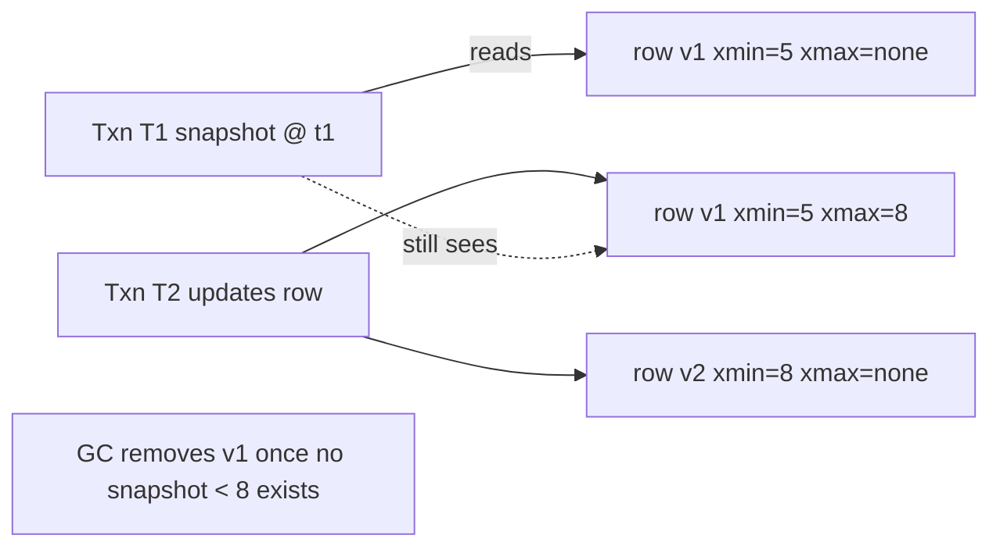

### 9.2 Isolation levels & write conflicts
- **Read-committed / Snapshot (repeatable read)** come naturally from MVCC.
- **Lost-update / write-write conflicts** — two txns update the same row: **first-committer-wins**; the second sees the changed `xmax` and **aborts → retry** (optimistic). Or take a **row write-lock** on update (pessimistic).
- **Serializable** — either **strict 2-phase locking (S2PL)** (acquire shared/exclusive locks, release at commit; risk deadlock → detect via wait-for graph or timeout) **or** **Serializable Snapshot Isolation (SSI)** — MVCC plus tracking of dangerous read/write dependency cycles, aborting one offender (Postgres' approach). State the trade-off: locking blocks; SSI is optimistic with abort/retry.
- **Atomicity** — a txn buffers its writes; **COMMIT** makes them visible atomically (flip commit timestamp) and durable (WAL, §10); **ROLLBACK** discards its versions.

### 9.3 Index concurrency
- Indexes are mutated concurrently too: use **latch-crabbing** on B+-tree nodes (lock child before releasing parent) or a **lock-free skip list** for the in-memory case; the inverted index batches updates into immutable **segments** to avoid in-place contention.

---

## 10. Durability & crash recovery — WAL (focus area)

RAM is volatile, so committed data must survive a crash.

### 10.1 Write-Ahead Log (the durability backbone)
- **Log the change before applying/acking** it. Each mutation appends a **redo (and undo) record** `{LSN, txn_id, table, RowID, before, after}` to a sequential file. **WAL rule:** a transaction is durable once its **COMMIT record is fsync'd**.
- **fsync policy** (the latency knob): `on-commit` (every commit fsync's — safest, slowest), **group commit** (batch many commits into one fsync — amortizes the ~ms cost over thousands of txns), or `periodic` (flush every N ms — fast, may lose the last window). Group commit is the usual default.

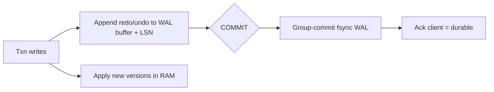

### 10.2 Checkpoints / snapshots
- Periodically write a **consistent snapshot** of the in-memory tables (fork + copy-on-write, or a background flusher) and record the **LSN** it covers. Lets recovery start from the snapshot and replay only the **WAL tail** after it → bounded recovery time.

### 10.3 Crash recovery (ARIES-style)
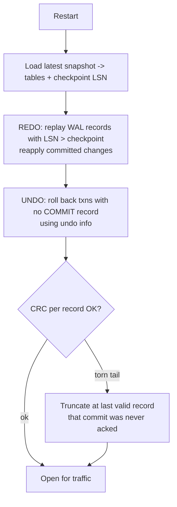
1. **Load latest snapshot** (fast bulk restore) → state + checkpoint LSN.
2. **REDO** all logged changes after the checkpoint (rebuild exact pre-crash state, including uncommitted).
3. **UNDO** transactions lacking a COMMIT record (atomicity) using undo records.
4. **CRC per record** detects a **torn tail** from a crash mid-append → truncate at the last valid record (that commit was never acked). Then rebuild indexes (or log index changes too) and serve.

---

## 11. Replication & sharding — distributed scale-out (focus area)

### 11.1 Sharding (partition the data)
- **Partition by key**: **hash partitioning** (`shard = hash(pk) mod N`, even spread) or **range partitioning** (ordered ranges — good for range scans, risks hotspots). **Consistent hashing / slots** so adding nodes moves a minimal fraction of data.
- **Co-locate joinable data** — partition related tables on the **same key** (e.g. `orders` and `users` both by `user_id`) so the common join is **shard-local** (no network shuffle).

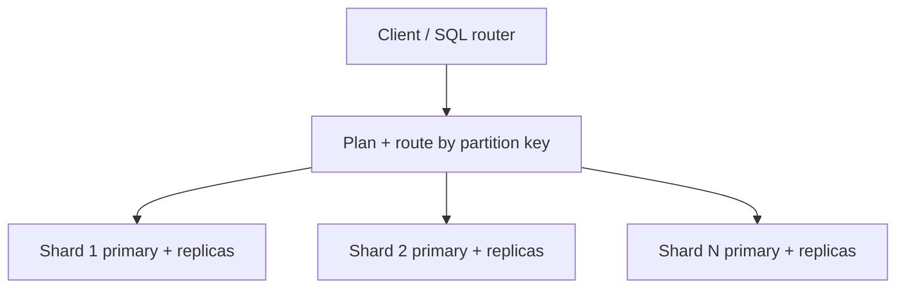

### 11.2 Distributed queries & joins
- **Predicate routing** — if the `WHERE` pins the partition key, route to **one shard** (fast path). Otherwise **scatter-gather**: run the partial query on all shards in parallel, then **merge** (re-aggregate / k-way merge for `ORDER BY`, combine partial `SUM/COUNT`) at the coordinator.
- **Distributed join strategies**: **co-located join** (same key — local, cheapest) > **broadcast join** (replicate the small table to every shard) > **repartition/shuffle join** (re-hash both tables on the join key across the network — most expensive). The planner picks based on table sizes.

### 11.3 Replication (HA per shard)
- **Primary–replica per shard.** Primary ships its **WAL stream (LSN-ordered)** to replicas.
- **Async** — ack on local commit; replicate in background → **low latency**, but a primary crash can lose the un-replicated tail (**eventual** on replicas).
- **Quorum / Raft (sync)** — replicate the log via consensus; commit once a **majority** persists it → **no lost acked writes**, automatic leader election on failure, **strong consistency** (etcd/CockroachDB/Spanner model). Higher latency.
- **Failover** — health-check primaries; **promote a replica** (Raft elects automatically). Replicas can **serve reads** (read scaling) at the cost of staleness.

### 11.4 Distributed transactions (cross-shard)
- A txn spanning shards needs **2-phase commit (2PC)**: coordinator → *prepare* (each shard durably votes yes/no) → *commit/abort*. Correct but **blocking** if the coordinator dies → back it with a **Raft-replicated coordinator** and timeouts. **Trade-off:** cross-shard txns are expensive; design partition keys to keep transactions single-shard whenever possible.

---

## 12. Consistency guarantees & trade-offs (focus area)

- **Single node:** **linearizable + serializable/snapshot** via MVCC (+SSI or 2PL). The strong island.
- **Across replicas (async):** **eventual consistency** — replica reads can be stale; failover may drop the un-replicated tail. Favor for read scaling / latency.
- **Across replicas (Raft quorum):** **strong consistency**, no lost acked writes, but higher write latency and unavailable during a partition without quorum.
- **Across shards:** no global serializable order unless you pay for **2PC + a global timestamp** (e.g. Spanner TrueTime / hybrid logical clocks). Default: each shard is its own consistency domain.

**CAP / PACELC framing:** a single shard with quorum replication is **CP** (consistent, unavailable without majority). Run replicas **AP/eventual** for latency, or **CP** via Raft for correctness. **PACELC:** even with no partition (*else*), you trade **Latency vs Consistency** through the WAL-fsync and replication-ack settings.

| Want | Setting | Cost |
|---|---|---|
| Lowest latency | async replication, group/periodic fsync, read replicas | stale reads; may lose recent tail on crash |
| No lost acked writes | Raft quorum + fsync-on-commit | higher write latency |
| Read-your-writes | read from primary, or wait replica LSN ≥ commit LSN | less read scaling |
| Serializable | SSI or 2PL (single node); 2PC + global ts (cross-shard) | aborts/retries or blocking + latency |

---

## 13. Backpressure under overload

A heavy query (cartesian join, unindexed sort over 1B rows) or a flood of connections must not melt the node.

- **Admission control** — bound concurrent queries + **per-query memory (work_mem) limits**; queue or **reject fast** when saturated rather than buffering unbounded.
- **Query timeouts + cancellation** — kill runaway queries (the iterator tree checks a cancel flag at `next()`); **statement cost ceilings** from the optimizer estimate reject obviously-cartesian plans before running.
- **Spill to disk** — large sorts/hash joins spill (external merge / grace hash) instead of OOM-killing the process.
- **Connection limits + pooling**; **slow-query log**; **load shedding** (shed low-priority/analytical reads to protect OLTP commits) and **circuit-breaking** at the router.
- **Avoid p99 stalls** — incremental index rehash, MVCC GC in bounded batches, no giant synchronous deletes.

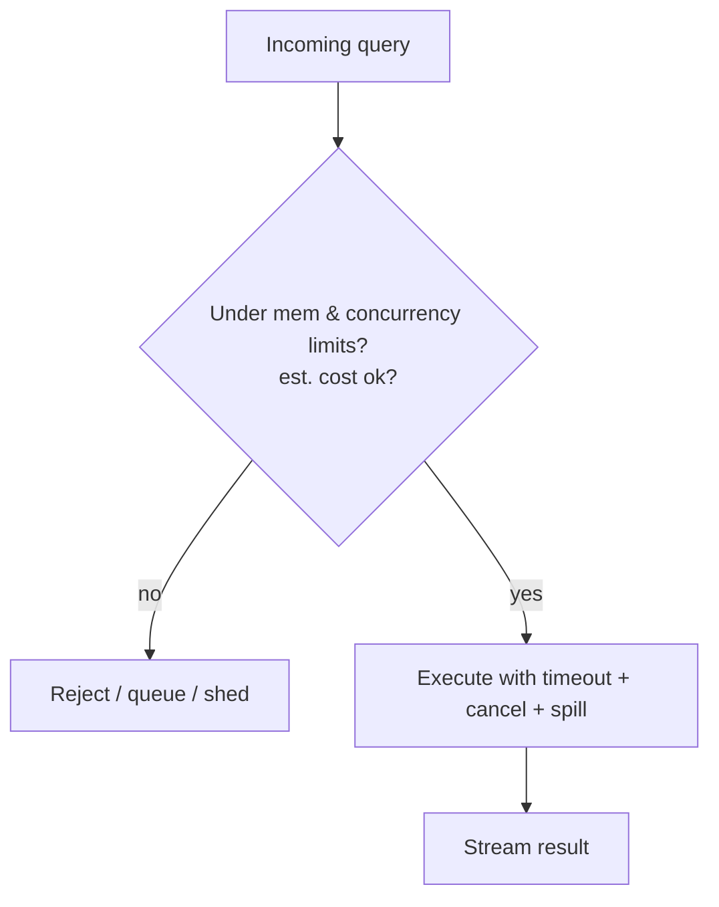

---

## 14. Observability (a stated requirement)

- **Metrics** — QPS by statement type, **p50/p99/p999 query latency**, rows scanned vs returned (selectivity), **index hit/miss & usage**, buffer/work-mem usage, **MVCC version count & vacuum lag**, WAL fsync time, **replication lag (LSN delta)**, txn aborts/retries, deadlocks, connections, rejected/queued queries.
- **`EXPLAIN [ANALYZE]`** — chosen plan + estimated vs **actual** rows/time per operator (the #1 query-debugging tool; surfaces bad cardinality estimates).
- **Slow-query log**, **structured logs** (commits, checkpoints, failovers, vacuums), **tracing** (router → shard → replica) with a request id.
- **Golden signals** — p99 latency, error/abort rate, replication lag, memory headroom.

---

## 15. Failure modes — *"what if X fails?"*

| Failure | Impact | Mitigation |
|---|---|---|
| **Process crash** | In-RAM tables gone | **Snapshot + WAL REDO/UNDO** recovery; replica serves meanwhile |
| **Primary dies** | Shard write-unavailable | **Failover/Raft-elect** a replica; async tail may be lost (eventual), quorum loses none |
| **Torn WAL write (crash mid-append)** | Corrupt log tail | **CRC per record** → truncate at last valid (that commit was never acked) |
| **fsync/disk slow or full** | Commit stalls | Group commit; alert on fsync latency; cap/rotate WAL; alert on disk |
| **Bad plan / missing stats** | Query 1000× too slow | `EXPLAIN ANALYZE`; refresh statistics/histograms; plan hints; cost ceilings |
| **Cartesian/huge join** | Memory blowup, stall | Cost-ceiling reject; **spill** (grace hash / external sort); query timeout |
| **MVCC version bloat** | RAM growth, slow scans | Bounded background **vacuum/GC**; alert on oldest-snapshot age |
| **Hot partition / skew** | One shard saturated | Better partition key; split range; replica reads; salting |
| **Deadlock (2PL)** | Txns stuck | Wait-for-graph detection or timeout → abort youngest, retry |
| **Cross-shard coordinator dies (2PC)** | In-doubt txns block | **Raft-replicated coordinator** + recovery/timeout protocol |
| **Network partition** | Split-brain risk | Quorum (Raft) decides; minority steps down (CP) |
| **SQL injection attempt** | Data breach | **Prepared statements / bound params only**; never string-concat SQL; least-priv accounts |

**Guiding principle:** a single shard is a **strongly-consistent, recoverable island** (MVCC + WAL); the cluster trades some consistency for availability/latency and **degrades (shed, spill, redirect) rather than crashing**.

---

## 16. Trade-off analysis (the money section)

| Axis | Choice A | Choice B | Guidance |
|---|---|---|---|
| **Storage layout** | Row store (OLTP) | Column store (OLAP) | Match the workload; hybrid/HTAP if both ✅ |
| **Execution** | Iterator/Volcano (simple, low-latency) | Vectorized/compiled (high throughput) | Volcano for OLTP; vectorized for analytics |
| **Index** | More indexes (fast reads) | Fewer (fast writes, less RAM) | Index for selective, frequent predicates only |
| **Join** | Hash (equi, linear) | Sort-merge (ordered/range) / NL (tiny) | Hash by default; sort-merge when sorted/range |
| **ORDER BY** | Index-ordered scan (no sort) | Explicit sort / top-K heap | Use an index if it exists; heap for `LIMIT k` |
| **Concurrency** | MVCC snapshot (no read locks) | 2PL serializable (blocks) | MVCC default; SSI/2PL when serializable required |
| **Durability** | fsync-on-commit (safe) | group/periodic (fast) | **Group commit** default; on-commit for systems of record |
| **Replication** | Async (low latency, may lose tail) | Raft quorum (no loss, slower) | Async for read scaling; quorum for correctness |
| **Consistency** | Serializable/linearizable (CP) | Eventual (AP) | Per-shard strong; cluster tunable |
| **Transactions** | Single-shard (cheap) | Cross-shard 2PC (correct, slow) | Partition to keep txns single-shard |

**One-liner to say out loud:** *"I'd build a **parser → cost-based optimizer → Volcano executor** over **in-RAM row-store tables (RowID heap + free list)**, with **hash indexes for equality, B+-trees for ranges/ORDER BY, and an inverted index (sorted, compressed posting lists with skip pointers) for full-text/multi-valued search**. `WHERE` pushes predicates down and seeks the most selective index; `JOIN` defaults to **hash join** (sort-merge when input is already ordered or it's a range join, index-nested-loop when the inner is indexed); `ORDER BY` rides a **B+-tree's order** when possible, else a **top-K heap for LIMIT** or introsort with external-merge spill. Concurrency is **MVCC snapshot isolation** (readers never block writers; SSI for serializable), durability is a **group-commit WAL + checkpoints**, recovered as **snapshot → REDO → UNDO → CRC-truncate torn tail**. I scale by **partitioning on the join/PK key to keep joins and transactions shard-local**, **Raft-replicate each shard** for HA, and state the consistency model explicitly — **per-shard serializable (CP), cluster tunably AP/eventual** via fsync + replication-ack knobs — degrading via **admission control, spilling, and load-shedding** under overload."*

---

## 17. Networking, security & performance best practices

### Networking
- **Binary wire protocol** (typed result frames) over TCP; **pipelining / multi-statement batches** to amortize round-trips; **server-side cursors** to stream large results without materializing.
- **Connection pooling** (a server-side pool / external pooler like PgBouncer) — connections are expensive; reuse them. Co-locate app/router/nodes in one AZ for µs RTT; **TLS** with session resumption.
- **Smart router** routes by partition key to the owning shard; fans out + merges for scatter-gather.

### Security
- **SQL injection: prepared statements / bound parameters only** — never concatenate user input into SQL (OWASP A03). This is the single most important rule.
- **AuthN** (mTLS / user+password), **AuthZ** (role-based, per-table/column **GRANT**s, row-level security), **least privilege** app accounts.
- **Encryption** in transit (TLS) + at rest (WAL/snapshots); **audit logging** of DDL/DML; resource quotas per user; redact PII in logs.

### Performance
- **Keep data + indexes in RAM**, cache-friendly layouts (column store + SIMD for scans), **dictionary/RLE/bit-pack** compression, **prepared-plan cache**.
- **Group-commit WAL**, **incremental** index rehash & MVCC GC (no stop-the-world), **work-mem limits + spill**.
- **NUMA-aware** placement, jemalloc/tcmalloc to curb fragmentation, **per-core/sharded** execution for linear scale; **late materialization** (carry RowIDs, fetch columns only when needed).

---

## 18. Staying current — modern & emerging approaches

- **Reference systems:** **SQLite** (embedded, single-file), **VoltDB / SingleStore (MemSQL)** (in-memory NewSQL, compiled queries), **H2/HSQLDB**, **Redis Stack / RediSearch** (inverted index in a KV store), **DuckDB** (in-process OLAP, vectorized), **SAP HANA** (in-memory column store).
- **Distributed SQL:** **CockroachDB / YugabyteDB / TiDB** (Raft + distributed txns), **Google Spanner** (TrueTime, external consistency), **FoundationDB**.
- **Search:** **Lucene / Elasticsearch / OpenSearch** (segment-based inverted index, BM25), Tantivy.
- **Execution:** **vectorized** (MonetDB/X100, DuckDB) and **query compilation/JIT** (HyPer, SingleStore); **morsel-driven parallelism**.
- **Storage:** **HTAP** (row+column hybrid), **persistent memory** tiers, **LSM-trees** (RocksDB) for write-heavy indexes.
- **How I stay current:** the **VLDB/SIGMOD** papers (Volcano, ARIES, Selinger optimizer, SSI, Spanner, HyPer), CMU's *Database Systems* course, and DuckDB/CockroachDB/SingleStore engineering blogs — and benchmarking before adopting.

---

## 19. Likely follow-up questions (rehearse these)
- How does a SQL string become an execution plan? *(tokenize → parse → bind → logical → cost-based optimize → physical → Volcano executor)*
- How do you pick a join algorithm? *(hash for equi/linear; sort-merge for ordered/range; index-nested-loop for indexed selective inner; cost via stats)*
- How does `ORDER BY … LIMIT 10` avoid sorting 1B rows? *(index-ordered scan with early stop, or a top-K heap → `O(n log k)`)*
- Why an inverted index, and how does `a AND b` run? *(term→sorted posting list; intersect sorted lists with skip pointers/galloping, start from the smallest)*
- When does the optimizer ignore an index? *(non-sargable predicate, or low selectivity where a full scan is cheaper)*
- How do readers not block writers? *(MVCC: per-row versions + per-txn snapshot visibility)*
- How do you get serializable? *(SSI — detect dangerous dependency cycles — or strict 2PL; trade-off abort/retry vs blocking)*
- Crash mid-commit — what's durable? *(WAL rule: durable iff COMMIT record fsync'd; REDO committed, UNDO uncommitted, CRC-truncate torn tail)*
- Cross-shard transaction? *(2PC over a Raft-replicated coordinator; better: partition to keep it single-shard)*
- Strong vs eventual across replicas? *(Raft quorum = CP, no lost writes, higher latency; async = AP, low latency, stale/lossy tail)*
- How do you prevent SQL injection? *(prepared statements / bound parameters — never string-concat)*

---

## 20. Summary checklist (whiteboard recap)

- **Pipeline** — **tokenize → parse (AST) → bind → logical plan → cost-based optimize → physical plan → Volcano executor**; `EXPLAIN` to inspect.
- **Storage** — in-RAM **row store** (RowID heap + free list); column store for OLAP; typed tuples + null bitmap.
- **Indexes** — **hash** (`=`), **B+-tree/skip list** (range + `ORDER BY`), **inverted** (sorted compressed postings + skip pointers) for `MATCH`/multi-valued.
- **WHERE** — predicate tree (Composite/Interpreter), **predicate pushdown**, seek most selective index, residual filter.
- **JOIN** — **hash** (equi, `O(n+m)`) default; **sort-merge** (ordered/range); **index-nested-loop** (indexed inner).
- **ORDER BY** — **index order (no sort)** > **top-K heap `O(n log k)`** for `LIMIT` > introsort + **external merge** spill.
- **Transactions** — **MVCC snapshot isolation** (readers don't block writers); **SSI/2PL** for serializable; conflicts → abort/retry.
- **Durability** — **group-commit WAL + checkpoints**; recover **snapshot → REDO → UNDO → CRC-truncate**.
- **Scale** — partition on join/PK key (shard-local joins/txns), **Raft-replicate** per shard; scatter-gather + broadcast/repartition joins.
- **Consistency** — per-shard **serializable/linearizable (CP)**; cluster **tunably AP/eventual** (PACELC: latency vs consistency).
- **Backpressure** — admission control, work-mem limits, cost ceilings, timeouts, **spill**, load-shed.
- **Security** — **prepared statements (no injection)**, RBAC + row-level security, TLS, audit.
- **Observability** — p99 latency, index usage, MVCC/vacuum lag, WAL fsync, replication lag, aborts/deadlocks.
- **Design patterns** — Composite/Interpreter (expressions), Visitor (optimizer), Iterator (executor), Strategy/Factory (operators), Adapter (storage), Singleton (catalog).
